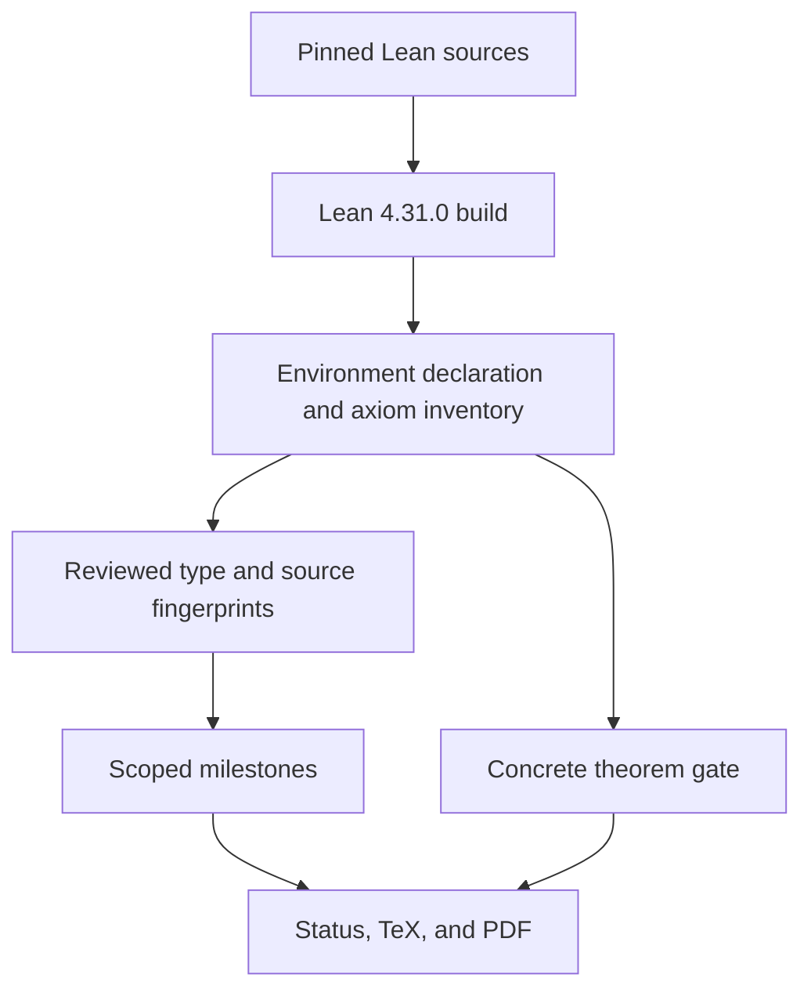

# Formal Evidence Pipeline

## Current Outcome

The repository does not establish `P = NP`. The current public surface is generated from a compiled
Lean theorem inventory, and its concrete publication gate is false.

The pipeline is deliberately one-way:

Status JSON, website copy, report text, hashes, and checker Booleans are downstream publication
artefacts. None can flow backward as theorem evidence.

## Inventory Compilation

The core repository imports the complete `PNP` module closure under the exact pinned Lean toolchain,
walks public environment constants, classifies declaration kinds, and uses Lean's axiom collection
for dependencies. Every public row records name, module, kind, and axiom closure; the 1729 reviewed
milestone candidates additionally record raw kernel types for publication fingerprinting. The
canonical output records:

- 11,055 public declarations;
- 6,294 theorem-kind declarations;
- 3,428 assumption-free theorem-kind declarations;
- 94 source-closure modules;
- 4,278 excluded private compiler auxiliaries;
- four project axioms.

The source closure includes every tracked `lean/**/*.lean` source plus the toolchain and Lake build
configuration. Symlinked sources, malformed probe output, private-row forgery, unsorted declarations,
unknown declaration forms, and byte drift reject.

## Earned Milestones

An earned milestone requires all of the following:

1. every reviewed declaration is present with theorem kind;
2. every exact domain-separated kernel-type SHA-256 matches;
3. every declaration's exact closure contains only approved Lean-standard axioms and no project axiom;
4. the complete Lean-source closure matches its reviewed digest.

The fifty-four earned scopes are:

| Milestone | Exact scope | Explicit non-claim |
| --- | --- | --- |
| Concrete machine and cost kernel | Executable bitstrings/codecs, finite rule-list machines, collision-free pipeline namespaces, one literal four-stage all-input compiler, sequential raw-machine composition, and recursive function/decision compilation into one raw finite machine with exact verdict/output/no-timeout and explicit external polynomials | This closes the concrete machine link only; CNF-SAT in P, NP-completeness, and `P = NP` remain absent |
| Concrete P, NP, and reductions | Finite charged pipelines, bounded certificates, polynomial reductions, the NP-complete-in-P implication, and recursively compiled exact raw-machine refinements | No concrete SAT completeness/decider or root theorem |
| Concrete universal CNF-SAT verifier | Exact formula/assignment decoding, universal accept/reject semantics, no timeout, and `CNFSAT ∈ NP` | No CNF-SAT in P, NP-completeness, or `P = NP` |
| Cook-Levin dimensions and layout | Executable tableau dimensions and disjoint, in-range Boolean-variable blocks | Layout alone is not a CNF reduction |
| Fixed-certificate tableau | Canonical bounded raw traces characterized by intrinsic transition validity | Fixed-certificate semantics alone does not emit CNF |
| Uniform verifier tableau | Language membership equivalent to an existential bounded accepting tableau | No Boolean encoding or reduction polynomial follows alone |
| Local CNF compiler | Finite local constraints compile to scoped clauses with exact satisfaction and clause counts | Does not enumerate the whole verifier tableau |
| Whole-tableau CNF syntax | Answer-independent finite formula encoding initialization, transitions, preservation, and acceptance | Syntax alone is not the final semantic or complexity theorem |
| Whole-tableau CNF semantics | Formula satisfaction exactly equivalent to an intrinsic accepting tableau, using only approved Lean-standard axioms | Still requires the concrete raw-tape execution bridge |
| Cook-Levin raw-tape bridge | `encodedFormula_mem_CNFSAT_iff_language` proves exact equivalence between generated-CNF satisfiability and concrete verifier-language membership | Semantic correctness alone is not a size/runtime or packaged reduction theorem |
| External Cook-Levin encoded-formula size | `encodedFormula_size_le` bounds the actual canonical unary-indexed encoding by an explicit fixed-verifier polynomial in external source-input length | No raw formula builder or construction-runtime polynomial, packaged polynomial reduction, NP-completeness, CNF-SAT in P, or `P = NP` |
| Rectangular Cook-Levin formula schedule | Exact answer-independent constraint, clause, token, and raw-bit slot rectangles emit the existing program and encoding; `formulaBitSchedule_length` is exactly the external-input size polynomial and `formulaBitSchedule_emit_eq_encodedFormula` reproduces the encoded formula | Pure schedule only: no constant-time raw slot action, raw builder, construction-runtime polynomial, `FunctionProgram.RawRefinement`, packaged reduction, NP-completeness, CNF-SAT in P, or `P = NP` |
| Direct Cook-Levin formula cursor | Direct constraint, clause, token, and bit coordinate decoders preserve out-of-range/padding/populated states; exact prefix, full, one-step-short, terminal, excess-fuel, polynomial-count, and emitted-output theorems bind the cursor to the canonical formula | Lean specification cursor only: no constant-time raw interpretation, raw builder, construction-runtime theorem, `FunctionProgram.RawRefinement`, packaged reduction, NP-completeness, CNF-SAT in P, or `P = NP` |
| Literal Cook-Levin input-length tally | A fixed 19-rule work machine is definitionally connected to the total input-framer endpoint, preserves source bits, appends exact unary length, runs in exactly `2*n*n + 4*n + 2` work and `12*n*n + 24*n + 12` compiled raw steps, and times out for malformed internal scan symbols or one-step-short fuel | No formula-bit emission, complete raw formula builder, `FunctionProgram.RawRefinement`, packaged reduction, NP-completeness, CNF-SAT in P, or `P = NP` |
| Executable Cook-Levin builder input prefix | One literal finite work machine composes the all-input framer, an explicit launch transition, and the 19-rule tally in collision-free namespaces; it reaches the represented final tape after exactly `totalInputFramerWorkSteps(input) + 1 + 2*n*n + 4*n + 2` work steps and has compiled raw bound `18*n*n + 63*n + 93`; malformed tally-scan symbols and one-step-short fuel time out | No formula-bit emission, direct cursor interpretation by raw transitions, complete raw formula builder, builder `FunctionProgram.RawRefinement`, packaged reduction, NP-completeness, CNF-SAT in P, or `P = NP` |
| Standalone Cook-Levin builder token appender | A fixed 59-rule finite machine appends each requested token exactly for arbitrary represented input, tally, prior output, and exterior tape; its first-header specialization emits the first two direct formula bits and has compiled raw bound `24*n + 48`; malformed phase symbols and one-step-short fuel time out | Independently audited reusable component; the next row records its composed first-token use, but neither result supplies the remaining header/body traversal or a complete raw builder |
| Composed Cook-Levin first-token prefix | One literal 184-rule table contains the 116-rule input prefix, nine symbol-preserving bridges, and 59-rule appender under injective disjoint state maps; every raw input emits exactly the first `T` token, its bits equal `encodedFormula.take 2`, and compiled raw cost is bounded by `18*n*n + 87*n + 147`; malformed phase and one-step-short cases time out | No remaining width header, dynamic cursor controller, complete raw formula builder, builder `FunctionProgram.RawRefinement`, packaged reduction, NP-completeness, CNF-SAT in P, or `P = NP` |
| Composed Cook-Levin complete width header | One literal finite table composes the 184-rule prefix, structurally generated unary polynomial evaluator, 16-rule controller, two 59-rule appender copies, and five total bridges in pairwise-disjoint state images; every raw input emits exactly `FormulaWidth` copies of `T` followed by `F`, equal to `encodedFormula.take (2 * (FormulaWidth + 1))`, under an external `NatPolynomial` compiled-time bound | Complete answer-independent width header only: no dynamic cursor controller, formula body, complete raw builder, builder `FunctionProgram.RawRefinement`, packaged reduction, NP-completeness, CNF-SAT in P, or `P = NP` |
| Composed Cook-Levin body-start prefix | One literal finite table composes the complete width header, a unary next-token-slot evaluator, and the reusable appender; every raw input emits `T^FormulaWidth F Sep`, and the final exterior retains `formulaVariableSlotBound + 2` under an external `NatPolynomial` compiled-time bound | Fixed separator and coordinate only: no dynamic cursor controller, subsequent body tokens, complete raw builder, builder `FunctionProgram.RawRefinement`, packaged reduction, NP-completeness, CNF-SAT in P, or `P = NP` |
| Composed Cook-Levin first-literal prefix | One literal finite table composes the body-start prefix, a unary next-token-slot evaluator, and two appender copies; every raw input emits `T^FormulaWidth F Sep T F`, the canonical first positive literal for variable zero, and the final exterior retains `formulaVariableSlotBound + 4` under an external `NatPolynomial` compiled-time bound | Fixed first literal and coordinate only: no dynamic cursor controller, remaining body tokens, complete raw builder, builder `FunctionProgram.RawRefinement`, packaged reduction, NP-completeness, CNF-SAT in P, or `P = NP` |
| Composed Cook-Levin first-clause prefix | One literal finite table composes the first-literal prefix, a unary next-token-slot evaluator, and a fixed eight-token tail; every raw input emits `T^FormulaWidth F Sep T F T T F T T T F Finish`, the complete positive first clause on variables zero, one, and two, and the final exterior retains `formulaVariableSlotBound + 12` under an external `NatPolynomial` compiled-time bound | Complete first clause and retained coordinate only: no dynamic cursor controller, remaining body tokens, complete raw builder, builder `FunctionProgram.RawRefinement`, packaged reduction, NP-completeness, CNF-SAT in P, or `P = NP` |
| Literal Cook-Levin token-cursor padding step | One literal table with `1192` plus four inherited unary-evaluator rule counts composes the complete first clause, nine launch rules, and a fixed 45-rule cursor advance; every raw input preserves the output, consumes the proved first valid-padding opportunity, advances the unary coordinate from `FormulaVariableSlotBound + 12` to `+ 13`, and adds exactly `2*cursorWord.length + 8` work steps within `BuilderFirstClausePrefix.rawTimeBound + 48 + 12*cursorWord.length` compiled steps | One padding transition only: no general dynamic cursor loop, arbitrary raw slot decoder, emitted token, remaining formula body, complete raw builder, builder `FunctionProgram.RawRefinement`, packaged reduction, NP-completeness, CNF-SAT in P, or `P = NP` |
| Literal Cook-Levin first-clause padding run | One literal table with `1244` plus six inherited/generated unary-evaluator rule counts composes the preceding cursor step, two unary evaluators, and a fixed 25-rule countdown; every raw input executes exactly `D = (FormulaVariableSlotBound - 1) * (FormulaVariableSlotBound + 6) = FormulaTokensPerClause - 12` remaining padding opportunities without emission and reaches `FormulaVariableSlotBound + 1 + FormulaTokensPerClause`, where the next direct outcome is `Sep`, under an external `NatPolynomial` compiled bound | Exact remaining first-clause padding block and second-clause boundary only: no general dynamic formula cursor, remaining formula body, complete raw builder, builder `FunctionProgram.RawRefinement`, packaged reduction, NP-completeness, CNF-SAT in P, or `P = NP` |
| Literal Cook-Levin second-clause separator step | One literal table with `1366` plus six inherited/generated unary-evaluator rule counts composes the complete padding run, a selected 59-rule `Sep` appender, two total nine-symbol bridges, and the fixed 45-rule cursor advance; every raw input emits the canonical separator beginning clause two, advances the retained coordinate by one, emits `encodedFormula.take (2 * (FormulaWidth + 13))`, and proves the following direct token is `F`, within `BuilderFirstClausePaddingRun.rawTimeBound + 246 + 24*n + 12*FormulaWidth + 12*cursorWord.length` compiled steps | One fixed populated transition only: no general dynamic formula cursor, emitted following `F`, remaining formula body, complete raw builder, builder `FunctionProgram.RawRefinement`, packaged reduction, NP-completeness, CNF-SAT in P, or `P = NP` |
| Literal Cook-Levin clause-two first negative literal | One literal table with `1610` plus six inherited/generated unary-evaluator rule counts composes the separator prefix, two selected 59-rule `F` appenders, four total symbol-preserving bridges, and two fixed 45-rule cursor advances; every raw input emits `T^FormulaWidth F Sep T F T T F T T T F Finish Sep F F`, advances to `secondClauseStart + 3`, and emits `encodedFormula.take (2 * (FormulaWidth + 15))`, within `BuilderSecondClauseSeparatorStep.rawTimeBound + 564 + 48*n + 24*FormulaWidth + 24*cursorWord.length` compiled steps | One fixed negative literal only: no completed clause two, general dynamic formula cursor, remaining formula body, complete raw builder, builder `FunctionProgram.RawRefinement`, packaged reduction, NP-completeness, CNF-SAT in P, or `P = NP` |
| Literal Cook-Levin clause-two second negative literal | One literal table with `1976` plus six inherited/generated unary-evaluator rule counts composes the first-literal prefix, selected 59-rule `F`, `T`, and `F` appenders, six total symbol-preserving bridges, and three fixed 45-rule cursor advances; every raw input emits `T^FormulaWidth F Sep T F T T F T T T F Finish Sep F F F T F`, retains `secondClauseStart + 6` at the following `Finish`, and emits `encodedFormula.take (2 * (FormulaWidth + 18))`, within `BuilderSecondClauseFirstLiteralPrefix.rawTimeBound + 1026 + 72*n + 36*FormulaWidth + 36*cursorWord.length` compiled steps | One fixed negative literal only: the retained `Finish` and clause terminator are not emitted; no completed clause two, general dynamic formula cursor, remaining formula body, complete raw builder, builder `FunctionProgram.RawRefinement`, packaged reduction, NP-completeness, CNF-SAT in P, or `P = NP` |
| Literal Cook-Levin complete clause-two prefix | One literal table with `2098` plus six inherited/generated unary-evaluator rule counts composes the second-literal prefix, one selected 59-rule `Finish` appender, two total symbol-preserving bridges, and one fixed 45-rule cursor advance; every raw input emits `T^FormulaWidth F Sep T F T T F T T T F Finish Sep F F F T F Finish`, retains `secondClauseStart + 7` at the first padding coordinate, and emits `encodedFormula.take (2 * (FormulaWidth + 19))`, within `BuilderSecondClauseSecondLiteralPrefix.rawTimeBound + 390 + 24*n + 12*FormulaWidth + 12*cursorWord.length` compiled steps | One fixed clause prefix only: no clause-two padding traversal, clause three, general dynamic formula cursor, remaining formula body, complete raw builder, builder `FunctionProgram.RawRefinement`, packaged reduction, NP-completeness, CNF-SAT in P, or `P = NP` |
| Literal Cook-Levin clause-two padding run | One literal table with `2150` plus eight inherited/generated unary-evaluator rule counts composes the complete second-clause prefix, two unary evaluators, the fixed 25-rule padding countdown, and three total bridges; every raw input traverses `D = FormulaTokensPerClause - 7` remaining padding coordinates without emission, reaches `FormulaVariableSlotBound + 1 + 2 * FormulaTokensPerClause`, retains direct `Sep`, and preserves `encodedFormula.take (2 * (FormulaWidth + 19))` within an external input-size polynomial | Exact remaining clause-two padding only: no separator emission, general dynamic formula cursor, remaining formula body, complete raw builder, builder `FunctionProgram.RawRefinement`, packaged reduction, NP-completeness, CNF-SAT in P, or `P = NP` |
| Literal Cook-Levin third-clause separator step | One literal table with `2272` plus eight inherited/generated unary-evaluator rule counts composes the complete clause-two padding run, a selected 59-rule `Sep` appender, two total nine-symbol bridges, and one fixed 45-rule cursor advance; every raw input emits the fixed separator beginning clause three, advances the retained coordinate by one, emits `encodedFormula.take (2 * (FormulaWidth + 20))`, and proves the following direct token is `F`, within `BuilderSecondClausePaddingRun.rawTimeBound + 330 + 24*n + 12*FormulaWidth + 12*cursorWord.length` compiled steps | One fixed populated transition only: no emitted following `F`, general dynamic formula cursor, remaining formula body, complete raw builder, builder `FunctionProgram.RawRefinement`, packaged reduction, NP-completeness, CNF-SAT in P, or `P = NP` |
| Literal Cook-Levin clause-three first negative literal | One literal table with `2516` plus eight inherited/generated unary-evaluator rule counts composes the complete third-clause separator prefix with the reused 235-rule two-`F` appender/cursor suffix behind one total nine-symbol bridge; every raw input emits the complete negative literal on variable zero in clause three, retains `thirdClauseStart + 3`, emits `encodedFormula.take (2 * (FormulaWidth + 22))`, and proves the literal sign, zero terminator, and following direct token are all `F`, within `BuilderThirdClauseSeparatorStep.rawTimeBound + 732 + 48*n + 24*FormulaWidth + 24*cursorWord.length` compiled steps | One fixed negative literal only: no emitted following `F`, completed clause three, general dynamic formula cursor, remaining formula body, complete raw builder, builder `FunctionProgram.RawRefinement`, packaged reduction, NP-completeness, CNF-SAT in P, or `P = NP` |
| Literal Cook-Levin clause-three second negative literal | One literal table with `3004` plus eight inherited/generated unary-evaluator rule counts composes the complete first-literal prefix with a fixed 479-rule `F T T F` appender/cursor suffix behind one total nine-symbol bridge; nested tables have 113, 235, 357, and 479 rules, every raw input emits the complete negative literal on variable two in clause three, retains `thirdClauseStart + 7`, emits `encodedFormula.take (2 * (FormulaWidth + 26))`, and proves the sign `F`, both unary units `T`, terminator `F`, and following token `Finish`, within `BuilderThirdClauseFirstLiteralPrefix.rawTimeBound + 1752 + 96*n + 48*FormulaWidth + 48*cursorWord.length` compiled steps | One fixed negative literal only: no emitted following `Finish`, completed clause three, general dynamic formula cursor, remaining formula body, complete raw builder, builder `FunctionProgram.RawRefinement`, packaged reduction, NP-completeness, CNF-SAT in P, or `P = NP` |
| Literal Cook-Levin complete clause-three prefix | One literal table with `3126` plus eight inherited/generated unary-evaluator rule counts composes the complete second-literal prefix, a selected 59-rule `Finish` appender, two total symbol-preserving bridges, and the existing 45-rule cursor advance; the fixed suffix has 113 rules, every raw input emits the complete third clause, retains `thirdClauseStart + 8` at the first padding coordinate, emits `encodedFormula.take (2 * (FormulaWidth + 27))`, and proves the executed opportunity is `Finish` and the retained next opportunity is padding, within `BuilderThirdClauseSecondLiteralPrefix.rawTimeBound + 498 + 24*n + 12*FormulaWidth + 12*BuilderThirdClauseSeparatorStep.cursorWord.length` compiled steps | Complete fixed third clause only: no clause-three padding traversal, general dynamic formula cursor, remaining formula body, complete raw builder, builder `FunctionProgram.RawRefinement`, packaged reduction, NP-completeness, CNF-SAT in P, or `P = NP` |
| Literal Cook-Levin third-clause remaining-padding run | One literal table with `3178` plus ten inherited/generated unary-evaluator rule counts composes the complete third-clause prefix, two unary-polynomial evaluators, the reused 25-rule padding countdown, and three total symbol-preserving bridges; every raw input traverses `FormulaTokensPerClause - 8` padding coordinates without emission, preserves `encodedFormula.take (2 * (FormulaWidth + 27))`, reaches `FormulaVariableSlotBound + 1 + 3 * FormulaTokensPerClause`, and proves direct lookup is `Sep`, within `BuilderThirdClausePrefix.rawTimeBound + 18 + 6*countEvaluator.workSteps + 6*(D*(2*countRootPrefixLength + 8) + D*D) + 6*targetEvaluator.workSteps` compiled steps | Complete remaining third-clause padding run only: no fourth-clause separator emission, general dynamic formula cursor, remaining formula body, complete raw builder, builder `FunctionProgram.RawRefinement`, packaged reduction, NP-completeness, CNF-SAT in P, or `P = NP` |
| Literal Cook-Levin fourth-clause separator step | One literal table with `3300` plus ten inherited/generated unary-evaluator rule counts composes the complete third-clause padding run with the reused 113-rule selected `Sep` appender/cursor machine through one total nine-symbol bridge; every raw input emits exactly the fixed separator beginning clause four, preserves `encodedFormula.take (2 * (FormulaWidth + 28))`, advances to `FormulaVariableSlotBound + 1 + 3 * FormulaTokensPerClause + 1`, and proves the following direct token is `F`, within `BuilderThirdClausePaddingRun.rawTimeBound + 426 + 24*n + 12*FormulaWidth + 12*cursorWord.length` compiled steps | One fixed populated transition only: no emitted following `F`, completed clause four, general dynamic formula cursor, remaining formula body, complete raw builder, builder `FunctionProgram.RawRefinement`, packaged reduction, NP-completeness, CNF-SAT in P, or `P = NP` |
| Literal Cook-Levin fourth-clause first negative literal | One literal table with `3666` plus ten inherited/generated unary-evaluator rule counts composes the complete fourth-clause separator prefix with the reused 357-rule `F T F` appender/cursor suffix through one outer total nine-symbol bridge; every raw input emits the complete first negative literal on variable one in clause four, preserves `encodedFormula.take (2 * (FormulaWidth + 31))`, advances to `FormulaVariableSlotBound + 1 + 3 * FormulaTokensPerClause + 4`, and proves the following direct token is `F`, within `BuilderFourthClauseSeparatorStep.rawTimeBound + 1422 + 72*n + 36*FormulaWidth + 36*cursorWord.length` compiled steps | One fixed negative literal only: no emitted following `F`, completed clause four, general dynamic formula cursor, remaining formula body, complete raw builder, builder `FunctionProgram.RawRefinement`, packaged reduction, NP-completeness, CNF-SAT in P, or `P = NP` |
| Literal Cook-Levin fourth-clause second negative literal | One literal table with `4154` plus ten inherited/generated unary-evaluator rule counts composes the complete first-literal prefix with the reused 479-rule `F T T F` appender/cursor suffix through one outer total nine-symbol bridge; every raw input emits the complete second negative literal on variable two in clause four, preserves `encodedFormula.take (2 * (FormulaWidth + 35))`, advances to `FormulaVariableSlotBound + 1 + 3 * FormulaTokensPerClause + 8`, and proves the following direct token is `Finish`, within `BuilderFourthClauseFirstLiteralPrefix.rawTimeBound + 2232 + 96*n + 48*FormulaWidth + 48*cursorWord.length` compiled steps. The 147-declaration audit covers 124 new declarations, 21 reused suffix interfaces, and two cursor dead-state facts | One fixed negative literal only: no emitted following `Finish`, completed clause four, general dynamic formula cursor, remaining formula body, complete raw builder, builder `FunctionProgram.RawRefinement`, packaged reduction, NP-completeness, CNF-SAT in P, or `P = NP` |
| Literal Cook-Levin complete fourth clause | One literal table with `4276` plus ten inherited/generated unary-evaluator rule counts composes the complete fourth-clause second-literal prefix with a selected 59-rule `Finish` appender, the existing 45-rule cursor advance, and two total nine-symbol bridges; every raw input emits the `Finish` that completes clause four, preserves `encodedFormula.take (2 * (FormulaWidth + 36))`, advances to `FormulaVariableSlotBound + 1 + 3 * FormulaTokensPerClause + 9`, and proves the next direct token is padding, within `BuilderFourthClauseSecondLiteralPrefix.rawTimeBound + 618 + 24*n + 12*FormulaWidth + 12*BuilderFourthClauseSeparatorStep.cursorWord.length` compiled steps. The 57-declaration audit covers 55 new declarations and two cursor dead-state facts | One complete fixed clause only: no clause-four padding traversal, general dynamic formula cursor, remaining formula body, complete raw builder, builder `FunctionProgram.RawRefinement`, packaged reduction, NP-completeness, CNF-SAT in P, or `P = NP` |
| Literal Cook-Levin fourth-clause remaining-padding run | One literal table with `4328` plus twelve inherited/generated unary-evaluator rule counts composes the complete fourth-clause prefix with two unary-polynomial evaluators, the reused 25-rule padding countdown, and three total nine-symbol bridges; every raw input traverses `FormulaTokensPerClause - 9` padding opportunities without emission, preserves `encodedFormula.take (2 * (FormulaWidth + 36))`, reaches `FormulaVariableSlotBound + 1 + 4 * FormulaTokensPerClause`, and proves direct and specification-cursor lookup are padding in the intentionally empty fifth clause rectangle, within `BuilderFourthClausePrefix.rawTimeBound + 18` plus six times the count-evaluator work, countdown bound, and target-evaluator work. The 68-declaration audit covers 65 new declarations and three reused countdown interfaces | Complete remaining fourth-clause padding run only: no traversal of the empty fifth rectangle, next-constraint access, further token emission, general dynamic formula cursor, remaining formula body, complete raw builder, builder `FunctionProgram.RawRefinement`, packaged reduction, NP-completeness, CNF-SAT in P, or `P = NP` |
| Literal Cook-Levin empty fifth-clause padding run | One literal table with `4380` plus fourteen inherited/generated unary-evaluator rule counts composes the complete fourth-clause padding run with two unary-polynomial evaluators, the reused 25-rule padding countdown, and three total nine-symbol bridges; every raw input traverses all `FormulaTokensPerClause` opportunities in the intentionally empty fifth clause rectangle without emission, preserves `encodedFormula.take (2 * (FormulaWidth + 36))`, reaches `FormulaVariableSlotBound + 1 + 5 * FormulaTokensPerClause`, and proves every traversed opportunity and the retained target in the intentionally empty sixth clause rectangle are padding, within `BuilderFourthClausePaddingRun.rawTimeBound + 18` plus six times the count-evaluator work, countdown bound, and target-evaluator work. The 68-declaration audit covers 65 new declarations and three reused countdown interfaces | Complete fifth-clause rectangle traversal only: no traversal of the empty sixth rectangle, next-constraint access, further token emission, general dynamic formula cursor, remaining formula body, complete raw builder, builder `FunctionProgram.RawRefinement`, packaged reduction, NP-completeness, CNF-SAT in P, or `P = NP` |
| Literal Cook-Levin remaining first-constraint padding run | One literal table with `4432` plus sixteen inherited/generated unary-evaluator rule counts composes the fifth-clause padding predecessor with two unary-polynomial evaluators, the reused 25-rule padding countdown, and three total nine-symbol bridges; every raw input traverses `(FormulaVariableSlotBound - 2) * (FormulaVariableSlotBound + 2) * FormulaTokensPerClause` remaining padding opportunities in the first scheduled constraint without emission, preserves `encodedFormula.take (2 * (FormulaWidth + 36))`, reaches `FormulaVariableSlotBound + 1 + FormulaClauseSlotsPerConstraint * FormulaTokensPerClause`, and proves every traversed opportunity is padding and the retained direct token is the `Sep` beginning the second scheduled constraint, within `BuilderFifthClausePaddingRun.rawTimeBound + 18` plus six times the count-evaluator work, countdown bound, and target-evaluator work. The 68-declaration audit covers 65 new declarations and three reused countdown interfaces | Complete remaining first-constraint padding traversal only: no emitted second-constraint separator or following literal, general dynamic formula cursor, remaining formula body, complete raw builder, builder `FunctionProgram.RawRefinement`, packaged reduction, NP-completeness, CNF-SAT in P, or `P = NP` |
| Literal Cook-Levin second-constraint separator step | One literal table with `4554` plus sixteen inherited/generated unary-evaluator rule counts composes the complete first-constraint padding run with the selected 59-rule `Sep` appender, 45-rule cursor advance, and one outer nine-symbol bridge; every raw input follows exact component and combined traces, emits exactly the `Sep` beginning the second scheduled constraint, preserves `encodedFormula.take (2 * (FormulaWidth + 37))`, reaches `FormulaVariableSlotBound + 1 + FormulaClauseSlotsPerConstraint * FormulaTokensPerClause + 1`, and proves the direct next token is `T`, within `BuilderFirstConstraintPaddingRun.rawTimeBound + 534 + 24*n + 12*FormulaWidth + 12*cursorWord.length`. The 56-declaration audit covers 48 new public declarations and eight reused separator/cursor interfaces | Exactly one emitted separator only: no following `T` or first literal, second-constraint traversal, general dynamic formula cursor, remaining formula body, complete raw builder, builder `FunctionProgram.RawRefinement`, packaged reduction, NP-completeness, CNF-SAT in P, or `P = NP` |
| Literal Cook-Levin second-constraint first-literal sign step | One literal table with `4676` plus sixteen inherited/generated unary-evaluator rule counts composes the complete second-constraint separator with the reused 113-rule selected `T` appender/cursor suffix through one outer nine-symbol bridge; every raw input follows exact prefix, appender, cursor, bridge, suffix, and combined traces, emits exactly the positive `T` sign beginning the first literal in the second scheduled constraint, preserves `encodedFormula.take (2 * (FormulaWidth + 38))`, reaches `FormulaVariableSlotBound + 1 + FormulaClauseSlotsPerConstraint * FormulaTokensPerClause + 2`, and proves the direct next token is the unary `T` beginning variable zero, within `BuilderSecondConstraintSeparatorStep.rawTimeBound + 546 + 24*n + 12*FormulaWidth + 12*cursorWord.length`. The 56-declaration audit covers 48 new public declarations and eight reused appender/cursor and dead-state interfaces | Exactly one emitted positive sign only: no following unary `T`, completed first literal, second-constraint traversal, general dynamic formula cursor, remaining formula body, complete raw builder, builder `FunctionProgram.RawRefinement`, packaged reduction, NP-completeness, CNF-SAT in P, or `P = NP` |
| Literal Cook-Levin second-constraint first-literal first unary-unit step | One literal table with `4798` plus sixteen inherited/generated unary-evaluator rule counts composes the completed sign step with the reused selected 59-rule `T` appender and 45-rule cursor advance through one outer nine-symbol bridge; every raw input follows exact prefix, appender, cursor, bridge, suffix, and combined traces, emits exactly the first unary `T` of the second scheduled constraint's first variable index, preserves `encodedFormula.take (2 * (FormulaWidth + 39))`, reaches `FormulaVariableSlotBound + 1 + FormulaClauseSlotsPerConstraint * FormulaTokensPerClause + 3`, and proves the direct next token is the second unary `T`, within `BuilderSecondConstraintFirstLiteralSignStep.rawTimeBound + 558 + 24*n + 12*FormulaWidth + 12*cursorWord.length`. The 56-declaration audit covers 48 new public declarations and eight reused true-token/cursor interfaces | Exactly one emitted unary unit only: no following second unary `T`, completed first literal, second-constraint traversal, general dynamic formula cursor, remaining formula body, complete raw builder, builder `FunctionProgram.RawRefinement`, packaged reduction, NP-completeness, CNF-SAT in P, or `P = NP` |
| Literal Cook-Levin second-constraint first-literal second unary-unit step | One literal table with `4920` plus sixteen inherited/generated unary-evaluator rule counts composes the completed first-unary-unit step with the reused selected 59-rule `T` appender and 45-rule cursor advance through one outer nine-symbol bridge; every raw input follows exact prefix, appender, cursor, bridge, suffix, and combined traces, emits exactly the second unary `T` of the second scheduled constraint's first variable index, preserves `encodedFormula.take (2 * (FormulaWidth + 40))`, reaches `FormulaVariableSlotBound + 1 + FormulaClauseSlotsPerConstraint * FormulaTokensPerClause + 4`, and proves the direct next token is the third unary `T`, within `BuilderSecondConstraintFirstLiteralFirstUnaryUnitStep.rawTimeBound + 570 + 24*n + 12*FormulaWidth + 12*cursorWord.length`. The 56-declaration audit covers 48 new public declarations and eight reused true-token/cursor interfaces | Exactly one additional emitted unary unit only: no following third unary `T`, completed first literal, second-constraint traversal, general dynamic formula cursor, remaining formula body, complete raw builder, builder `FunctionProgram.RawRefinement`, packaged reduction, NP-completeness, CNF-SAT in P, or `P = NP` |
| Literal Cook-Levin second-constraint first-literal third unary-unit step | One literal table with `5042` plus sixteen inherited/generated unary-evaluator rule counts composes the completed second-unary-unit step with the reused selected 59-rule `T` appender and 45-rule cursor advance through one outer nine-symbol bridge; every raw input follows exact prefix, appender, cursor, bridge, suffix, and combined traces, emits exactly the third and final unary `T` of the second scheduled constraint's first variable index, preserves `encodedFormula.take (2 * (FormulaWidth + 41))`, reaches `FormulaVariableSlotBound + 1 + FormulaClauseSlotsPerConstraint * FormulaTokensPerClause + 5`, and proves the direct next token is the terminating `F`, within `BuilderSecondConstraintFirstLiteralSecondUnaryUnitStep.rawTimeBound + 582 + 24*n + 12*FormulaWidth + 12*cursorWord.length`. The 56-declaration audit covers 48 new public declarations and eight reused true-token/cursor interfaces | Exactly one additional emitted unary unit only: no following terminating `F`, completed first literal, second-constraint traversal, general dynamic formula cursor, remaining formula body, complete raw builder, builder `FunctionProgram.RawRefinement`, packaged reduction, NP-completeness, CNF-SAT in P, or `P = NP` |
| Literal Cook-Levin second-constraint first-literal terminator step | One literal table with `5164` plus sixteen inherited/generated unary-evaluator rule counts composes the completed third-unary-unit step with the reused selected 59-rule `F` appender and 45-rule cursor advance through one outer nine-symbol bridge; every raw input follows exact prefix, appender, cursor, bridge, suffix, and combined traces, emits exactly the terminating `F` of the second scheduled constraint's first literal, preserves `encodedFormula.take (2 * (FormulaWidth + 42))`, reaches `FormulaVariableSlotBound + 1 + FormulaClauseSlotsPerConstraint * FormulaTokensPerClause + 6`, and proves the direct next token is `Finish` at width one and the positive `T` beginning the next literal at wider widths, within `BuilderSecondConstraintFirstLiteralThirdUnaryUnitStep.rawTimeBound + 594 + 24*n + 12*FormulaWidth + 12*cursorWord.length`. The 56-declaration audit covers 48 new public declarations and eight reused false-token/cursor and dead-state interfaces | Exactly one emitted literal terminator only: no following width-dependent `Finish` or `T`, second-constraint traversal, general dynamic formula cursor, remaining formula body, complete raw builder, builder `FunctionProgram.RawRefinement`, packaged reduction, NP-completeness, CNF-SAT in P, or `P = NP` |
| Literal Cook-Levin second-constraint first-literal successor-token step | One literal table with `5284` plus eighteen inherited/generated unary-evaluator rule counts composes the completed terminator with represented-width evaluation, a 93-rule width branch selecting one reused 59-rule token appender, and retained-coordinate evaluation through three nine-symbol bridges; every raw input follows exact predecessor, evaluator, branch/appender, bridge, suffix, and combined traces, emits `Finish` exactly at width one or positive `T` at wider widths, preserves `encodedFormula.take (2 * (FormulaWidth + 43))`, reaches `FormulaVariableSlotBound + 1 + FormulaClauseSlotsPerConstraint * FormulaTokensPerClause + 7`, and proves the following opportunity is padding at width one or unary `T` at wider widths, within `BuilderSecondConstraintFirstLiteralTerminatorStep.rawTimeBound + 600 + 24*n + 12*FormulaWidth + 12*width + 12*widthRootPrefixLength + 6*widthWorkSteps + 6*targetWorkSteps`. The 82-declaration audit covers 80 new public declarations and two strengthened predecessor boundary lemmas | Exactly one emitted width-selected token only: no following padding or unary token, second-constraint traversal, general dynamic formula cursor, remaining formula body, complete raw builder, builder `FunctionProgram.RawRefinement`, packaged reduction, NP-completeness, CNF-SAT in P, or `P = NP` |
| Literal Cook-Levin second-constraint padding-or-unary opportunity step | One literal table with `5404` plus twenty inherited/generated unary-evaluator rule counts composes the completed width-selected successor-token step with represented-width evaluation, a 93-rule optional appender, and retained-coordinate evaluation through three nine-symbol bridges; every raw input follows exact predecessor, evaluator, width-one skip or wider-width appender, bridge, suffix, and combined traces, consumes padding without emission at width one or emits the first unary `T` of the second literal at wider widths, preserves `encodedFormula.take (2 * (FormulaWidth + 43 + if tapeWidth = 1 then 0 else 1))`, reaches `FormulaVariableSlotBound + 1 + FormulaClauseSlotsPerConstraint * FormulaTokensPerClause + 8`, and proves the following opportunity is again padding at width one or the second unary `T` at wider widths, within `BuilderSecondConstraintFirstLiteralSuccessorTokenStep.rawTimeBound + 612 + 24*n + 12*FormulaWidth + 12*width + 12*widthRootPrefixLength + 6*widthWorkSteps + 6*targetWorkSteps`. The 82-declaration audit covers 80 new public declarations and two strengthened schedule lemmas | Exactly one handled width-dependent opportunity only: no following padding or second unary token, second-constraint traversal, general dynamic formula cursor, remaining formula body, complete raw builder, builder `FunctionProgram.RawRefinement`, packaged reduction, NP-completeness, CNF-SAT in P, or `P = NP` |
| Typed direct-wire NAND semantics | Topological Boolean NAND programs and ordered multi-output semantics | No minimization, SAT, or `P = NP` |
| Finite enumeration and reference minimum | Exhaustive finite Boolean direct-wire search in the empty-profile model | No polynomial-runtime result |
| Concrete framed replacement and slack | Serial framed contexts with explicit support and bypass wires | No arbitrary-support/global replacement theorem |
| Locked-NAND local baselines | Typed local candidates, source-derived counts, and five finite local square minima | No global `BaselineDistinct` or threshold |
| Conditional threshold boundary | Consequences of a proof-bearing six-premise candidate package | No uniform construction or premise instantiation |
| Explicit-list residual routes | Sound strict-gain search over one caller-supplied finite list | No global completeness or `ZeroSlack` from unresolved |

Three global milestones remain unearned: the unconditional locked-NAND construction/threshold, the
complete ZeroSlack/PCCMin/residual-band polynomial route, and the concrete standard P-vs-NP root.

## Concrete Publication Gate

Publication of any theorem statement requires a concrete standard complexity target and a
compatibility-root theorem with exact reviewed type/value/source/axiom fingerprints. The allowlist is
immutable and contains only `Classical.choice`, `Quot.sound`, and `propext`.

This pass is intentionally non-activating:

- `PNP.Main.ConcretePEqualsNP` is present as an inactive axiom-free charged-pipeline definition, not a proof;
- `PNP.Main.p_eq_np` is absent;
- the expected activation fingerprints are unset;
- unset fingerprints are unconfigured and never match null actual values;
- the abstract string-handle `PNP.PEqualsNP` bridge is categorically ineligible;
- four project axioms and six blockers remain.

Every theorem-emission field is derived from `concretePublicationGate.passed`. Historical accepted
records, JSON values, checker results, or report wording cannot override it.

## Current Public Artefacts

| Artefact | Role |
| --- | --- |
| `public/pnp-theorem-inventory.json` | Byte-identical mirror of the compiled inventory |
| `public/pnp-status.json` | Generated gate, milestone, blocker, and non-claim status |
| `downloads/canonical_proof_report.tex` | Generated non-claiming report source |
| `downloads/canonical_proof_report.pdf` | Deterministic same-environment fifty-five-page report build |
| `downloads/formal-publication-release.json` | Exact merged-core commit and digest map |
| `downloads/release-seal.json` / `SHA256SUMS` | Companion file-identity seal |

PDF determinism here means a same-environment double build followed by exact byte comparison in CI;
it is not a claim of universal cross-toolchain reproducibility.

## Remaining Route To The Target

The six current blockers are:

1. `Formal.ConcreteSAT`;
2. `Formal.LockedNANDThreshold`;
3. `Formal.ResidualBandMinimizer`;
4. `Formal.ZeroSlack`;
5. `Formal.PolynomialRuntimeAndCertificateBounds`;
6. `Formal.RootTheoremAndAxiomAudit`.

Closing them requires concrete formal definitions, unconditional theorems at the required scopes,
polynomial bounds, a concrete root theorem, and an acceptable axiom audit. Publication machinery is
not a substitute for any of those obligations.

## Historical Checker Route

The 56-page 7072f8d manuscript described a SAT-to-locked-NAND, residual-band, `PCCPack`, checker,
replay, and release-gate route. That material remains useful as a list of proposed obligations and
implementation audit targets. It is preserved at source tag
`final-pnp-proof-report-hardened-7072f8d`, commit
`7072f8d0bda6d44d240f9bb3fad624fd357e1278`, with archive coordinates in
`archive/legacy-v0/ARCHIVE.json`.

Historical replay can reproduce assertion-checker behavior. It is not current authority, does not
earn a formal milestone, and cannot satisfy the concrete publication gate.
