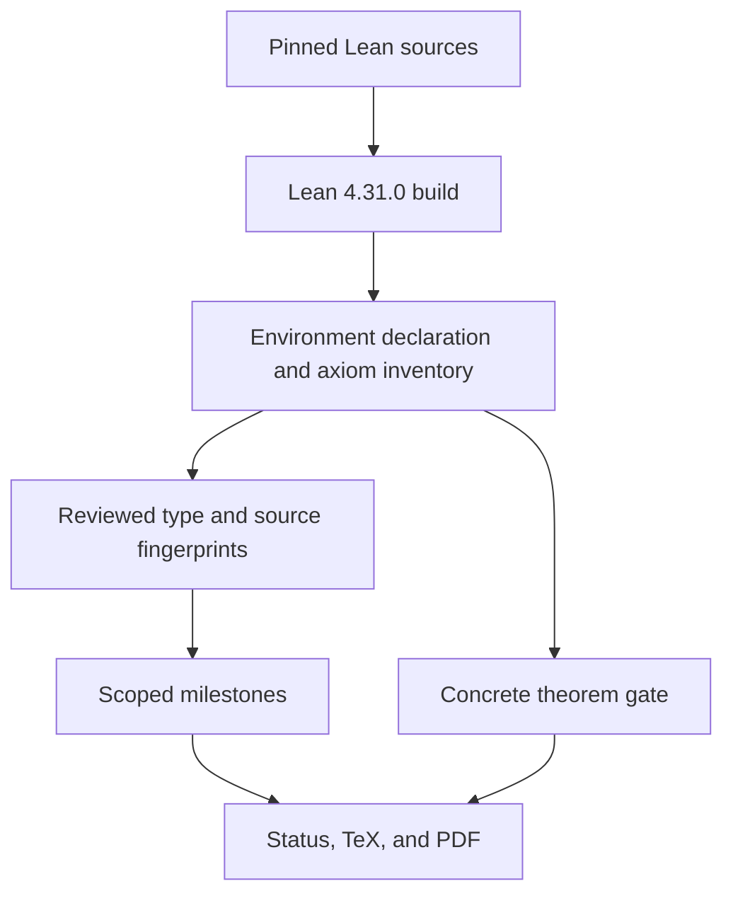

# Formal Evidence Pipeline

## Current Outcome

The repository does not establish `P = NP`. The current public surface is generated from a compiled
Lean theorem inventory, and its concrete publication gate is false.

The pipeline is deliberately one-way:

Status JSON, website copy, report text, hashes, and checker Booleans are downstream publication
artefacts. None can flow backward as theorem evidence.

## Inventory Compilation

The core repository imports the complete `PNP` module closure under the exact pinned Lean toolchain,
walks public environment constants, classifies declaration kinds, and uses Lean's axiom collection
for dependencies. Every public row records name, module, kind, and axiom closure; the 198 reviewed
milestone candidates additionally record raw kernel types for publication fingerprinting. The
canonical output records:

- 5,323 public declarations;
- 2,282 theorem-kind declarations;
- 2,181 assumption-free theorem-kind declarations;
- 51 source-closure modules;
- 1,042 excluded private compiler auxiliaries;
- four project axioms.

The source closure includes every tracked `lean/**/*.lean` source plus the toolchain and Lake build
configuration. Symlinked sources, malformed probe output, private-row forgery, unsorted declarations,
unknown declaration forms, and byte drift reject.

## Earned Milestones

An earned milestone requires all of the following:

1. every reviewed declaration is present with theorem kind;
2. every exact domain-separated kernel-type SHA-256 matches;
3. every declaration has an empty axiom closure;
4. the complete Lean-source closure matches its reviewed digest.

The nine earned scopes are:

| Milestone | Exact scope | Explicit non-claim |
| --- | --- | --- |
| Concrete machine and cost kernel | Executable bitstrings/codecs, finite rule-list machines, collision-free pipeline namespaces, one literal four-stage all-input compiler, sequential raw-machine composition, and recursive function/decision compilation into one raw finite machine with exact verdict/output/no-timeout and explicit external polynomials | This closes the concrete machine link only; CNF-SAT in P, NP-completeness, and `P = NP` remain absent |
| Concrete P, NP, and reductions | Finite charged pipelines, bounded certificates, polynomial reductions, the NP-complete-in-P implication, and recursively compiled exact raw-machine refinements | No concrete SAT completeness/decider or root theorem |
| Concrete universal CNF-SAT verifier | Exact formula/assignment decoding, universal accept/reject semantics, no timeout, and `CNFSAT ∈ NP` | No CNF-SAT in P, NP-completeness, or `P = NP` |
| Typed direct-wire NAND semantics | Topological Boolean NAND programs and ordered multi-output semantics | No minimization, SAT, or `P = NP` |
| Finite enumeration and reference minimum | Exhaustive finite Boolean direct-wire search in the empty-profile model | No polynomial-runtime result |
| Concrete framed replacement and slack | Serial framed contexts with explicit support and bypass wires | No arbitrary-support/global replacement theorem |
| Locked-NAND local baselines | Typed local candidates, source-derived counts, and five finite local square minima | No global `BaselineDistinct` or threshold |
| Conditional threshold boundary | Consequences of a proof-bearing six-premise candidate package | No uniform construction or premise instantiation |
| Explicit-list residual routes | Sound strict-gain search over one caller-supplied finite list | No global completeness or `ZeroSlack` from unresolved |

Three global milestones remain unearned: the unconditional locked-NAND construction/threshold, the
complete ZeroSlack/PCCMin/residual-band polynomial route, and the concrete standard P-vs-NP root.

## Concrete Publication Gate

Publication of any theorem statement requires a concrete standard complexity target and a
compatibility-root theorem with exact reviewed type/value/source/axiom fingerprints. The allowlist is
immutable and contains only `Classical.choice`, `Quot.sound`, and `propext`.

This pass is intentionally non-activating:

- `PNP.Main.ConcretePEqualsNP` is present as an inactive axiom-free charged-pipeline definition, not a proof;
- `PNP.Main.p_eq_np` is absent;
- the expected activation fingerprints are unset;
- unset fingerprints are unconfigured and never match null actual values;
- the abstract string-handle `PNP.PEqualsNP` bridge is categorically ineligible;
- four project axioms and six blockers remain.

Every theorem-emission field is derived from `concretePublicationGate.passed`. Historical accepted
records, JSON values, checker results, or report wording cannot override it.

## Current Public Artefacts

| Artefact | Role |
| --- | --- |
| `public/pnp-theorem-inventory.json` | Byte-identical mirror of the compiled inventory |
| `public/pnp-status.json` | Generated gate, milestone, blocker, and non-claim status |
| `downloads/canonical_proof_report.tex` | Generated non-claiming report source |
| `downloads/canonical_proof_report.pdf` | Deterministic same-environment nine-page report build |
| `downloads/formal-publication-release.json` | Exact merged-core commit and digest map |
| `downloads/release-seal.json` / `SHA256SUMS` | Companion file-identity seal |

PDF determinism here means a same-environment double build followed by exact byte comparison in CI;
it is not a claim of universal cross-toolchain reproducibility.

## Remaining Route To The Target

The six current blockers are:

1. `Formal.ConcreteSAT`;
2. `Formal.LockedNANDThreshold`;
3. `Formal.ResidualBandMinimizer`;
4. `Formal.ZeroSlack`;
5. `Formal.PolynomialRuntimeAndCertificateBounds`;
6. `Formal.RootTheoremAndAxiomAudit`.

Closing them requires concrete formal definitions, unconditional theorems at the required scopes,
polynomial bounds, a concrete root theorem, and an acceptable axiom audit. Publication machinery is
not a substitute for any of those obligations.

## Historical Checker Route

The 56-page 7072f8d manuscript described a SAT-to-locked-NAND, residual-band, `PCCPack`, checker,
replay, and release-gate route. That material remains useful as a list of proposed obligations and
implementation audit targets. It is preserved at source tag
`final-pnp-proof-report-hardened-7072f8d`, commit
`7072f8d0bda6d44d240f9bb3fad624fd357e1278`, with archive coordinates in
`archive/legacy-v0/ARCHIVE.json`.

Historical replay can reproduce assertion-checker behavior. It is not current authority, does not
earn a formal milestone, and cannot satisfy the concrete publication gate.
