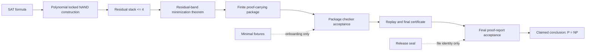

# Proof Pipeline

## Problem Statement

The standard question is whether every language in NP can be decided by a deterministic polynomial-time algorithm. Because SAT is NP-complete, proving `SAT in P` is sufficient to prove `P = NP`.

The report claims to prove `SAT in P` by reducing SAT instances to a constrained NAND minimization problem and then proving that the relevant residual-band exact minimization problem is polynomial when a finite generated package is accepted by the checker stack.

## Claimed Route From SAT To The Target Construction

The report describes a reduction from a SAT formula to a locked multi-output NAND direct-wire word. In conventional terms, this is a many-one reduction from SAT to a circuit-minimization-style decision or optimization task over a restricted NAND representation.

The internal name "locked NAND" refers to the target representation and its macro/slot discipline. The reviewer should first check the usual reduction properties:

- the construction is computable in polynomial time;
- the constructed object has size polynomial in the SAT instance;
- satisfiable and unsatisfiable SAT instances map to distinguishable minimization outcomes;
- the construction does not call an exact minimizer.

## Where Polynomial Time Is Asserted

Polynomial time is asserted at these points:

- SAT-to-locked-NAND construction in Package G;
- bounded truth-table and finite-table checks in the package schedule;
- residual-band exact minimization when residual slack is bounded;
- generated package checking and replay;
- final SAT decision once the accepted package is available.

The report records Package G as checking polynomial construction and residual slack at most four. It records Package PACK as checking bounds, import discipline, no-hidden-minimization, and generated package sufficiency.

## Where Correctness Is Asserted

Correctness is asserted through:

- mathematical lemmas and theorems in the report;
- finite proof objects and row-family records in the generated package;
- checker acceptance records for package, replay, certificate, release gate, and final proof report;
- canonical-byte comparisons linking generator output to accepted records.

This public checkout contains the report and public file seal. It does not contain the full generated package or source/checker implementation, so checker correctness cannot be re-established from this checkout alone.

## Where Minimality Enters

The report uses the residual slack quantity

```text
Lambda(C) = |C| - mu(C)
```

where `|C|` is circuit size and `mu(C)` is the minimum equivalent circuit size in the chosen framework. The proof route is not based on decreasing the root circuit size directly; it is based on bounded residual slack and certified gains or routes.

Minimality is therefore a critical trust point. A reviewer should verify:

- the definition of `mu(C)` and all variants such as open same-frontier minima;
- that the locked NAND construction and the minimizer package use the same size notion;
- that no algorithmic step computes `mu(C)` by hidden exhaustive search;
- that exact-minimization facts appear only as proved/certified fields, not as executable shortcuts.

## Where Hidden Search Could Enter

Hidden exponential work could enter through:

- an executable call to an exact minimizer;
- unbounded enumeration of candidate circuits, cuts, supports, or truth tables;
- a macro or generated template expanding into minimization;
- a digest lookup treated as object equality;
- a proof reference accepted without checking the referenced node;
- an import cycle that lets two packages assume each other's conclusion;
- a quotient-mode equality used as a full-mode constructive replacement.

## How The Checker Is Claimed To Rule Out Hidden Minimization

The report states that the no-hidden-minimization checker expands macros, aliases, generated templates, and imported identifiers before classifying executable occurrences. It rejects executable uses of minimization symbols and aliases such as `minimumEquivalent`, `optimalCircuit`, `exactMinSearch`, `canonicalMinimizer`, and `maximizeGain`.

In this public checkout, `tools/reviewer-fixture-checker.mjs` includes a small educational version of that idea for minimal fixtures. It is not the report's `CheckNoHiddenMin0` and does not validate the theorem.

## Artefacts To Inspect

| Pipeline step | Primary artefact in this checkout | Required external artefact for full audit |
| --- | --- | --- |
| SAT problem statement | `downloads/canonical_proof_report.tex` Sections 1 and 18 | None beyond standard SAT/NP definitions |
| Locked NAND construction | Report Section "Locked NAND and final integration" and Appendix A | Source/checker Package G and `GPack` |
| Residual slack definition | Report Section "Central scale correction" | Source definitions for `mu`, `mu*`, size, and carrier conventions |
| Package sufficiency | Report Sections 18 and 20 | Generated `PCCPack`, reflection registry, global proof DAG |
| Checker acceptance | Report Section "Final proof-report release seal" | `CheckPCCPackexp0`, acceptance run, replay, final certificate, release gate |
| File identity | `downloads/release-seal.json`, `downloads/SHA256SUMS` | Optional sealed artefact tag for full bundle |
| Minimal examples | `examples/minimal/` | None; examples are illustrative only |

## Pipeline Diagram



The dotted edges are not theorem-soundness evidence.
