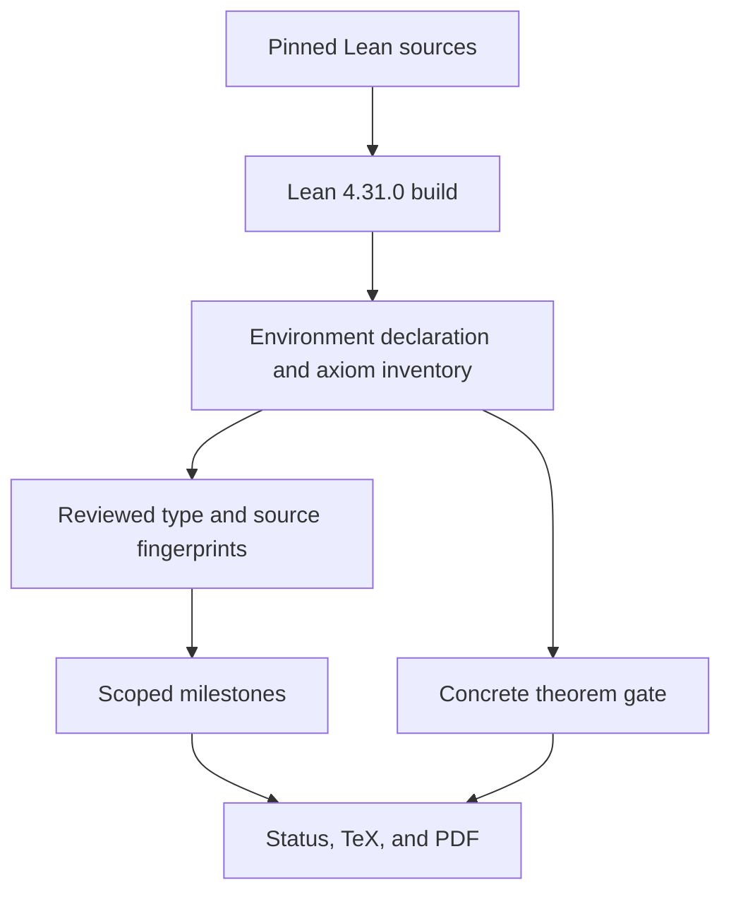

# Formal Evidence Pipeline

## Current Outcome

The repository does not establish `P = NP`. The current public surface is generated from a compiled
Lean theorem inventory, and its concrete publication gate is false.

The pipeline is deliberately one-way:

```mermaid
flowchart TD
  SRC[Pinned Lean sources] --> BUILD[Lean 4.31.0 build]
  BUILD --> INV[Environment declaration and axiom inventory]
  INV --> PIN[Reviewed type and source fingerprints]
  PIN --> MILE[Scoped milestones]
  INV --> GATE[Concrete theorem gate]
  MILE --> PUB[Status, TeX, and PDF]
  GATE --> PUB
```

Status JSON, website copy, report text, hashes, and checker Booleans are downstream publication
artefacts. None can flow backward as theorem evidence.

## Inventory Compilation

The core repository imports the complete `PNP` module closure under the exact pinned Lean toolchain,
walks public environment constants, classifies declaration kinds, and uses Lean's axiom collection
for dependencies. Every public row records name, module, kind, and axiom closure; the 3,120 reviewed
milestone candidates additionally record raw kernel types for publication fingerprinting. The
canonical output records:

- 29,988 public declarations;
- 15,497 theorem-kind declarations;
- 7,613 assumption-free theorem-kind declarations;
- 303 source-closure modules;
- 15,141 excluded private compiler auxiliaries;
- 3 project axioms.

The source closure includes every tracked `lean/**/*.lean` source plus the toolchain and Lake build
configuration. Symlinked sources, malformed probe output, private-row forgery, unsorted declarations,
unknown declaration forms, and byte drift reject.

## Earned Milestones

An earned milestone requires all of the following:

1. every reviewed declaration is present with theorem kind;
2. every exact domain-separated kernel-type SHA-256 matches;
3. every declaration's exact closure contains only approved Lean-standard axioms and no project axiom;
4. the complete Lean-source closure matches its reviewed digest.

The 162 earned formal artefact scopes are:

| Milestone | Exact scope | Explicit non-claim |
| --- | --- | --- |
| Concrete machine and cost kernel | Executable bitstrings/codecs, finite rule-list machines, collision-free pipeline namespaces, one literal four-stage all-input compiler, sequential raw-machine composition, and recursive function/decision compilation into one raw finite machine with exact verdict/output/no-timeout and explicit external polynomials | This closes the concrete machine link only; CNF-SAT in P, NP-completeness, and `P = NP` remain absent |
| Concrete P, NP, and reductions | Finite charged pipelines, bounded certificates, polynomial reductions, the NP-complete-in-P implication, and recursively compiled exact raw-machine refinements | No concrete SAT completeness/decider or root theorem |
| Concrete universal CNF-SAT verifier | Exact formula/assignment decoding, universal accept/reject semantics, no timeout, and `CNFSAT ∈ NP` | No CNF-SAT in P, NP-completeness, or `P = NP` |
| Cook-Levin dimensions and layout | Executable tableau dimensions and disjoint, in-range Boolean-variable blocks | Layout alone is not a CNF reduction |
| Fixed-certificate tableau | Canonical bounded raw traces characterized by intrinsic transition validity | Fixed-certificate semantics alone does not emit CNF |
| Uniform verifier tableau | Language membership equivalent to an existential bounded accepting tableau | No Boolean encoding or reduction polynomial follows alone |
| Local CNF compiler | Finite local constraints compile to scoped clauses with exact satisfaction and clause counts | Does not enumerate the whole verifier tableau |
| Whole-tableau CNF syntax | Answer-independent finite formula encoding initialization, transitions, preservation, and acceptance | Syntax alone is not the final semantic or complexity theorem |
| Whole-tableau CNF semantics | Formula satisfaction exactly equivalent to an intrinsic accepting tableau, using only approved Lean-standard axioms | Still requires the concrete raw-tape execution bridge |
| Cook-Levin raw-tape bridge | `encodedFormula_mem_CNFSAT_iff_language` proves exact equivalence between generated-CNF satisfiability and concrete verifier-language membership | Semantic correctness alone is not a size/runtime or packaged reduction theorem |
| External Cook-Levin encoded-formula size | `encodedFormula_size_le` bounds the actual canonical unary-indexed encoding by an explicit fixed-verifier polynomial in external source-input length | No raw formula builder or construction-runtime polynomial, packaged polynomial reduction, NP-completeness, CNF-SAT in P, or `P = NP` |
| Rectangular Cook-Levin formula schedule | Exact answer-independent constraint, clause, token, and raw-bit slot rectangles emit the existing program and encoding; `formulaBitSchedule_length` is exactly the external-input size polynomial and `formulaBitSchedule_emit_eq_encodedFormula` reproduces the encoded formula | Pure schedule only: no constant-time raw slot action, raw builder, construction-runtime polynomial, `FunctionProgram.RawRefinement`, packaged reduction, NP-completeness, CNF-SAT in P, or `P = NP` |
| Direct Cook-Levin formula cursor | Direct constraint, clause, token, and bit coordinate decoders preserve out-of-range/padding/populated states; exact prefix, full, one-step-short, terminal, excess-fuel, polynomial-count, and emitted-output theorems bind the cursor to the canonical formula | Lean specification cursor only: no constant-time raw interpretation, raw builder, construction-runtime theorem, `FunctionProgram.RawRefinement`, packaged reduction, NP-completeness, CNF-SAT in P, or `P = NP` |
| Literal Cook-Levin input-length tally | A fixed 19-rule work machine is definitionally connected to the total input-framer endpoint, preserves source bits, appends exact unary length, runs in exactly `2*n*n + 4*n + 2` work and `12*n*n + 24*n + 12` compiled raw steps, and times out for malformed internal scan symbols or one-step-short fuel | No formula-bit emission, complete raw formula builder, `FunctionProgram.RawRefinement`, packaged reduction, NP-completeness, CNF-SAT in P, or `P = NP` |
| Executable Cook-Levin builder input prefix | One literal finite work machine composes the all-input framer, an explicit launch transition, and the 19-rule tally in collision-free namespaces; it reaches the represented final tape after exactly `totalInputFramerWorkSteps(input) + 1 + 2*n*n + 4*n + 2` work steps and has compiled raw bound `18*n*n + 63*n + 93`; malformed tally-scan symbols and one-step-short fuel time out | No formula-bit emission, direct cursor interpretation by raw transitions, complete raw formula builder, builder `FunctionProgram.RawRefinement`, packaged reduction, NP-completeness, CNF-SAT in P, or `P = NP` |
| Standalone Cook-Levin builder token appender | A fixed 59-rule finite machine appends each requested token exactly for arbitrary represented input, tally, prior output, and exterior tape; its first-header specialization emits the first two direct formula bits and has compiled raw bound `24*n + 48`; malformed phase symbols and one-step-short fuel time out | Independently audited reusable component; the next row records its composed first-token use, but neither result supplies the remaining header/body traversal or a complete raw builder |
| Composed Cook-Levin first-token prefix | One literal 184-rule table contains the 116-rule input prefix, nine symbol-preserving bridges, and 59-rule appender under injective disjoint state maps; every raw input emits exactly the first `T` token, its bits equal `encodedFormula.take 2`, and compiled raw cost is bounded by `18*n*n + 87*n + 147`; malformed phase and one-step-short cases time out | No remaining width header, dynamic cursor controller, complete raw formula builder, builder `FunctionProgram.RawRefinement`, packaged reduction, NP-completeness, CNF-SAT in P, or `P = NP` |
| Composed Cook-Levin complete width header | One literal finite table composes the 184-rule prefix, structurally generated unary polynomial evaluator, 16-rule controller, two 59-rule appender copies, and five total bridges in pairwise-disjoint state images; every raw input emits exactly `FormulaWidth` copies of `T` followed by `F`, equal to `encodedFormula.take (2 * (FormulaWidth + 1))`, under an external `NatPolynomial` compiled-time bound | Complete answer-independent width header only: no dynamic cursor controller, formula body, complete raw builder, builder `FunctionProgram.RawRefinement`, packaged reduction, NP-completeness, CNF-SAT in P, or `P = NP` |
| Composed Cook-Levin body-start prefix | One literal finite table composes the complete width header, a unary next-token-slot evaluator, and the reusable appender; every raw input emits `T^FormulaWidth F Sep`, and the final exterior retains `formulaVariableSlotBound + 2` under an external `NatPolynomial` compiled-time bound | Fixed separator and coordinate only: no dynamic cursor controller, subsequent body tokens, complete raw builder, builder `FunctionProgram.RawRefinement`, packaged reduction, NP-completeness, CNF-SAT in P, or `P = NP` |
| Composed Cook-Levin first-literal prefix | One literal finite table composes the body-start prefix, a unary next-token-slot evaluator, and two appender copies; every raw input emits `T^FormulaWidth F Sep T F`, the canonical first positive literal for variable zero, and the final exterior retains `formulaVariableSlotBound + 4` under an external `NatPolynomial` compiled-time bound | Fixed first literal and coordinate only: no dynamic cursor controller, remaining body tokens, complete raw builder, builder `FunctionProgram.RawRefinement`, packaged reduction, NP-completeness, CNF-SAT in P, or `P = NP` |
| Composed Cook-Levin first-clause prefix | One literal finite table composes the first-literal prefix, a unary next-token-slot evaluator, and a fixed eight-token tail; every raw input emits `T^FormulaWidth F Sep T F T T F T T T F Finish`, the complete positive first clause on variables zero, one, and two, and the final exterior retains `formulaVariableSlotBound + 12` under an external `NatPolynomial` compiled-time bound | Complete first clause and retained coordinate only: no dynamic cursor controller, remaining body tokens, complete raw builder, builder `FunctionProgram.RawRefinement`, packaged reduction, NP-completeness, CNF-SAT in P, or `P = NP` |
| Literal Cook-Levin token-cursor padding step | One literal table with `1192` plus four inherited unary-evaluator rule counts composes the complete first clause, nine launch rules, and a fixed 45-rule cursor advance; every raw input preserves the output, consumes the proved first valid-padding opportunity, advances the unary coordinate from `FormulaVariableSlotBound + 12` to `+ 13`, and adds exactly `2*cursorWord.length + 8` work steps within `BuilderFirstClausePrefix.rawTimeBound + 48 + 12*cursorWord.length` compiled steps | One padding transition only: no general dynamic cursor loop, arbitrary raw slot decoder, emitted token, remaining formula body, complete raw builder, builder `FunctionProgram.RawRefinement`, packaged reduction, NP-completeness, CNF-SAT in P, or `P = NP` |
| Literal Cook-Levin first-clause padding run | One literal table with `1244` plus six inherited/generated unary-evaluator rule counts composes the preceding cursor step, two unary evaluators, and a fixed 25-rule countdown; every raw input executes exactly `D = (FormulaVariableSlotBound - 1) * (FormulaVariableSlotBound + 6) = FormulaTokensPerClause - 12` remaining padding opportunities without emission and reaches `FormulaVariableSlotBound + 1 + FormulaTokensPerClause`, where the next direct outcome is `Sep`, under an external `NatPolynomial` compiled bound | Exact remaining first-clause padding block and second-clause boundary only: no general dynamic formula cursor, remaining formula body, complete raw builder, builder `FunctionProgram.RawRefinement`, packaged reduction, NP-completeness, CNF-SAT in P, or `P = NP` |
| Literal Cook-Levin second-clause separator step | One literal table with `1366` plus six inherited/generated unary-evaluator rule counts composes the complete padding run, a selected 59-rule `Sep` appender, two total nine-symbol bridges, and the fixed 45-rule cursor advance; every raw input emits the canonical separator beginning clause two, advances the retained coordinate by one, emits `encodedFormula.take (2 * (FormulaWidth + 13))`, and proves the following direct token is `F`, within `BuilderFirstClausePaddingRun.rawTimeBound + 246 + 24*n + 12*FormulaWidth + 12*cursorWord.length` compiled steps | One fixed populated transition only: no general dynamic formula cursor, emitted following `F`, remaining formula body, complete raw builder, builder `FunctionProgram.RawRefinement`, packaged reduction, NP-completeness, CNF-SAT in P, or `P = NP` |
| Literal Cook-Levin clause-two first negative literal | One literal table with `1610` plus six inherited/generated unary-evaluator rule counts composes the separator prefix, two selected 59-rule `F` appenders, four total symbol-preserving bridges, and two fixed 45-rule cursor advances; every raw input emits `T^FormulaWidth F Sep T F T T F T T T F Finish Sep F F`, advances to `secondClauseStart + 3`, and emits `encodedFormula.take (2 * (FormulaWidth + 15))`, within `BuilderSecondClauseSeparatorStep.rawTimeBound + 564 + 48*n + 24*FormulaWidth + 24*cursorWord.length` compiled steps | One fixed negative literal only: no completed clause two, general dynamic formula cursor, remaining formula body, complete raw builder, builder `FunctionProgram.RawRefinement`, packaged reduction, NP-completeness, CNF-SAT in P, or `P = NP` |
| Literal Cook-Levin clause-two second negative literal | One literal table with `1976` plus six inherited/generated unary-evaluator rule counts composes the first-literal prefix, selected 59-rule `F`, `T`, and `F` appenders, six total symbol-preserving bridges, and three fixed 45-rule cursor advances; every raw input emits `T^FormulaWidth F Sep T F T T F T T T F Finish Sep F F F T F`, retains `secondClauseStart + 6` at the following `Finish`, and emits `encodedFormula.take (2 * (FormulaWidth + 18))`, within `BuilderSecondClauseFirstLiteralPrefix.rawTimeBound + 1026 + 72*n + 36*FormulaWidth + 36*cursorWord.length` compiled steps | One fixed negative literal only: the retained `Finish` and clause terminator are not emitted; no completed clause two, general dynamic formula cursor, remaining formula body, complete raw builder, builder `FunctionProgram.RawRefinement`, packaged reduction, NP-completeness, CNF-SAT in P, or `P = NP` |
| Literal Cook-Levin complete clause-two prefix | One literal table with `2098` plus six inherited/generated unary-evaluator rule counts composes the second-literal prefix, one selected 59-rule `Finish` appender, two total symbol-preserving bridges, and one fixed 45-rule cursor advance; every raw input emits `T^FormulaWidth F Sep T F T T F T T T F Finish Sep F F F T F Finish`, retains `secondClauseStart + 7` at the first padding coordinate, and emits `encodedFormula.take (2 * (FormulaWidth + 19))`, within `BuilderSecondClauseSecondLiteralPrefix.rawTimeBound + 390 + 24*n + 12*FormulaWidth + 12*cursorWord.length` compiled steps | One fixed clause prefix only: no clause-two padding traversal, clause three, general dynamic formula cursor, remaining formula body, complete raw builder, builder `FunctionProgram.RawRefinement`, packaged reduction, NP-completeness, CNF-SAT in P, or `P = NP` |
| Literal Cook-Levin clause-two padding run | One literal table with `2150` plus eight inherited/generated unary-evaluator rule counts composes the complete second-clause prefix, two unary evaluators, the fixed 25-rule padding countdown, and three total bridges; every raw input traverses `D = FormulaTokensPerClause - 7` remaining padding coordinates without emission, reaches `FormulaVariableSlotBound + 1 + 2 * FormulaTokensPerClause`, retains direct `Sep`, and preserves `encodedFormula.take (2 * (FormulaWidth + 19))` within an external input-size polynomial | Exact remaining clause-two padding only: no separator emission, general dynamic formula cursor, remaining formula body, complete raw builder, builder `FunctionProgram.RawRefinement`, packaged reduction, NP-completeness, CNF-SAT in P, or `P = NP` |
| Literal Cook-Levin third-clause separator step | One literal table with `2272` plus eight inherited/generated unary-evaluator rule counts composes the complete clause-two padding run, a selected 59-rule `Sep` appender, two total nine-symbol bridges, and one fixed 45-rule cursor advance; every raw input emits the fixed separator beginning clause three, advances the retained coordinate by one, emits `encodedFormula.take (2 * (FormulaWidth + 20))`, and proves the following direct token is `F`, within `BuilderSecondClausePaddingRun.rawTimeBound + 330 + 24*n + 12*FormulaWidth + 12*cursorWord.length` compiled steps | One fixed populated transition only: no emitted following `F`, general dynamic formula cursor, remaining formula body, complete raw builder, builder `FunctionProgram.RawRefinement`, packaged reduction, NP-completeness, CNF-SAT in P, or `P = NP` |
| Literal Cook-Levin clause-three first negative literal | One literal table with `2516` plus eight inherited/generated unary-evaluator rule counts composes the complete third-clause separator prefix with the reused 235-rule two-`F` appender/cursor suffix behind one total nine-symbol bridge; every raw input emits the complete negative literal on variable zero in clause three, retains `thirdClauseStart + 3`, emits `encodedFormula.take (2 * (FormulaWidth + 22))`, and proves the literal sign, zero terminator, and following direct token are all `F`, within `BuilderThirdClauseSeparatorStep.rawTimeBound + 732 + 48*n + 24*FormulaWidth + 24*cursorWord.length` compiled steps | One fixed negative literal only: no emitted following `F`, completed clause three, general dynamic formula cursor, remaining formula body, complete raw builder, builder `FunctionProgram.RawRefinement`, packaged reduction, NP-completeness, CNF-SAT in P, or `P = NP` |
| Literal Cook-Levin clause-three second negative literal | One literal table with `3004` plus eight inherited/generated unary-evaluator rule counts composes the complete first-literal prefix with a fixed 479-rule `F T T F` appender/cursor suffix behind one total nine-symbol bridge; nested tables have 113, 235, 357, and 479 rules, every raw input emits the complete negative literal on variable two in clause three, retains `thirdClauseStart + 7`, emits `encodedFormula.take (2 * (FormulaWidth + 26))`, and proves the sign `F`, both unary units `T`, terminator `F`, and following token `Finish`, within `BuilderThirdClauseFirstLiteralPrefix.rawTimeBound + 1752 + 96*n + 48*FormulaWidth + 48*cursorWord.length` compiled steps | One fixed negative literal only: no emitted following `Finish`, completed clause three, general dynamic formula cursor, remaining formula body, complete raw builder, builder `FunctionProgram.RawRefinement`, packaged reduction, NP-completeness, CNF-SAT in P, or `P = NP` |
| Literal Cook-Levin complete clause-three prefix | One literal table with `3126` plus eight inherited/generated unary-evaluator rule counts composes the complete second-literal prefix, a selected 59-rule `Finish` appender, two total symbol-preserving bridges, and the existing 45-rule cursor advance; the fixed suffix has 113 rules, every raw input emits the complete third clause, retains `thirdClauseStart + 8` at the first padding coordinate, emits `encodedFormula.take (2 * (FormulaWidth + 27))`, and proves the executed opportunity is `Finish` and the retained next opportunity is padding, within `BuilderThirdClauseSecondLiteralPrefix.rawTimeBound + 498 + 24*n + 12*FormulaWidth + 12*BuilderThirdClauseSeparatorStep.cursorWord.length` compiled steps | Complete fixed third clause only: no clause-three padding traversal, general dynamic formula cursor, remaining formula body, complete raw builder, builder `FunctionProgram.RawRefinement`, packaged reduction, NP-completeness, CNF-SAT in P, or `P = NP` |
| Literal Cook-Levin third-clause remaining-padding run | One literal table with `3178` plus ten inherited/generated unary-evaluator rule counts composes the complete third-clause prefix, two unary-polynomial evaluators, the reused 25-rule padding countdown, and three total symbol-preserving bridges; every raw input traverses `FormulaTokensPerClause - 8` padding coordinates without emission, preserves `encodedFormula.take (2 * (FormulaWidth + 27))`, reaches `FormulaVariableSlotBound + 1 + 3 * FormulaTokensPerClause`, and proves direct lookup is `Sep`, within `BuilderThirdClausePrefix.rawTimeBound + 18 + 6*countEvaluator.workSteps + 6*(D*(2*countRootPrefixLength + 8) + D*D) + 6*targetEvaluator.workSteps` compiled steps | Complete remaining third-clause padding run only: no fourth-clause separator emission, general dynamic formula cursor, remaining formula body, complete raw builder, builder `FunctionProgram.RawRefinement`, packaged reduction, NP-completeness, CNF-SAT in P, or `P = NP` |
| Literal Cook-Levin fourth-clause separator step | One literal table with `3300` plus ten inherited/generated unary-evaluator rule counts composes the complete third-clause padding run with the reused 113-rule selected `Sep` appender/cursor machine through one total nine-symbol bridge; every raw input emits exactly the fixed separator beginning clause four, preserves `encodedFormula.take (2 * (FormulaWidth + 28))`, advances to `FormulaVariableSlotBound + 1 + 3 * FormulaTokensPerClause + 1`, and proves the following direct token is `F`, within `BuilderThirdClausePaddingRun.rawTimeBound + 426 + 24*n + 12*FormulaWidth + 12*cursorWord.length` compiled steps | One fixed populated transition only: no emitted following `F`, completed clause four, general dynamic formula cursor, remaining formula body, complete raw builder, builder `FunctionProgram.RawRefinement`, packaged reduction, NP-completeness, CNF-SAT in P, or `P = NP` |
| Literal Cook-Levin fourth-clause first negative literal | One literal table with `3666` plus ten inherited/generated unary-evaluator rule counts composes the complete fourth-clause separator prefix with the reused 357-rule `F T F` appender/cursor suffix through one outer total nine-symbol bridge; every raw input emits the complete first negative literal on variable one in clause four, preserves `encodedFormula.take (2 * (FormulaWidth + 31))`, advances to `FormulaVariableSlotBound + 1 + 3 * FormulaTokensPerClause + 4`, and proves the following direct token is `F`, within `BuilderFourthClauseSeparatorStep.rawTimeBound + 1422 + 72*n + 36*FormulaWidth + 36*cursorWord.length` compiled steps | One fixed negative literal only: no emitted following `F`, completed clause four, general dynamic formula cursor, remaining formula body, complete raw builder, builder `FunctionProgram.RawRefinement`, packaged reduction, NP-completeness, CNF-SAT in P, or `P = NP` |
| Literal Cook-Levin fourth-clause second negative literal | One literal table with `4154` plus ten inherited/generated unary-evaluator rule counts composes the complete first-literal prefix with the reused 479-rule `F T T F` appender/cursor suffix through one outer total nine-symbol bridge; every raw input emits the complete second negative literal on variable two in clause four, preserves `encodedFormula.take (2 * (FormulaWidth + 35))`, advances to `FormulaVariableSlotBound + 1 + 3 * FormulaTokensPerClause + 8`, and proves the following direct token is `Finish`, within `BuilderFourthClauseFirstLiteralPrefix.rawTimeBound + 2232 + 96*n + 48*FormulaWidth + 48*cursorWord.length` compiled steps. The 147-declaration audit covers 124 new declarations, 21 reused suffix interfaces, and two cursor dead-state facts | One fixed negative literal only: no emitted following `Finish`, completed clause four, general dynamic formula cursor, remaining formula body, complete raw builder, builder `FunctionProgram.RawRefinement`, packaged reduction, NP-completeness, CNF-SAT in P, or `P = NP` |
| Literal Cook-Levin complete fourth clause | One literal table with `4276` plus ten inherited/generated unary-evaluator rule counts composes the complete fourth-clause second-literal prefix with a selected 59-rule `Finish` appender, the existing 45-rule cursor advance, and two total nine-symbol bridges; every raw input emits the `Finish` that completes clause four, preserves `encodedFormula.take (2 * (FormulaWidth + 36))`, advances to `FormulaVariableSlotBound + 1 + 3 * FormulaTokensPerClause + 9`, and proves the next direct token is padding, within `BuilderFourthClauseSecondLiteralPrefix.rawTimeBound + 618 + 24*n + 12*FormulaWidth + 12*BuilderFourthClauseSeparatorStep.cursorWord.length` compiled steps. The 57-declaration audit covers 55 new declarations and two cursor dead-state facts | One complete fixed clause only: no clause-four padding traversal, general dynamic formula cursor, remaining formula body, complete raw builder, builder `FunctionProgram.RawRefinement`, packaged reduction, NP-completeness, CNF-SAT in P, or `P = NP` |
| Literal Cook-Levin fourth-clause remaining-padding run | One literal table with `4328` plus twelve inherited/generated unary-evaluator rule counts composes the complete fourth-clause prefix with two unary-polynomial evaluators, the reused 25-rule padding countdown, and three total nine-symbol bridges; every raw input traverses `FormulaTokensPerClause - 9` padding opportunities without emission, preserves `encodedFormula.take (2 * (FormulaWidth + 36))`, reaches `FormulaVariableSlotBound + 1 + 4 * FormulaTokensPerClause`, and proves direct and specification-cursor lookup are padding in the intentionally empty fifth clause rectangle, within `BuilderFourthClausePrefix.rawTimeBound + 18` plus six times the count-evaluator work, countdown bound, and target-evaluator work. The 68-declaration audit covers 65 new declarations and three reused countdown interfaces | Complete remaining fourth-clause padding run only: no traversal of the empty fifth rectangle, next-constraint access, further token emission, general dynamic formula cursor, remaining formula body, complete raw builder, builder `FunctionProgram.RawRefinement`, packaged reduction, NP-completeness, CNF-SAT in P, or `P = NP` |
| Literal Cook-Levin empty fifth-clause padding run | One literal table with `4380` plus fourteen inherited/generated unary-evaluator rule counts composes the complete fourth-clause padding run with two unary-polynomial evaluators, the reused 25-rule padding countdown, and three total nine-symbol bridges; every raw input traverses all `FormulaTokensPerClause` opportunities in the intentionally empty fifth clause rectangle without emission, preserves `encodedFormula.take (2 * (FormulaWidth + 36))`, reaches `FormulaVariableSlotBound + 1 + 5 * FormulaTokensPerClause`, and proves every traversed opportunity and the retained target in the intentionally empty sixth clause rectangle are padding, within `BuilderFourthClausePaddingRun.rawTimeBound + 18` plus six times the count-evaluator work, countdown bound, and target-evaluator work. The 68-declaration audit covers 65 new declarations and three reused countdown interfaces | Complete fifth-clause rectangle traversal only: no traversal of the empty sixth rectangle, next-constraint access, further token emission, general dynamic formula cursor, remaining formula body, complete raw builder, builder `FunctionProgram.RawRefinement`, packaged reduction, NP-completeness, CNF-SAT in P, or `P = NP` |
| Literal Cook-Levin remaining first-constraint padding run | One literal table with `4464` plus sixteen inherited/generated unary-evaluator rule counts composes the fifth-clause padding predecessor with two unary-polynomial evaluators, the reused 25-rule padding countdown, and three total nine-symbol bridges; every raw input traverses `(FormulaVariableSlotBound - 2) * (FormulaVariableSlotBound + 2) * FormulaTokensPerClause` remaining padding opportunities in the first scheduled constraint without emission, preserves `encodedFormula.take (2 * (FormulaWidth + 36))`, reaches `FormulaVariableSlotBound + 1 + FormulaClauseSlotsPerConstraint * FormulaTokensPerClause`, and proves every traversed opportunity is padding and the retained direct token is the `Sep` beginning the second scheduled constraint, within `BuilderFifthClausePaddingRun.rawTimeBound + 18` plus six times the count-evaluator work, countdown bound, and target-evaluator work. The 68-declaration audit covers 65 new declarations and three reused countdown interfaces | Complete remaining first-constraint padding traversal only: no emitted second-constraint separator or following literal, general dynamic formula cursor, remaining formula body, complete raw builder, builder `FunctionProgram.RawRefinement`, packaged reduction, NP-completeness, CNF-SAT in P, or `P = NP` |
| Literal Cook-Levin second-constraint separator step | One literal table with `4554` plus sixteen inherited/generated unary-evaluator rule counts composes the complete first-constraint padding run with the selected 59-rule `Sep` appender, 45-rule cursor advance, and one outer nine-symbol bridge; every raw input follows exact component and combined traces, emits exactly the `Sep` beginning the second scheduled constraint, preserves `encodedFormula.take (2 * (FormulaWidth + 37))`, reaches `FormulaVariableSlotBound + 1 + FormulaClauseSlotsPerConstraint * FormulaTokensPerClause + 1`, and proves the direct next token is `T`, within `BuilderFirstConstraintPaddingRun.rawTimeBound + 534 + 24*n + 12*FormulaWidth + 12*cursorWord.length`. The 56-declaration audit covers 48 new public declarations and eight reused separator/cursor interfaces | Exactly one emitted separator only: no following `T` or first literal, second-constraint traversal, general dynamic formula cursor, remaining formula body, complete raw builder, builder `FunctionProgram.RawRefinement`, packaged reduction, NP-completeness, CNF-SAT in P, or `P = NP` |
| Literal Cook-Levin second-constraint first-literal sign step | One literal table with `4676` plus sixteen inherited/generated unary-evaluator rule counts composes the complete second-constraint separator with the reused 113-rule selected `T` appender/cursor suffix through one outer nine-symbol bridge; every raw input follows exact prefix, appender, cursor, bridge, suffix, and combined traces, emits exactly the positive `T` sign beginning the first literal in the second scheduled constraint, preserves `encodedFormula.take (2 * (FormulaWidth + 38))`, reaches `FormulaVariableSlotBound + 1 + FormulaClauseSlotsPerConstraint * FormulaTokensPerClause + 2`, and proves the direct next token is the unary `T` beginning variable zero, within `BuilderSecondConstraintSeparatorStep.rawTimeBound + 546 + 24*n + 12*FormulaWidth + 12*cursorWord.length`. The 56-declaration audit covers 48 new public declarations and eight reused appender/cursor and dead-state interfaces | Exactly one emitted positive sign only: no following unary `T`, completed first literal, second-constraint traversal, general dynamic formula cursor, remaining formula body, complete raw builder, builder `FunctionProgram.RawRefinement`, packaged reduction, NP-completeness, CNF-SAT in P, or `P = NP` |
| Literal Cook-Levin second-constraint first-literal first unary-unit step | One literal table with `4798` plus sixteen inherited/generated unary-evaluator rule counts composes the completed sign step with the reused selected 59-rule `T` appender and 45-rule cursor advance through one outer nine-symbol bridge; every raw input follows exact prefix, appender, cursor, bridge, suffix, and combined traces, emits exactly the first unary `T` of the second scheduled constraint's first variable index, preserves `encodedFormula.take (2 * (FormulaWidth + 39))`, reaches `FormulaVariableSlotBound + 1 + FormulaClauseSlotsPerConstraint * FormulaTokensPerClause + 3`, and proves the direct next token is the second unary `T`, within `BuilderSecondConstraintFirstLiteralSignStep.rawTimeBound + 558 + 24*n + 12*FormulaWidth + 12*cursorWord.length`. The 56-declaration audit covers 48 new public declarations and eight reused true-token/cursor interfaces | Exactly one emitted unary unit only: no following second unary `T`, completed first literal, second-constraint traversal, general dynamic formula cursor, remaining formula body, complete raw builder, builder `FunctionProgram.RawRefinement`, packaged reduction, NP-completeness, CNF-SAT in P, or `P = NP` |
| Literal Cook-Levin second-constraint first-literal second unary-unit step | One literal table with `4920` plus sixteen inherited/generated unary-evaluator rule counts composes the completed first-unary-unit step with the reused selected 59-rule `T` appender and 45-rule cursor advance through one outer nine-symbol bridge; every raw input follows exact prefix, appender, cursor, bridge, suffix, and combined traces, emits exactly the second unary `T` of the second scheduled constraint's first variable index, preserves `encodedFormula.take (2 * (FormulaWidth + 40))`, reaches `FormulaVariableSlotBound + 1 + FormulaClauseSlotsPerConstraint * FormulaTokensPerClause + 4`, and proves the direct next token is the third unary `T`, within `BuilderSecondConstraintFirstLiteralFirstUnaryUnitStep.rawTimeBound + 570 + 24*n + 12*FormulaWidth + 12*cursorWord.length`. The 56-declaration audit covers 48 new public declarations and eight reused true-token/cursor interfaces | Exactly one additional emitted unary unit only: no following third unary `T`, completed first literal, second-constraint traversal, general dynamic formula cursor, remaining formula body, complete raw builder, builder `FunctionProgram.RawRefinement`, packaged reduction, NP-completeness, CNF-SAT in P, or `P = NP` |
| Literal Cook-Levin second-constraint first-literal third unary-unit step | One literal table with `5042` plus sixteen inherited/generated unary-evaluator rule counts composes the completed second-unary-unit step with the reused selected 59-rule `T` appender and 45-rule cursor advance through one outer nine-symbol bridge; every raw input follows exact prefix, appender, cursor, bridge, suffix, and combined traces, emits exactly the third and final unary `T` of the second scheduled constraint's first variable index, preserves `encodedFormula.take (2 * (FormulaWidth + 41))`, reaches `FormulaVariableSlotBound + 1 + FormulaClauseSlotsPerConstraint * FormulaTokensPerClause + 5`, and proves the direct next token is the terminating `F`, within `BuilderSecondConstraintFirstLiteralSecondUnaryUnitStep.rawTimeBound + 582 + 24*n + 12*FormulaWidth + 12*cursorWord.length`. The 56-declaration audit covers 48 new public declarations and eight reused true-token/cursor interfaces | Exactly one additional emitted unary unit only: no following terminating `F`, completed first literal, second-constraint traversal, general dynamic formula cursor, remaining formula body, complete raw builder, builder `FunctionProgram.RawRefinement`, packaged reduction, NP-completeness, CNF-SAT in P, or `P = NP` |
| Literal Cook-Levin second-constraint first-literal terminator step | One literal table with `5164` plus sixteen inherited/generated unary-evaluator rule counts composes the completed third-unary-unit step with the reused selected 59-rule `F` appender and 45-rule cursor advance through one outer nine-symbol bridge; every raw input follows exact prefix, appender, cursor, bridge, suffix, and combined traces, emits exactly the terminating `F` of the second scheduled constraint's first literal, preserves `encodedFormula.take (2 * (FormulaWidth + 42))`, reaches `FormulaVariableSlotBound + 1 + FormulaClauseSlotsPerConstraint * FormulaTokensPerClause + 6`, and proves the direct next token is `Finish` at width one and the positive `T` beginning the next literal at wider widths, within `BuilderSecondConstraintFirstLiteralThirdUnaryUnitStep.rawTimeBound + 594 + 24*n + 12*FormulaWidth + 12*cursorWord.length`. The 56-declaration audit covers 48 new public declarations and eight reused false-token/cursor and dead-state interfaces | Exactly one emitted literal terminator only: no following width-dependent `Finish` or `T`, second-constraint traversal, general dynamic formula cursor, remaining formula body, complete raw builder, builder `FunctionProgram.RawRefinement`, packaged reduction, NP-completeness, CNF-SAT in P, or `P = NP` |
| Literal Cook-Levin second-constraint first-literal successor-token step | One literal table with `5284` plus eighteen inherited/generated unary-evaluator rule counts composes the completed terminator with represented-width evaluation, a 93-rule width branch selecting one reused 59-rule token appender, and retained-coordinate evaluation through three nine-symbol bridges; every raw input follows exact predecessor, evaluator, branch/appender, bridge, suffix, and combined traces, emits `Finish` exactly at width one or positive `T` at wider widths, preserves `encodedFormula.take (2 * (FormulaWidth + 43))`, reaches `FormulaVariableSlotBound + 1 + FormulaClauseSlotsPerConstraint * FormulaTokensPerClause + 7`, and proves the following opportunity is padding at width one or unary `T` at wider widths, within `BuilderSecondConstraintFirstLiteralTerminatorStep.rawTimeBound + 600 + 24*n + 12*FormulaWidth + 12*width + 12*widthRootPrefixLength + 6*widthWorkSteps + 6*targetWorkSteps`. The 82-declaration audit covers 80 new public declarations and two strengthened predecessor boundary lemmas | Exactly one emitted width-selected token only: no following padding or unary token, second-constraint traversal, general dynamic formula cursor, remaining formula body, complete raw builder, builder `FunctionProgram.RawRefinement`, packaged reduction, NP-completeness, CNF-SAT in P, or `P = NP` |
| Literal Cook-Levin second-constraint padding-or-unary opportunity step | One literal table with `5404` plus twenty inherited/generated unary-evaluator rule counts composes the completed width-selected successor-token step with represented-width evaluation, a 93-rule optional appender, and retained-coordinate evaluation through three nine-symbol bridges; every raw input follows exact predecessor, evaluator, width-one skip or wider-width appender, bridge, suffix, and combined traces, consumes padding without emission at width one or emits the first unary `T` of the second literal at wider widths, preserves `encodedFormula.take (2 * (FormulaWidth + 43 + if tapeWidth = 1 then 0 else 1))`, reaches `FormulaVariableSlotBound + 1 + FormulaClauseSlotsPerConstraint * FormulaTokensPerClause + 8`, and proves the following opportunity is again padding at width one or the second unary `T` at wider widths, within `BuilderSecondConstraintFirstLiteralSuccessorTokenStep.rawTimeBound + 612 + 24*n + 12*FormulaWidth + 12*width + 12*widthRootPrefixLength + 6*widthWorkSteps + 6*targetWorkSteps`. The 82-declaration audit covers 80 new public declarations and two strengthened schedule lemmas | Exactly one handled width-dependent opportunity only: no following padding or second unary token, second-constraint traversal, general dynamic formula cursor, remaining formula body, complete raw builder, builder `FunctionProgram.RawRefinement`, packaged reduction, NP-completeness, CNF-SAT in P, or `P = NP` |
| Literal Cook-Levin second-constraint second padding-or-unary opportunity step | One literal table with `5524` plus twenty-two inherited/generated unary-evaluator rule counts composes the completed first padding-or-unary opportunity with represented-width evaluation, the same reviewed 93-rule optional appender, and retained-coordinate evaluation through three nine-symbol bridges; every raw input follows exact predecessor, evaluator, width-one skip or wider-width appender, bridge, suffix, and combined traces, consumes another padding slot without emission at width one or emits the second unary `T` of the second literal at wider widths, preserves `encodedFormula.take (2 * (FormulaWidth + 43 + if tapeWidth = 1 then 0 else 2))`, reaches `FormulaVariableSlotBound + 1 + FormulaClauseSlotsPerConstraint * FormulaTokensPerClause + 9`, and proves the following opportunity is again padding at width one or the third unary `T` at wider widths, within `BuilderSecondConstraintPaddingOrUnaryOpportunityStep.rawTimeBound + 624 + 24*n + 12*FormulaWidth + 12*width + 12*widthRootPrefixLength + 6*widthWorkSteps + 6*targetWorkSteps`. The 82-declaration audit covers 66 new public declarations, fourteen reused optional-appender interfaces, and two strengthened schedule lemmas | Exactly one additional handled width-dependent opportunity only: no following padding or third unary token, completion or traversal of the second constraint, general dynamic formula cursor, remaining formula body, complete raw builder, builder `FunctionProgram.RawRefinement`, packaged reduction, NP-completeness, CNF-SAT in P, or `P = NP` |
| Literal Cook-Levin second-constraint third padding-or-unary opportunity step | One literal table with `5644` plus twenty-four inherited/generated unary-evaluator rule counts composes the completed second padding-or-unary opportunity with represented-width evaluation, the same reviewed 93-rule optional appender, and retained-coordinate evaluation through three nine-symbol bridges; every raw input follows exact predecessor, evaluator, width-one skip or wider-width appender, bridge, suffix, and combined traces, consumes a third padding slot without emission at width one or emits the third unary `T` of the second literal at wider widths, preserves `encodedFormula.take (2 * (FormulaWidth + 43 + if tapeWidth = 1 then 0 else 3))`, reaches `FormulaVariableSlotBound + 1 + FormulaClauseSlotsPerConstraint * FormulaTokensPerClause + 10`, and proves the following opportunity is again padding at width one or the fourth unary `T` at wider widths, within `BuilderSecondConstraintSecondPaddingOrUnaryOpportunityStep.rawTimeBound + 636 + 24*n + 12*FormulaWidth + 12*width + 12*widthRootPrefixLength + 6*widthWorkSteps + 6*targetWorkSteps`. The 82-declaration audit covers 66 new public declarations, fourteen reused optional-appender interfaces, and two strengthened schedule lemmas | Exactly one additional handled width-dependent opportunity only: no following padding or fourth unary token, completion or traversal of the second constraint, general dynamic formula cursor, remaining formula body, complete raw builder, builder `FunctionProgram.RawRefinement`, packaged reduction, NP-completeness, CNF-SAT in P, or `P = NP` |
| Literal Cook-Levin second-constraint fourth padding-or-unary opportunity step | One literal table with `5764` plus twenty-six inherited/generated unary-evaluator rule counts composes the completed third padding-or-unary opportunity with represented-width evaluation, the same reviewed 93-rule optional appender, and retained-coordinate evaluation through three nine-symbol bridges; every raw input follows exact predecessor, evaluator, width-one skip or wider-width appender, bridge, suffix, and combined traces, consumes a fourth padding slot without emission at width one or emits the fourth unary `T` of the second literal at wider widths, preserves `encodedFormula.take (2 * (FormulaWidth + 43 + if tapeWidth = 1 then 0 else 4))`, reaches `FormulaVariableSlotBound + 1 + FormulaClauseSlotsPerConstraint * FormulaTokensPerClause + 11`, and proves the following opportunity is padding at width one or the terminating `F` at wider widths, within `BuilderSecondConstraintThirdPaddingOrUnaryOpportunityStep.rawTimeBound + 648 + 24*n + 12*FormulaWidth + 12*width + 12*widthRootPrefixLength + 6*widthWorkSteps + 6*targetWorkSteps`. The 82-declaration audit covers 66 new public declarations, fourteen reused optional-appender interfaces, and two strengthened schedule lemmas | Exactly one additional handled width-dependent opportunity only: no following padding or terminating token, completion or traversal of the second constraint, general dynamic formula cursor, remaining formula body, complete raw builder, builder `FunctionProgram.RawRefinement`, packaged reduction, NP-completeness, CNF-SAT in P, or `P = NP` |
| Literal Cook-Levin second-constraint fifth padding-or-terminator opportunity step | One literal table with `5884` plus twenty-eight inherited/generated unary-evaluator rule counts composes the completed fourth padding-or-unary opportunity with represented-width evaluation, a new reviewed 93-rule optional-terminator appender, and retained-coordinate evaluation through three nine-symbol bridges; every raw input follows exact predecessor, evaluator, width-one skip or wider-width `F` appender, bridge, suffix, and combined traces, consumes a fifth padding slot without emission at width one or emits the terminating `F` of the second literal at wider widths, preserves `encodedFormula.take (2 * (FormulaWidth + 43 + if tapeWidth = 1 then 0 else 5))`, reaches `FormulaVariableSlotBound + 1 + FormulaClauseSlotsPerConstraint * FormulaTokensPerClause + 12`, and proves the following opportunity is padding at width one or the opening unary `T` of the following literal at wider widths, within `BuilderSecondConstraintFourthPaddingOrUnaryOpportunityStep.rawTimeBound + 660 + 24*n + 12*FormulaWidth + 12*width + 12*widthRootPrefixLength + 6*widthWorkSteps + 6*targetWorkSteps`. The 82-declaration audit covers 66 new public outer declarations, fourteen new optional-terminator interfaces, and two strengthened schedule lemmas | Exactly one additional handled width-dependent opportunity only: no following padding or opening unary token, completion of the following literal or traversal of the second constraint, general dynamic formula cursor, remaining formula body, complete raw builder, builder `FunctionProgram.RawRefinement`, packaged reduction, NP-completeness, CNF-SAT in P, or `P = NP` |
| Literal Cook-Levin second-constraint sixth padding-or-opening-unary opportunity step | One literal table with `6004` plus thirty inherited/generated unary-evaluator rule counts composes the completed fifth padding-or-terminator opportunity with represented-width evaluation, the reviewed 93-rule optional appender, and retained-coordinate evaluation through three nine-symbol bridges; every raw input follows exact predecessor, evaluator, width-one skip or wider-width opening-`T` appender, bridge, suffix, and combined traces, consumes a sixth padding slot without emission at width one or emits the opening positive `T` of the following literal at wider widths, preserves `encodedFormula.take (2 * (FormulaWidth + 43 + if tapeWidth = 1 then 0 else 6))`, reaches `FormulaVariableSlotBound + 1 + FormulaClauseSlotsPerConstraint * FormulaTokensPerClause + 13`, and proves the following opportunity is padding at width one or the first unary-index `T` of that literal at wider widths, within `BuilderSecondConstraintFifthPaddingOrTerminatorOpportunityStep.rawTimeBound + 672 + 24*n + 12*FormulaWidth + 12*width + 12*widthRootPrefixLength + 6*widthWorkSteps + 6*targetWorkSteps`. The 82-declaration audit covers 66 new public outer declarations, fourteen reused optional-appender interfaces, and two strengthened schedule lemmas | Exactly one additional handled width-dependent opportunity only: no following padding or first unary-index token, completion of the following literal or traversal of the second constraint, general dynamic formula cursor, remaining formula body, complete raw builder, builder `FunctionProgram.RawRefinement`, packaged reduction, NP-completeness, CNF-SAT in P, or `P = NP` |
| Literal Cook-Levin second-constraint seventh padding-or-unary opportunity step | One literal table with `6124` plus thirty-two inherited/generated unary-evaluator rule counts composes the completed sixth padding-or-opening-unary opportunity with represented-width evaluation, the reviewed 93-rule optional appender, and retained-coordinate evaluation through three nine-symbol bridges; every raw input follows exact predecessor, evaluator, width-one skip or wider-width first-unary-index-`T` appender, bridge, suffix, and combined traces, consumes a seventh padding slot without emission at width one or emits the first unary-index `T` of the following literal at wider widths, preserves `encodedFormula.take (2 * (FormulaWidth + 43 + if tapeWidth = 1 then 0 else 7))`, reaches `FormulaVariableSlotBound + 1 + FormulaClauseSlotsPerConstraint * FormulaTokensPerClause + 14`, and proves the following opportunity is padding at width one or the second unary-index `T` of that literal at wider widths, within `BuilderSecondConstraintSixthPaddingOrOpeningUnaryOpportunityStep.rawTimeBound + 684 + 24*n + 12*FormulaWidth + 12*width + 12*widthRootPrefixLength + 6*widthWorkSteps + 6*targetWorkSteps`. The 82-declaration audit covers 66 new public outer declarations, fourteen reused optional-appender interfaces, and two strengthened schedule lemmas | Exactly one additional handled width-dependent opportunity only: no following padding or second unary-index token, completion of the following literal or traversal of the second constraint, general dynamic formula cursor, remaining formula body, complete raw builder, builder `FunctionProgram.RawRefinement`, packaged reduction, NP-completeness, CNF-SAT in P, or `P = NP` |
| Typed direct-wire NAND semantics | Topological Boolean NAND programs and ordered multi-output semantics | No minimization, SAT, or `P = NP` |
| Finite enumeration and reference minimum | Exhaustive finite Boolean direct-wire search in the empty-profile model | No polynomial-runtime result |
| Concrete framed replacement and slack | Serial framed contexts with explicit support and bypass wires | No arbitrary-support/global replacement theorem |
| Locked-NAND local baselines | Typed local candidates, source-derived counts, and five finite local square minima | No global `BaselineDistinct` or threshold |
| Locked-NAND global carrier and trace equivalence | For every finite topological NAND circuit, an exact `X/T/O/R/L/z` carrier separates inputs, six tagged coordinates per gate, and one fresh final lock; exactly three checks per gate characterize coherent traces, and circuit satisfiability is equivalent to the existence of such a trace | No complete exposed candidates, cross-instance `BaselineDistinct` or final-output laws, uniform polynomial builder, locked-NAND threshold, ZeroSlack result, or `P = NP` |
| Locked-NAND global candidate assembly | For every finite topological NAND circuit, exact source-derived candidates have `B` gates and `B` outputs at baseline and `B + 4` gates and `B + 1` outputs after extension; source, initial-conjunction, and final-conjunction semantics, constant-freedom, and baseline-output independence from the fresh final lock are proved | No cross-instance `BaselineDistinct`, conditional final-output branch law, residual-slack bound, uniform polynomial bitstring builder, locked-NAND threshold, ZeroSlack result, or `P = NP` |
| Locked-NAND global baseline distinctness | For every finite topological NAND circuit, every exposed baseline output is nonconstant, is not a positive input projection, and is pairwise semantically distinct; these conditions establish global `BaselineDistinct` and the exact exhaustive reference minimum `B` | No whole-carrier final-output branch law, complete threshold-premise package, residual-slack bound, uniform polynomial bitstring builder, locked-NAND threshold, ZeroSlack result, or `P = NP` |
| Locked-NAND unsatisfiable final-zero branch | For every finite topological NAND circuit, unsatisfiability makes the full final coordinate false on the whole carrier and fixes the exhaustive full-candidate reference minimum at `B` | No satisfiable final-output conditions, complete threshold-premise package, residual-slack bound, uniform polynomial bitstring builder, locked-NAND threshold, ZeroSlack result, or `P = NP` |
| Locked-NAND global semantic threshold | For every finite topological NAND circuit, one answer-independent full candidate supplies all six typed semantic premises, the exhaustive reference minimum is at least `B + 1` exactly when the source circuit is satisfiable, and residual slack is at most four | This milestone alone supplied no encoded polynomial-time builder, compilation, NP-hardness transport, CNF-SAT-in-P result, or `P = NP`; later concrete milestones provide the builder and compatibility link, but not the remaining results. |
| Encoded locked-NAND semantic boundary | Strict version-zero token, normalized-circuit, and complete-instance codecs have exact round trips; malformed source bytes are rejected; `encoded_fullCandidate_threshold_iff_satisfiable` and `buildLockedNANDInstance_correct` prove the pure encoded construction preserves the typed satisfiability threshold | The downstream parser, emitter, reduction, and M186 compatibility layer make this construction executable and report-facing; this milestone alone does not establish CNF-SAT NP-completeness or in P, or prove `P = NP`. |
| Concrete strict-v0 locked-NAND source parser | One literal nine-symbol finite work machine with 228 states and 2,052 pairwise-query-distinct rules accepts exactly `ValidEncodedCircuit`, preserves valid bytes, clears invalid bytes, cannot time out within `6 * 4096 * (n + 1)^3`, and supplies polynomial-time machine/function witnesses plus the validator leaf's exact `RawRefinement` | The downstream emitter, reduction, and M186 compatibility layer compose with this parser, but this milestone alone starts from `EncodedNANDSAT`; it supplies no target decider, hardness transport, CNF-SAT-in-P result, or `P = NP`. |
| Concrete strict-v0 locked-NAND target emitter | One literal 1,387,921-rule, nine-symbol grammar-only controller emits the exact direct locked-NAND target on every grammar-decoded circuit, rejects malformed grammar with empty output, cannot time out within an explicit all-input polynomial, has an explicit quadratic output-size bound, and supplies compiled polynomial-time machine/function witnesses, exact leaf `RawRefinement`, and strict parser/emitter composition computing `buildLockedNANDInstance` | The standalone emitter intentionally accepts every grammar-decoded raw circuit, including intrinsically invalid references; strict fail-closed semantics come from parser composition. Downstream milestones package and expose that composition, but the emitter itself supplies no target decider, CNF-SAT-in-P result, NP-hardness transport, or `P = NP`. |
| Concrete strict-v0 locked-NAND polynomial reduction | The parser/emitter composition is packaged as a concrete polynomial many-one reduction from `EncodedNANDSAT` to `EncodedLockedNANDThreshold`; exact function identity, exact output, all-bitstring language equivalence, a `ReducesTo` witness, recursive raw-machine refinement, and the complete 16-declaration approved axiom audit are formalized | The downstream all-input CNF compiler and M186 compatibility layer reach and expose this reduction. It does not put the target or CNF-SAT in P, prove NP-hardness or NP-completeness transport, complete ZeroSlack, or prove `P = NP`. |
| General CNF-to-NAND semantic compiler | A total answer-independent compiler transforms every strict canonical CNF formula into an intrinsically topological well-formed NAND circuit, preserves satisfiability exactly, proves the exact gate count and a quadratic serialized-output bound, fails closed on every malformed bitstring, and composes semantically with the concrete locked-NAND threshold builder. The expanded 68-declaration semantic audit has 28 empty, 19 `propext`-only, and 21 `propext` plus `Quot.sound` closures, with no project axiom or `Classical.choice`. | This is the pure semantic and size-bound layer. Later milestones supply the machine, reduction, and report-facing compatibility interfaces; they still do not decide CNF-SAT, prove CNFSAT is in deterministic polynomial time, complete ZeroSlack/PCCMin, or prove P = NP. |
| Fixed all-input CNF-to-NAND polynomial reduction | One fixed 135,070-rule three-node parser/carrier/controller work graph halts on every bitstring, rejects malformed CNF words with empty output, emits exactly `compileEncodedCNFToNAND` on every valid source, has one external encoded-input polynomial, compiles to a non-timeout `PolynomialTimeFunction`, retains literal `RawRefinement`, packages a direct `PolynomialReduction` from `CNFSAT` to `EncodedNANDSAT`, and composes it with the strict locked-NAND reduction to `EncodedLockedNANDThreshold`. The complete 1,316-declaration audit has 864 empty, 151 `propext`-only, and 301 `propext` plus `Quot.sound` closures. | M186 now connects this exact reduction to the concrete report-facing target and removes the duplicate project assumption. The compiler does not decide CNF-SAT, put `CNFSAT` in deterministic polynomial time, establish SAT NP-hardness or CNF-SAT NP-completeness, complete residual minimization or ZeroSlack/PCCMin, or prove P = NP. |
| Report-facing concrete locked-NAND threshold reduction | `PNP.Main.locked_nand_threshold` packages the composed finite CNF parser, NAND compiler, and locked-NAND emitter as `ReducesTo CNFSAT EncodedLockedNANDThreshold`. Correctness, polynomial runtime, output-size bounds, malformed-input behavior, and recursive raw refinement apply uniformly to every bitstring. Its one reviewed theorem pin uses only `Quot.sound` and `propext`, with no project axiom. M186 consumes it through the exact concrete report-facing compatibility layer. | This is a polynomial many-one reduction, not a polynomial-time decider for the target, a concrete CNF-SAT NP-hardness or NP-completeness result, a residual-band minimization theorem, `ZeroSlack`, PCCMin, an eligible root theorem, or P = NP. |
| Universal verified residual-gain chain bound | Every finite proof-bearing or executably verified chain of adjacent strict equivalent gains preserves semantics and the exhaustive reference minimum; endpoint residual slack plus chain length is at most starting residual slack. The locked-NAND slack-at-most-four theorem specializes the bound to at most four verified steps. Twelve generic audited declarations are axiom-free and four locked specializations use only `propext` and `Quot.sound`. | This verifies and bounds a supplied chain. It does not generate a gain, prove route or candidate-list completeness, justify stopping early, construct `ZeroSlack`, compute an exact minimizer, establish polynomial checker or PCCMin runtime, put SAT in P, discharge a project assumption, or prove P = NP. |
| Terminal full-carrier residual bridge | For every finite direct-wire implementation, terminalization preserves the exact whole implementation, gate count, and complete multi-output semantics. The terminal full minimum equals the exhaustive reference minimum; positive slack is equivalent to a cheaper whole-span full realization, each such realization strictly descends, and zero slack is equivalent to absence of one. All 22 audited public declarations are axiom-free. | This is the direct-wire full-mode specialization. It does not formalize the quotient carrier or quotient-to-full firewall, proper or governed supports, saturation, BCEL/BN2–BN6, packet or selector completeness, route generation, `ZeroSlack`, PCCMin, polynomial minimum search or checking, SAT in P, assumption discharge, or `P = NP`. |
| Terminal quotient/full mode firewall | For every finite direct-wire implementation, a computed observer records the ten terminal carrier roles and an explicit forgetful projection selects quotient coordinates while retaining the exact implementation, gate count, and complete semantics. A quotient comparison has a checked full lift exactly when every forgotten profile coordinate agrees; lossless projections lift directly, and obligation discharge transports through a checked lift. All 29 audited public declarations are axiom-free. | This supplies only the terminal comparison/lifting firewall. It supplies no proper or governed supports, arbitrary quotient construction, support or projection-defect minimum, saturation, Package E, BCEL/BN2–BN6, packet or selector completeness, global residual route, `ZeroSlack`, PCCMin exactness or polynomial runtime, SAT-in-P result, assumption discharge, or `P = NP`. |
| Terminal full/quotient projection minima | For every finite direct-wire implementation, computed terminal-profile observer, and explicit forgetful projection, exhaustive scans through the current gate count compute attained full-profile and quotient-profile minima. Both universally lower-bound matching realizations, projection cannot increase the minimum, the full minimum is the quotient minimum plus a nonnegative defect, and zero defect is equivalent to a checked full lift at an attained quotient minimum. The 27 audited declarations use only empty closure or `propext`; all 14 reviewed theorem pins use `propext`. | These are exhaustive finite reference minima, not a polynomial-time minimizer. This supplies no proper or governed supports, arbitrary manuscript quotient carrier, saturation, Package E, BCEL/BN2–BN6, complete residual route, `ZeroSlack`, PCCMin exactness or polynomial runtime, SAT-in-P result, assumption discharge, or `P = NP`. |
| Residual terminal projection transfer | For every finite direct-wire four-corner terminal-profile family sharing one computed observer and one explicit projection, signed full and quotient minimum deltas obey the exact Section 5.2 transfer identity. The projection excess is the quotient delta minus the full delta; if meet and both side defects are zero while the join defect is `D`, the excess equals `D` and is positive whenever `D` is positive. | This is signed arithmetic over four supplied corners. It does not construct or certify a proper governed support square, prove `SaturatePositive`, discharge Package E or BCEL/BN2–BN6, generate a complete residual route, prove `ZeroSlack` or PCCMin, establish polynomial runtime, put SAT in P, remove a project assumption, or prove `P = NP`. |
| Residual terminal saturation closure | For every finite terminal primitive-record universe and every explicit Boolean dependency system tagged by the manuscript's ten closure mechanisms, generated saturation contains the seed, is dependency-closed and least among closed supersets, is monotone and idempotent, and fixes exactly the already closed supports. The 18-declaration audit has 15 empty closures and three using only `Quot.sound` and `propext`; all seven reviewed pins have permitted Lean-standard closure. | This does not derive the dependency relation from an arbitrary circuit, construct proper support, prove support completion or square legitimacy, instantiate a projection-compatible square, prove `SaturatePositive` or `BCELReady`, discharge Package E or BCEL/BN2-BN6, generate a complete residual route, prove `ZeroSlack` or PCCMin, establish polynomial runtime, put SAT in P, remove a project assumption, or prove `P = NP`. |
| Terminal executable and physical support completion | For every finite direct-wire candidate, explicit terminal dependency system, and finite seed list, a deterministic finite work list computes exactly the inductive saturation. The program then computes canonically ordered incoming boundary and outgoing interface wires; no crossing wire is omitted or added, and the composed physical support is compatible. The 35-declaration audit has 8 empty closures, 24 using only `propext`, and 3 using `Quot.sound` with `propext`; all 14 reviewed pins have permitted Lean-standard closure. | The dependency system remains explicit data rather than an extracted profile frontier. This does not construct proper positive support, prove support completion in the manuscript's full sense or square legitimacy, instantiate the required projection square, prove `SaturatePositive`, discharge Package E or BCEL/BN2-BN6, generate a complete residual route, prove `ZeroSlack` or PCCMin, establish polynomial runtime, put SAT in P, remove a project assumption, or prove `P = NP`. |
| Arbitrary terminal support extraction | For every finite direct-wire candidate and finite terminal record list, including noncontiguous selections, the actual program extracts an open candidate over its exact canonical incoming boundary and ordered outgoing interface. The extracted candidate equals an independently defined open-support function for every boundary valuation and recovers original interface values on whole-circuit-induced boundaries; the construction composes with executable terminal saturation. The 34-interface audit has 3 empty closures, 11 using only `propext`, and 20 using `Quot.sound` with `propext`; all 21 reviewed pins have permitted Lean-standard closure. | The record list and terminal dependency system remain explicit inputs rather than the manuscript's derived profile frontier. This does not construct proper positive support, prove governed support completion or square legitimacy, instantiate the required projection square, prove `SaturatePositive`, discharge Package E or BCEL/BN2-BN6, generate a complete residual route, prove `ZeroSlack` or PCCMin, establish polynomial runtime, put SAT in P, remove a project assumption, or prove `P = NP`. |
| Governed proper-positive terminal support search | For every finite direct-wire candidate and explicit terminal dependency system, Lean enumerates the complete canonical finite primitive-record seed universe, saturates and physically completes each seed, extracts its exact open support, and computes exact local gain from the exhaustive semantic reference minimum. It returns a proof-bearing nonempty proper positive-gain support whenever one exists in that universe, and returns none exactly when no such seed exists. The 37-declaration audit has 6 empty closures, 3 using only `propext`, and 28 using `Quot.sound` with `propext`; all 22 reviewed pins have permitted Lean-standard closure. | The dependency system remains explicit rather than a frontier derived from the circuit, and the search is exhaustive rather than polynomial. This does not prove global gain completeness, full manuscript support completion or square legitimacy, instantiate the required projection square, prove `SaturatePositive` or `BCELReady`, discharge Package E or BCEL/BN2-BN6, complete `ZeroSlack` or PCCMin, put SAT in P, remove a project assumption, or prove `P = NP`. |
| Saturated terminal support-square closure | For every finite direct-wire candidate, explicit terminal dependency system, and pair of finite terminal seeds, Lean computes saturated left and right supports, their canonical closed meet, and their closed saturated-union join. Exact greatest-lower-bound and least-upper-bound laws, seed extensionality, computed physical compatibility, exact gate count, open-support semantics, and induced whole-circuit recovery hold for all four corners. The 40-declaration audit has 6 empty closures, 13 using only `propext`, and 21 using `Quot.sound` with `propext`; all 23 reviewed pins have permitted Lean-standard closure. | The dependency system remains explicit input rather than a profile frontier derived from the circuit. This proves finite closed-corner algebra and extraction, not obstruction routing, frontier pushout, the manuscript's projection-compatible square, side-tight four-corner minima, BN2 square legitimacy, `SaturatePositive`, Package E, BCEL/BN2-BN6, complete residual routing, `ZeroSlack`, PCCMin, polynomial runtime, SAT in P, assumption discharge, or `P = NP`. |
| Governed terminal support completion | For every finite direct-wire candidate, explicit terminal dependency system, finite seed list, and computed saturated support-square corner, Lean computes the exact physical boundary, ordered interface, and partition of selected profile coordinates among all ten terminal profile roles. Exact membership, no duplicates, pairwise disjointness, record coverage, dependency closure, physical compatibility, and retention of each exact corner hold. The 42-declaration audit has 9 empty closures, 26 using only `propext`, and 7 using `Quot.sound` with `propext`; all 26 reviewed pins have permitted Lean-standard closure. | The dependency system remains explicit input rather than a profile frontier derived from the circuit. This governed finite completion is not obstruction routing, frontier pushout, the manuscript's projection-compatible square, side-tight four-corner minima, BN2 square legitimacy, `SaturatePositive`, Package E, BCEL/BN2-BN6, complete residual routing, `ZeroSlack`, PCCMin, polynomial runtime, SAT in P, assumption discharge, or `P = NP`. |
| Governed terminal frontier pushout | For every finite direct-wire candidate, explicit terminal dependency system, and computed saturated support square, Lean constructs the governed boundary, interface, and role-preserving profile pushout from the two side completions alone. The independently completed join frontier equals that gluing, the meet profile is the exact shared overlap, and every side physical coordinate is either retained externally or witnessed as internalized. The 39-declaration audit has 4 empty closures, 22 using only `propext`, and 13 using `Quot.sound` with `propext`; all 28 reviewed pins have permitted Lean-standard closure. | The dependency system remains explicit input rather than a profile frontier derived from the circuit. This proves exact gluing for computed saturated support squares, not projection compatibility, side-tight four-corner minima, BN2 square legitimacy, `SaturatePositive`, Package E, BCEL/BN2-BN6, complete obstruction routing, `ZeroSlack`, PCCMin, polynomial runtime, SAT in P, assumption discharge, or `P = NP`. |
| Governed terminal projection square | For every finite direct-wire candidate, explicit terminal dependency system, computed saturated support square, and forgetful terminal projection, Lean retains the exact physical frontier, filters all ten role profiles exactly, and proves projected meet is the shared overlap while projected join is the side-only projected pushout. The 33-declaration audit has 6 empty closures, 21 using only `propext`, and 6 using `Quot.sound` with `propext`; all 23 reviewed pins have permitted Lean-standard closure. | The dependency system remains explicit input rather than a profile frontier derived from the circuit. This structural projection commutation does not prove side-tight four-corner minima, BN2 square legitimacy, `SaturatePositive`, Package E, BCEL/BN2-BN6, complete obstruction routing, `ZeroSlack`, PCCMin, polynomial runtime, SAT in P, assumption discharge, or `P = NP`. |
| Side-tight four-corner minimum arithmetic | For every finite terminal projection four-corner family and every independently attained typed full or quotient basis, Lean proves componentwise minimum bounds and the exact signed four-slack identity. A fail-closed Boolean and Option gate returns the existing delta only when meet, left, right, and join all attain their exact minima, and both canonical independently attained minimum bases pass. The 43-declaration audit has 19 empty closures, 17 using only `propext`, and 7 using `Quot.sound` with `propext`; all 24 reviewed pins have permitted Lean-standard closure. | The canonical corner minima are independently attained. This numerical result does not construct one coherent four-corner basis, coherent completion, maximization over a finite tight family, BN2 square legitimacy, `SaturatePositive`, Package E, BCELReady or BCEL/BN2-BN6, complete obstruction routing, `ZeroSlack`, PCCMin, polynomial runtime, SAT in P, assumption discharge, or `P = NP`. |
| Residual terminal four-corner carrier transport | For every finite computed saturated terminal support square, direct-wire candidate, and forgetful terminal projection, Lean places all four exact governed and extracted endpoints into common ambient coordinates. It proves duplicate-free boundary, interface, and profile lists; exact meet and join profile transport; and fail-closed retained-or-internalized classification for each present side physical coordinate. The 38-declaration audit has 5 empty closures, 12 using only `propext`, and 21 using `Quot.sound` with `propext`; all 27 reviewed pins have permitted Lean-standard closure. | This is a structural carrier for computed corners. It does not transport four optimum realizers, construct a coherent four-corner optimum, prove coherent completion, BN2 square legitimacy, `SaturatePositive`, Package E, BCELReady or BCEL/BN2-BN6, complete obstruction routing, `ZeroSlack`, PCCMin, polynomial runtime, SAT in P, assumption discharge, or `P = NP`. |
| Residual terminal four-corner optimum carrier compatibility | For every finite computed saturated terminal support square and every explicit observer, Lean embeds all four exact corner candidates into one common ambient carrier, proves reversible semantic and gate-count preservation, proves exact ambient and corner reference minima agree, and localizes canonical full and quotient optima from one shared observer and projection without changing their exact minimum counts. The 57-declaration audit has 13 empty closures, 5 using only `propext`, and 39 using `Quot.sound` with `propext`; all 30 reviewed pins have permitted Lean-standard closure. | This milestone compares independently attained full and quotient optima on one reversible common carrier. It does not prove coherent transport along the square legs, construct a coherent four-corner optimum, prove sideTightCompletionExists or BN2 square legitimacy, derive the terminal dependency system, establish `SaturatePositive`, Package E, BCELReady or BCEL/BN2-BN6, complete obstruction routing, prove `ZeroSlack`, PCCMin, polynomial runtime, SAT in P, remove a project assumption, or prove `P = NP`. |
| Residual terminal four-corner optimum coherence dichotomy | For every finite computed terminal support square, explicit observer, terminal projection, and full or quotient coherence mode, Lean checks the meet-left, meet-right, left-join, and right-join optimum-transport legs in that deterministic order. It returns either one coherent canonical optimum tuple with exact transport, retained-semantics, side-tight, and incidence facts or the exact first transport, semantic, profile, charge-profile, or mode mismatch. The 37-declaration audit has 12 empty closures, 3 using only `propext`, and 22 using `Quot.sound` with `propext`; all 19 reviewed pins have permitted Lean-standard closure. | This milestone classifies coherent transport or its exact first failure. It does not prove every square coherent, construct the later no-outcome route, prove `sideTightCompletionExists` or BN2 square legitimacy, derive the terminal dependency system, establish `SaturatePositive`, Package E, BCELReady or BCEL/BN2-BN6, complete obstruction routing, prove `ZeroSlack`, PCCMin, polynomial runtime, SAT in P, remove a project assumption, or prove `P = NP`. |
| Residual terminal four-corner side-tight completion under local route silence | For every finite computed terminal support square, explicit observer, and full or quotient coherence mode, the exact first local route query returns a proof-bearing sound route or, under computed mode-appropriate local route silence, the complete checked side-tight coherent optimum tuple with its exact minimum incidence value. The quotient-promotion firewall remains separate. The 28-declaration audit has 2 empty closures, 2 using only `propext`, and 24 using `Quot.sound` with `propext`; all 20 reviewed pins have permitted Lean-standard closure. | This milestone closes only the local completion edge under computed local route silence. It does not prove universal route silence, connect a local obstruction to the complete global no-outcome route system, prove BN2 square legitimacy, derive the terminal dependency system, enumerate the complete tight-basis family, establish `SaturatePositive`, Package E, BCELReady or BCEL/BN2-BN6, complete obstruction routing, prove `ZeroSlack`, PCCMin, polynomial runtime, SAT in P, remove a project assumption, or prove `P = NP`. |
| Complete four-corner BN2 tight-basis maximum | For every finite computed terminal support square, explicit observer, and full or quotient mode, Lean enumerates every exact profile-constrained minimum at each corner, crosses the complete finite four-corner family, filters it with the arbitrary-family coherence query, and proves under exact local route silence that the signed maximum equals the selected delta. The 45-declaration audit has 12 empty closures, 5 using only `propext`, and 28 using `Quot.sound` with `propext`; all 28 reviewed pins have permitted Lean-standard closure. | This milestone closes the local all-finite tight-basis maximum under computed route silence. It does not prove universal route silence, connect a local obstruction to the complete global no-outcome route system, prove BN2 square legitimacy, derive the terminal dependency system, establish `SaturatePositive`, Package E, BCELReady or BCEL/BN2-BN6, complete obstruction routing, prove `ZeroSlack`, PCCMin, polynomial runtime, SAT in P, remove a project assumption, or prove `P = NP`. |
| Computed terminal BN2 square legitimacy | For every square computed from two finite seeds under one explicit terminal dependency system, direct-wire candidate, observer, and forgetful projection, Lean constructs the exact compatible governed frontier and projection square, retains full and quotient minimum quantities on one carrier, and returns either the complete local conclusion under exact route silence or the deterministic full-then-quotient proof-bearing first route. The focused 15-declaration audit uses `Quot.sound` with `propext`; all 20 reviewed pins have permitted Lean-standard closure. | This milestone packages computed structural legitimacy and the exact local no-route conclusion. It does not derive the dependency system from an arbitrary circuit, prove universal route silence, connect a local failure to the complete global no-outcome route system, identify a BCEL anchor square, establish `SaturatePositive`, Package E, BCELReady or later BCEL/BN2-BN6 conclusions, complete obstruction routing, prove `ZeroSlack`, PCCMin, polynomial runtime, SAT in P, remove a project assumption, or prove `P = NP`. |
| Computed terminal BCEL anchor nucleus and cut-square dichotomy | For every finite direct-wire candidate, explicit terminal dependency system, computed governed proper-positive support, forgetful projection, executable ambient observer, and positive whole-support projection defect, Lean computes the canonical minimum-cardinality positive anchor nucleus and returns either an insufficient nucleus, the exact first anchor-algebra mismatch, the exact first proper-cut defect mismatch, the first proof-bearing full-before-quotient local route, or exact constant-cut and local BN2 conclusions for every proper cut. The focused 79-declaration audit has 7 empty closures, 8 using only `propext`, and 64 using `Quot.sound` with `propext`; all 36 reviewed pins have permitted Lean-standard closure. | This milestone assumes a positive whole-support projection defect and an explicit terminal dependency system. It does not derive either premise, identify manuscript activation or charge equivalence classes, connect a local failure to the complete global route system, establish `SaturatePositive`, Package E, BCELReady or later BCEL/BN2-BN6 conclusions, prove `ZeroSlack`, PCCMin, polynomial runtime, SAT in P, remove a project assumption, or prove `P = NP`. |
| Computed terminal saturation-positivity firewall | For every finite direct-wire candidate, explicit terminal dependency system, computed governed proper-positive support, forgetful projection, and executable ambient observer, Lean computes the whole-support projection defect. Zero returns an attained quotient minimum with a checked full lift, while positive delegates exactly to the existing fail-closed BCEL anchor-nucleus classifier. The focused 20-declaration audit has 1 empty closure, 4 using only `propext`, and 15 using `Quot.sound` with `propext`; all 12 reviewed pins have permitted Lean-standard closure. | This closes only `projectionPositivityNotLostSilently` in the current finite terminal model and assumes the dependency system and governed proper-positive support. It does not discharge `transparentSaturationCostBalanced`, `interfaceExposureRoutesToE`, `originKernelObligationClosureRouted`, or `firstNontransparentStepRecorded`; establish full `SaturatePositive`, Package E, BCELReady or later BCEL/BN2-BN6 conclusions; prove `ZeroSlack`, PCCMin, polynomial runtime, SAT in P; remove a project assumption; or prove `P = NP`. |
| Candidate-derived terminal saturation cost balance | For every finite direct-wire candidate, executable observer, forgetful projection, and finite terminal seed, Lean derives the candidate-specific dependency system and deterministic rule-labelled saturation trace, then proves exact support and full-circuit cost balance throughout a transparent history or records the exact first nontransparent event and complete transparent prefix. The focused 53-declaration audit has 10 empty closures, 6 using only `propext`, and 37 using `Quot.sound` with `propext`; all 17 reviewed pins have permitted Lean-standard closure. | This closes only the finite terminal forms of `transparentSaturationCostBalanced` and `firstNontransparentStepRecorded`. The observer and projection remain explicit inputs, and a nontransparent event is recorded rather than routed. It does not discharge `interfaceExposureRoutesToE` or `originKernelObligationClosureRouted`; establish full `SaturatePositive`, Package E, BCELReady or later BCEL/BN2-BN6 conclusions; prove `ZeroSlack`, PCCMin, polynomial runtime, SAT in P; remove a project assumption; or prove `P = NP`. |
| Finite terminal interface-exposure routing | For every finite direct-wire candidate, executable observer, forgetful projection, and finite terminal seed, Lean recognizes only an exact candidate-derived interface-consumer edge. It proves each recognized event transparently cost-balanced or produces a proof-bearing local E-route, then records the exact first interface-exposure event and complete transparent prefix. The focused 28-declaration audit has 2 empty closures, 1 using only `propext`, and 25 using `Quot.sound` with `propext`; all 10 reviewed pins have permitted Lean-standard closure. | This closes only the finite local form of `interfaceExposureRoutesToE`. The local E-route is an exposure-obligation coordinate, not full Package E acceptance, verified global gain, or global route completeness. The observer and projection remain explicit inputs. It does not discharge `originKernelObligationClosureRouted`; establish full `SaturatePositive`, Package E, BCELReady or later BCEL/BN2-BN6 conclusions; prove `ZeroSlack`, PCCMin, polynomial runtime, SAT in P; remove a project assumption; or prove `P = NP`. |
| Finite terminal positive-saturation composition | For every finite direct-wire candidate, executable observer, forgetful projection, and proof-bearing candidate BCEL anchor problem whose normalized seed has positive full slack, Lean recognizes exact candidate-derived origin, kernel, and obligation closures in both gate and profile orientations; checks cost transparency, obligation discharge, and forgotten-profile stability; preserves positive full slack across an all-safe trace into the checked-lift or BCEL firewall; or returns the exact first interface, closure, or other fail-closed nontransparent route with its complete safe prefix. The focused 37-declaration audit has 7 empty closures, 1 using only `propext`, and 29 using `Quot.sound` with `propext`; all 9 reviewed pins have permitted Lean-standard closure. | This closes the finite local form of `originKernelObligationClosureRouted` and composes the five reconstructed terminal sub-obligations only for an explicit proof-bearing problem. A local route is not a complete global outcome, Package E VerifyDW acceptance, verified gain, or global route completeness. The positive initial full-slack premise remains explicit. It does not establish manuscript-wide `SaturatePositive`, BCELReady, RankWF, `ZeroSlack`, PCCMin, polynomial runtime, SAT in P; remove a project assumption; or prove `P = NP`. |
| Fixed residual terminal RankWF | Lean defines exactly ten natural-number coordinates in the manuscript priority order, proves that the executable Boolean comparison agrees with the lexicographic proposition, supplies all ten first-decreasing-coordinate witnesses, packages proof-bearing descent, and proves accessibility, induction, and kernel-checked well-foundedness. The focused 39-declaration audit has 37 empty closures and 2 using only `propext`; all 18 reviewed pins have permitted Lean-standard closure. | This establishes the fixed rank domain and RankWF only. It does not map current finite terminal routes into the complete global outcome system, prove that any current route strictly decreases the rank, establish route completeness or Package E, remove the finite composition's explicit positive premise, establish manuscript-wide `SaturatePositive` or BCELReady, prove `ZeroSlack`, PCCMin, polynomial runtime, SAT in P, remove a project assumption, or prove `P = NP`. |
| Candidate-derived finite BN3 request envelope | After the computed finite BCEL anchor-nucleus classifier succeeds, Lean enumerates every proper cut and constructs one canonical duplicate-free request-identity list. Exact executable membership is monotone and stable, minimal consumers are exact singletons, active incidence is duplicate-free, one canonical full-or-quotient side-tight basis family is selected jointly across all cuts, and every upstream classifier failure remains proof-bearing. The focused 84-declaration audit has 8 empty closures, 3 using only `propext`, and 73 using `Quot.sound` with `propext`; all 11 reviewed pins have permitted Lean-standard closure. | This is an exact finite reference construction whose all-subsets enumeration is exponential. It does not derive the terminal dependency system, construct BN4-BN6, map local routes into a decreasing complete global outcome system, prove selector or realizer completeness, establish global `ZeroSlack` or polynomial PCCMin, put SAT in P, remove a project assumption, or prove `P = NP`. |
| Finite BN4 activation-exact cancellation kernel | After the finite BN3 classifier succeeds, Lean gives every request atom a canonical singleton activation code, checks complete typed keys containing the atom, explicit semantic signature, and explicit transport type, totals positive and negative natural mass only at the same key, and returns a canonical balanced, positive, or negative residual. It proves exact integer mass conservation, preserved key identity, positive residual mass, absence of opposite-sign residual pairs, duplicate-free ledger keys, and fail-closed wrapper behavior. The focused 33-declaration audit has 11 empty closures, 6 using only `propext`, and 16 using `Quot.sound` with `propext`; all 13 reviewed pins have permitted Lean-standard closure. | The cell ledger, semantic signatures, and transport types are supplied explicitly rather than derived from the four-corner bases. This is not the full historical BN4 theorem, has no polynomial construction or size bound, and does not construct PkgC or BN6; complete global routes, selectors, or realizers; global `ZeroSlack` or polynomial PCCMin; SAT in P; assumption discharge; or `P = NP`. |
| Finite BN5 full-shadow localization kernel | Starting from one explicit negative BN4 cancellation result, finite payload list, cut, and quotient-shadow coordinate list, Lean expands negative mass into exact full-unit records, validates complete coordinates, computes cut silence, and otherwise returns complete multiplicity coverage or a strict Hall deficit. A deficit includes a literal smaller shadow-neighbour fibre, coordinate preservation, and a proof-bearing local X1 route that prevents active unmatched units from disappearing silently. The focused 40-declaration audit has 23 empty closures, 11 using only `propext`, and 6 using `Quot.sound` with `propext`; all 12 reviewed pins have permitted Lean-standard closure. | The payloads and shadow universe are explicit finite inputs rather than derived from four-corner bases. Complete matching is not connected back to a BN4 contradiction, and the classifier does not prove the full CritC/Q/E/L/X2/X3/X4 diagnosis or the full historical BN5 theorem. It does not construct PkgC or BN6; complete global routes, selectors, or realizers; polynomial generation or runtime; global `ZeroSlack` or PCCMin; SAT in P; assumption discharge; or `P = NP`. |
| Finite PkgC separating-consumer restoration dichotomy | For every explicit finite minimal-consumer antichain, Lean canonically scans for the first disjoint pair that is not singleton-singleton. Absence is exactly the V54 singletonization premise. A found pair's atoms become canonical exact-coordinate quotient units, and an explicit full-restoration universe is classified into complete multiplicity coverage or a strict Hall deficit with a deterministic local Q route. Every restoration edge preserves the full coordinate. The focused 27-declaration audit has 11 empty closures, 6 using only `propext`, and 10 using `Quot.sound` with `propext`; all 9 reviewed pins have permitted Lean-standard closure. | The antichain and restoration universe remain explicit inputs. Complete coverage is not connected back to a BN4 or BN5 contradiction, and the local Q route is not embedded in the complete global outcome system. This does not derive the inputs from terminal candidates, prove full PkgC route silence or the full historical PkgC theorem, complete BN6 or Packet selector and realizer results, prove polynomial generation or runtime, global `ZeroSlack` or PCCMin, put SAT in P, discharge an assumption, or prove `P = NP`. |
| Finite PkgC typed restoration realization | For every explicit finite minimal-consumer antichain and typed coordinate-preserving restoration operation, Lean materializes one full-restoration candidate per atom of the canonical first disjoint nonsingleton pair, proves exact candidate count and positional coordinate preservation, derives exact full and shadow equality-fibre multiplicities and complete coverage, excludes a strict Hall deficit, or proves exact V54 singletonization. The focused 17-declaration audit has 7 empty closures, 3 using only `propext`, and 7 using `Quot.sound` with `propext`; all 9 reviewed pins have permitted Lean-standard closure. | The typed restoration operation remains explicit caller data. This does not construct it from a terminal candidate or prove its full semantic adequacy, connect complete restoration to a BN4 or BN5 contradiction, embed local routes into the complete global outcome system, prove full PkgC route silence or the full historical PkgC theorem, complete BN6 or Packet selector and realizer results, prove polynomial generation or runtime, global `ZeroSlack` or PCCMin, put SAT in P, discharge an assumption, or prove `P = NP`. |
| Finite PkgC typed-restoration same-key cancellation | For every explicit finite minimal-consumer antichain and typed exact-coordinate restoration operation, Lean constructs opposite-sign quotient/restored unit-cell pairs, proves each pair has the same nested BN4 key, exact cell count and per-key balance, an empty computed residual and zero signed mass, and returns either a proof-bearing cancellation realization or exact V54 singletonization. Exact absence of every cancellation outcome forces singletonization. The focused 21-declaration audit has 4 empty closures, 5 using only `propext`, and 12 using `Quot.sound` with `propext`; all 11 reviewed pins have permitted Lean-standard closure. | The typed restorer and coordinate maps remain explicit inputs, and the generated cells are not yet identified with a terminal candidate's ambient BN4 ledger. This does not embed cancellation or Hall outcomes into the complete global route system, prove full PkgC route silence or the full historical PkgC theorem, complete BN6 or Packet selector and realizer results, prove polynomial generation or runtime, global `ZeroSlack` or PCCMin, put SAT in P, discharge an assumption, or prove `P = NP`. |
| Finite PkgC ambient BN4 ledger embedding | For arbitrary finite explicit BN4 cell ledgers, a proof-bearing exact multiset decomposition identifies the generated balanced PkgC cancellation cells with an ambient subledger, preserves duplicate multiplicities, decomposes per-key positive and negative mass, and leaves signed mass and executable residual contribution exactly equal to an explicit remainder. A candidate-derived kernel retains canonical request atoms, and complete bindings with no computed bridge imply V54 singletonization. The focused 17-declaration audit has 4 empty closures, 5 using only `propext`, and 8 using `Quot.sound` with `propext`; all 12 reviewed pins have permitted Lean-standard closure. | The ambient ledger, typed restorer, exact permutation certificate or canonical serialization, and successful candidate-derived kernel remain explicit inputs. This does not derive them from a terminal candidate, prove full PkgC route integration or silence, complete global routing, establish polynomial runtime, global `ZeroSlack` or PCCMin, put SAT in P, discharge an assumption, or prove `P = NP`. |
| Finite PkgC ambient BN4 residual reduction | For arbitrary finite explicit ambient BN4 ledgers, removing an exactly embedded balanced generated PkgC subledger preserves the executable residual cell at every complete key and makes the complete canonical residual ledger equal the explicit remainder. Every remainder key occurs in the ambient key universe, a fail-closed classifier constructs the exact reduction without caller-provided proof bits, and an empty remainder yields an empty ambient residual ledger, including for the candidate-derived computed bridge. The focused 13-declaration audit has all 13 declarations using only `Quot.sound` with `propext`; all 8 reviewed pins have that permitted Lean-standard closure. | The ambient ledger, typed restorer, exact embedding, and explicit remainder remain proof-bearing inputs. This does not derive them from an arbitrary terminal candidate, prove that the remainder is empty or route-producing, establish restoration semantic adequacy or complete global route silence, reconstruct the full historical PkgC, BN6, or Packet path, prove polynomial generation or runtime, establish `ZeroSlack` or PCCMin, put SAT in P, discharge an assumption, or prove `P = NP`. |
| Finite V54 consumer-antichain normal form | For every finite carrier and explicit minimal-consumer antichain, Lean proves request monotonicity, empty-request inactivity, and nonzero two-sided cut activation exactly equivalent to a disjoint consumer pair. Under the exact singletonized-disjoint-pair premise, it proves literal equality with the singleton-footprint cut indicator. The focused 28-declaration audit has 11 empty closures, 9 using only `propext`, and 8 using `Quot.sound` with `propext`; all 7 reviewed pins have permitted Lean-standard closure. | The theorem itself consumes an explicit antichain. The finite BN6 bridge transports explicitly grouped instances into V53, and the PkgC classifier proves singletonization when no separating pair exists, but this does not complete PkgC construction or route silence, derive or group inputs from terminal candidates, establish complete global routes, selectors, realizers, polynomial runtime, global `ZeroSlack` or PCCMin, put SAT in P, discharge an assumption, or prove `P = NP`. |
| Finite V53 constant-cut hypergraph rigidity | For every finite duplicate-free carrier and explicit sparse nonnegative weighted hypergraph with positive listed cells, equality of every nonempty proper cut proves the complete two-anchor, three-anchor, and four-or-more-anchor classification. The focused 58-declaration audit has 9 empty closures, 18 using only `propext`, and 31 using `Quot.sound` with `propext`; all 10 reviewed pins have permitted Lean-standard closure. | The finite BN6 bridge now constructs this hypergraph and cut equation from explicit grouped V54 cells and retains payload witnesses. Full PkgC construction and route silence, terminal-candidate derivation and grouping, the full historical BN6 and Packet selector and realizer results, complete global routes, polynomial runtime, global `ZeroSlack` or PCCMin, SAT in P, assumption discharge, and `P = NP` remain unproved. |
| Finite BN6 grouped hypergraph-packet bridge | For every finite duplicate-free anchor carrier and explicit already-grouped family of positive payload-bearing survivor cells, Lean transports V54 activation exactly into the constructed V53 hypergraph cut sum. A supplied common positive value on every nonempty proper cut then yields the pair, mixed three-anchor balanced-triple or full-span, or four-or-more-anchor full-span classification, with witnesses back to the original payloads. The focused 21-declaration audit has 4 empty closures, 6 using only `propext`, and 11 using `Quot.sound` with `propext`; all 8 reviewed pins have permitted Lean-standard closure. | The survivor family, grouping, positive atom ledger, payload data, PkgC singletonization proofs, and BCEL constant-cut equation are explicit inputs. This result does not complete PkgC or route silence, derive or group survivors from a terminal candidate, establish the full historical BN6 or Packet selector and realizer results, complete global routes, prove polynomial generation or runtime, global `ZeroSlack` or PCCMin, put SAT in P, discharge an assumption, or prove `P = NP`. |
| Finite Packet selector-seed extraction | For every finite exact BN6 packet conclusion, Lean extracts a carrier-contained raw selector seed backed by the original grouped cell and atom payload at the positive pair footprint, every positive pair footprint of a balanced triple, or the positive full-span footprint. The mixed three-anchor alternative does not assert that both masses are positive, and no carrier cardinality is fixed. The focused 5-declaration audit has 2 `propext`-only and 3 `Quot.sound` plus `propext` closures; all 3 reviewed pins have permitted Lean-standard closure. | The exact packet conclusion remains explicit. The result does not prove selector-universe membership, selector faithfulness or compatibility, enumeration, a realizer or route, polynomial generation or runtime, complete PkgC, global `ZeroSlack` or PCCMin, put SAT in P, discharge an assumption, or prove `P = NP`. |
| Finite Packet payload-selector universe membership | For every arbitrary finite explicit grouped BN6 family, Lean enumerates the exact duplicate-free list of grouped footprints, proves membership equivalent to an original grouped cell at that footprint, and upgrades every payload-backed pair, balanced-triple pair, or full-span seed into that same finite universe. The focused 9-declaration audit has 3 `propext`-only and 6 `Quot.sound` plus `propext` closures; all 6 reviewed pins have permitted Lean-standard closure. | The universe is exactly the grouped-footprint list already present in an explicit BN6 family. It is not the manuscript's encoded or polynomial selector universe, and payload retention is not manuscript-level selector faithfulness. This result does not prove selector compatibility, construct a realizer or route, derive the grouped family from a terminal candidate, establish polynomial enumeration or size bounds, complete PkgC, global `ZeroSlack` or PCCMin, put SAT in P, discharge an assumption, or prove `P = NP`. |
| Canonical finite Packet selector handles | For every arbitrary finite explicit grouped BN6 family, Lean defines canonical indexed handles for the exact duplicate-free grouped-footprint universe, proves decoding injective and every payload selector uniquely handled, and retains payload, carrier-containment, and length-at-least-two evidence across all Packet branches. The focused 16-declaration audit has 4 `propext`-only and 12 `Quot.sound` plus `propext` closures; all 11 reviewed pins have permitted Lean-standard closure. | The handles are input-relative list positions, not the manuscript's bit encoding or a polynomially enumerable selector universe. This result does not prove manuscript-level selector faithfulness or compatibility, construct a selector realizer or route, derive or group BN6 survivors from a terminal candidate, establish polynomial encoding length or runtime, complete PkgC, global `ZeroSlack` or PCCMin, put SAT in P, discharge an assumption, or prove `P = NP`. |
| Canonical fail-closed Packet selector-handle codec | For every arbitrary finite explicit grouped BN6 family, Lean encodes each canonical input-relative handle as a unary bitstring, rejects missing delimiters, trailing data, and out-of-range indices, and proves round trip, injectivity, canonical decoding, exact and explicit-list-bounded length, unique accepted codes, and retained payload, carrier, size, cell, and atom evidence. The focused 16-declaration audit has 9 `propext`-only and 7 `Quot.sound` plus `propext` closures; all 11 reviewed pins have permitted Lean-standard closure. | The length bound is by the supplied grouped-family list, not encoded circuit size. This result does not prove polynomial enumeration or runtime, encode atom or payload data, establish manuscript-level selector faithfulness or compatibility, construct a selector realizer or route, derive or group survivors from terminal data, complete PkgC, global `ZeroSlack` or PCCMin, put SAT in P, discharge an assumption, or prove `P = NP`. |
| Total fail-closed Packet source-payload realization | For every arbitrary finite explicit grouped BN6 family, Lean maps each accepted canonical selector code to its exact decoded handle, original source cell, decoded footprint, and a canonical original positive payload atom. Successful results re-encode exactly, remain in the supplied family, retain strict atom positivity, are equivalent to the finite payload-selector predicate, and preserve every Packet branch. The focused 21-declaration audit has 12 `propext`-only and 9 `Quot.sound` plus `propext` closures; all 11 reviewed pins have permitted Lean-standard closure. | This is source-payload materialization relative to a supplied grouped family, not the manuscript's gain-or-blocker selector realizer. The code still denotes only a list position and does not serialize atom or payload data. This result does not construct a replacement circuit, prove selector faithfulness or compatibility, return a gain or typed blocker route, derive or group survivors from terminal data, bound the selector family by encoded circuit size, prove polynomial generation or runtime, complete PkgC, global `ZeroSlack` or PCCMin, put SAT in P, discharge an assumption, or prove `P = NP`. |
| Checked Packet selector candidate-gain scan | For every arbitrary finite explicit grouped BN6 family whose payloads are direct-wire implementations, Lean decodes each accepted canonical selector, scans every original candidate payload in the exact selected source cell with the executable strict-equivalent-gain checker, and returns a genuine source-atom strict equivalent gain or exact cell-local no-gain. Every gain strictly decreases residual slack, decoder rejection is exact, and every Packet branch is preserved. The focused 20-declaration audit has 3 empty, 2 `propext`-only, and 15 `Quot.sound` plus `propext` closures; all 12 reviewed pins have permitted Lean-standard closure. | The candidate implementations and grouped BN6 family remain explicit inputs. Cell-local no-gain is not an HN, budget, or lower-rank manuscript blocker and does not imply global minimality or `ZeroSlack`. This result does not construct candidates, prove selector faithfulness or compatibility, connect payload mass to charge surplus, derive or group survivors from terminal data, bound the family by encoded circuit size, prove polynomial generation or runtime, complete PkgC, global `ZeroSlack` or PCCMin, put SAT in P, discharge an assumption, or prove `P = NP`. |
| Exhaustive Packet selector-universe gain scan | For every arbitrary finite explicit grouped BN6 family whose payloads are direct-wire implementations, Lean enumerates every canonical input-relative selector handle, scans every original candidate payload in every exact source cell, and returns a canonical source-atom strict equivalent gain with an accepted code and strict residual-slack descent or exact no-gain over the complete supplied selector universe. Every Packet branch remains literal. The focused 19-declaration audit has 9 `propext`-only and 10 `Quot.sound` plus `propext` closures; all 10 reviewed pins have permitted Lean-standard closure. | The candidate implementations and grouped BN6 family remain explicit inputs. Supplied-universe no-gain is not an HN, budget, or lower-rank manuscript blocker, does not establish selector faithfulness or compatibility, and does not imply global minimality or `ZeroSlack`. This result does not construct replacement candidates, connect payload mass to charge surplus, derive or group survivors from terminal data, bound the family by encoded circuit size, prove polynomial enumeration or runtime, complete PkgC, global `ZeroSlack` or PCCMin, put SAT in P, discharge an assumption, or prove `P = NP`. |
| Conditional Packet selector gain-or-ZeroSlack coverage | For every arbitrary finite explicit grouped BN6 family whose payloads are direct-wire implementations, an explicit proof-bearing coverage certificate requires every strict equivalent gain from the current implementation to occur as an original payload atom in an exact canonical selector source cell. Under precisely that premise, the exhaustive scan returns either a source-atom gain with strict residual descent or a proof-bearing semantic minimum and zero residual slack, while preserving every Packet branch literally. The focused 14-declaration audit has 7 `propext`-only and 7 `Quot.sound` plus `propext` closures; all 7 reviewed pins have permitted Lean-standard closure. | The gain-coverage certificate, grouped BN6 family, and candidate implementations remain explicit inputs. This result does not construct the certificate from terminal data, prove selector faithfulness or compatibility, construct or polynomially enumerate replacement candidates, establish encoded-size or runtime bounds, produce typed blockers or HB/rank closure, complete global PkgC, unconditional `ZeroSlack`, or PCCMin, put SAT in P, discharge an assumption, or prove `P = NP`. |
| Finite Packet charge-surplus realizer kernel | For arbitrary finite support and replacement charge ledgers, exact multiplicity-preserving occurrence pairing and pairwise weight preservation leave an unmatched positive support charge and derive strict occurrence count and strict total replacement weight. Exact NAND-gate accounting and independently proved semantic equivalence then construct a genuine `StrictEquivalentGain` and strict reference-residual descent without assuming either strict inequality. The focused 10-declaration audit has 2 empty, 2 `propext`-only, and 6 `Quot.sound` plus `propext` closures; all 8 reviewed pins have permitted Lean-standard closure. | The finite ledgers, pairing, unmatched witness, gate accounting, and semantic equivalence remain explicit inputs. This result does not construct a replacement or its charge ledger from Packet or terminal data, prove selector faithfulness or compatibility, produce `BotHN`, `BotBUD`, or a lower-rank `BotSeed`, close HB/rank routing, establish encoded-size or polynomial-runtime bounds, complete global PkgC, unconditional `ZeroSlack`, or PCCMin, put SAT in P, discharge an assumption, or prove `P = NP`. |
| Checked Packet unit-charge blueprint realizer | For arbitrary direct-wire arities and every finite explicit grouped BN6 family of replacement blueprints, Lean derives canonical unit-charge gate-occurrence ledgers and constructively checks exact occurrence multiplicity, a nonempty unmatched current-gate remainder, and semantic equivalence. Acceptance instantiates the charge-surplus kernel, constructs a genuine `StrictEquivalentGain` and strict residual descent without accepting a gate inequality, and the exhaustive scan visits every original blueprint atom behind every canonical handle while retaining all three Packet branches. The focused 30-declaration audit has 6 empty, 11 `propext`-only, and 13 `Quot.sound` plus `propext` closures; all 13 reviewed pins have permitted Lean-standard closure and none uses `Classical.choice`. | The grouped family, candidates, replacement blueprints, occurrence pairings, and unmatched lists remain explicit inputs. Supplied-family validator silence is not `BotHN`, `BotBUD`, a lower-rank `BotSeed`, global absence of strict gains, semantic minimality, or `ZeroSlack`. This result does not derive blueprints from terminal data, prove selector faithfulness or compatibility, close HB/rank routing, establish encoded-size or polynomial-runtime bounds, complete global PkgC, unconditional `ZeroSlack`, or PCCMin, put SAT in P, discharge an assumption, or prove `P = NP`. |
| Checked Packet typed-realizer contract | For arbitrary selector types, finite selector lists, positive finite rank carriers, executable faithfulness and blocker-activity tables, and data-only realizer claims, Lean accepts a faithful row exactly as a checked unit-charge gain, an active same-or-lower-rank HN bot, an active same-or-lower-rank budget bot, or a faithful strictly lower-rank seed bot. The generic list validator covers every faithful member, and its grouped-BN6 specialization covers every canonical input-relative Packet handle. The focused 20-declaration audit has 10 empty, five `propext`-only, and five `Quot.sound` plus `propext` closures; all five reviewed pins have permitted Lean-standard closure and none uses `Classical.choice`. | The selector family, finite rank assignment, faithfulness predicate, claims, hereditary and budget activity tables, and blueprints remain explicit inputs. Finite indices are not the manuscript's tuple-valued packet ranks, blocker activity is not blocker semantics, and an invalid faithful row is rejected rather than reinterpreted as a bot. This result does not construct blockers or blueprints from terminal data, prove selector faithfulness or compatibility, establish HB acyclicity or global selector silence, establish encoded-size or polynomial-runtime bounds, complete global PkgC, unconditional `ZeroSlack`, or PCCMin, put SAT in P, discharge an assumption, or prove `P = NP`. |
| Checked exact-rank HB blocker-graph acyclicity | For arbitrary finite HN and budget data-edge graphs, Lean checks that every supplied finite rank index embeds into the exact ten-coordinate residual rank and every supplied dependency edge strictly descends it. Acceptance derives accessibility and well-foundedness of exactly that relation, excludes every nonempty directed cycle, upgrades valid lower-seed bots to exact-rank descent, and composes with every faithful canonical handle in an accepted Packet typed-realizer table. The focused 22-declaration audit has 12 empty, one `propext`-only, and nine `Quot.sound` plus `propext` closures; all seven reviewed pins have permitted Lean-standard closure and none uses `Classical.choice`. | The graph, edges, finite-to-exact rank mapping, selector family, faithfulness predicate, blocker activity tables, and realizer claims remain explicit inputs. This result does not prove dependency completeness, blocker semantics, active-row coverage, construction from terminal data, selector compatibility, rank-complete selector silence, the full `HB.NegativeClosure` theorem, unconditional `ZeroSlack`, PCCMin, encoded-size or polynomial-runtime bounds, SAT in P, discharge an assumption, or prove `P = NP`. |
| Checked total-table HB dependency closure | For every arbitrary finite rank carrier, Lean enumerates every HN and budget node, requires one data-only dependency row for each node, and materializes the graph from all rows without a second edge list. It validates exact-rank descent for every listed dependency and derives exact row-to-edge coverage, accessibility, well-founded induction for arbitrary predicates with an explicit local premise, exclusion of every nonempty cycle, covered HN/BUD bot rows, and exact-rank descent for lower seeds. The focused 21-declaration audit has nine empty and 12 `Quot.sound` plus `propext` closures; all eleven reviewed pins have permitted Lean-standard closure and none uses `Classical.choice`. | The table, finite-to-exact rank mapping, selector family, faithfulness predicate, blocker activity tables, and realizer claims remain explicit inputs. Total table coverage does not prove blocker semantics, semantic dependency completeness relative to terminal data, or the local invariant premise required by generic induction. This result does not establish selector compatibility, rank-complete selector silence, the full `HB.NegativeClosure` theorem, unconditional `ZeroSlack`, PCCMin, encoded-size or polynomial-runtime bounds, SAT in P, discharge an assumption, or prove `P = NP`. |
| Checked HB active-dependency closure | For every arbitrary finite rank carrier and supplied typed-realizer environment, Lean checks that every active HN or budget node has an active dependency in its own total row and independently checks strict exact-rank descent for every row dependency. Well-founded induction proves every supplied HN and budget activity bit false. Composition with every faithful canonical grouped-BN6 handle removes the HN/BUD typed-bot branches while preserving a genuine checked strict gain or a faithful strictly lower-rank seed. The focused 13-declaration audit has six empty and seven `Quot.sound` plus `propext` closures; all seven reviewed pins have permitted Lean-standard closure and none uses `Classical.choice`. | The activity bits, dependency rows, finite-to-exact rank mapping, selector family, faithfulness predicate, and realizer claims remain explicit inputs. The local check does not derive blocker activity, blocker semantics, or semantic dependency completeness from terminal data. It eliminates HN/BUD bots only after the supplied tables pass; a checked gain or faithful lower-rank seed remains. This result does not establish selector compatibility, gain exclusion, lower-seed closure, rank-complete selector silence, the full `HB.NegativeClosure` theorem, unconditional `ZeroSlack`, PCCMin, encoded-size or polynomial-runtime bounds, SAT in P, discharge an assumption, or prove `P = NP`. |
| Conditional HB selector-silence rank closure | For every arbitrary finite accepted typed-realizer table, checked HN/BUD inactivity and explicit semantic exclusion of every strict equivalent gain leave a faithful selector only if a faithful selector exists at strictly lower finite rank. Strong induction proves every canonical selector in the supplied grouped-BN6 family nonfaithful. A specialization obtains global gain exclusion from the existing explicit gain-coverage certificate plus exact source-cell no-gain evidence. The four reviewed pins form a focused four-declaration audit, and all four use `Quot.sound` with `propext`; none uses a project axiom or `Classical.choice`. | Global semantic gain exclusion is an explicit proof-bearing premise. The specialization still requires a supplied coverage certificate and exact source-cell no-gain evidence. The grouped family, finite rank and faithfulness tables, realizer claims, blocker activity, dependency rows, and rank map remain explicit inputs. This does not establish selector faithfulness or compatibility, construct those inputs from terminal data, derive blocker semantics or semantic dependency completeness, prove unconditional `HB.NegativeClosure`, unconditional `ZeroSlack`, PCCMin, encoded-size or polynomial-runtime bounds, SAT in P, discharge an assumption, or prove `P = NP`. |
| Executable HB selector-silence induction | For every arbitrary finite accepted typed-realizer table, one exhaustive executable check proves that every canonical realizer claim is a typed bottom and retains faithful-row validity. Checked HN/BUD active-dependency closure eliminates hereditary and budget bottoms, while strong induction on the supplied finite rank eliminates faithful strictly lower-rank seeds. Every canonical selector is therefore nonfaithful without global semantic no-gain as a theorem premise. The seven reviewed pins have one empty and six `Quot.sound` plus `propext` closures. The focused nine-declaration audit has three empty and six `Quot.sound` plus `propext` closures; none uses only `propext`, a project axiom, or `Classical.choice`. | The grouped family, finite rank and faithfulness functions, realizer claim function, blocker activity functions, dependency rows, and finite-to-exact rank map remain explicit data inputs. The checker validates these data but does not construct them from terminal candidates or prove selector faithfulness, selector compatibility, blocker semantics, or semantic dependency completeness. This milestone does not establish the full unconditional `HB.NegativeClosure` theorem, unconditional `ZeroSlack`, PCCMin, encoded-size or polynomial-runtime bounds, SAT in P, remove a project assumption, or prove `P = NP`. |
| Packet selector-faithfulness routing and HB contradiction | For every arbitrary finite explicit grouped BN6 family, Lean checks ten canonical source-payload fields, exposes the first failed route, exhaustively checks every canonical handle, and binds computed faithfulness exactly to the supplied HB table. Every positive Packet conclusion yields a faithful canonical handle, while accepted executable HB selector silence proves that handle nonfaithful. Five of the 11 reviewed pins use only `propext` and six use `Quot.sound` plus `propext`. The focused 20-declaration audit has five empty, nine `propext`-only, and six `Quot.sound` plus `propext` closures; none uses a project axiom or `Classical.choice`. | The grouped family, payload field Booleans, finite rank tags, route-clear payload checks, exact HB binding, realizer claims, blocker activity, dependency rows, and finite-to-exact rank map remain explicit terminal-relative inputs. The checkers do not derive them from a terminal candidate or prove their external manuscript semantics. This milestone does not derive positive slack, `SaturatePositive`, BCELReady, the grouped family, or the no-lower ledger; establish unconditional `HB.NegativeClosure` or complete route silence; prove unconditional `ZeroSlack`, PCCMin, encoded-size or polynomial-runtime bounds, SAT in P; remove a project assumption; or prove `P = NP`. |
| Canonical Packet faithfulness-table construction | For every arbitrary finite explicit grouped BN6 family and finite rank carrier, Lean replaces a supplied typed-realizer table's free faithfulness function with the canonical positive source-payload computation while preserving rank, HN activity, budget activity, and every realizer claim exactly. Exhaustive faithfulness binding accepts by construction, and a route-clear positive Packet contradicts accepted executable HB selector silence without an independent binding premise. Five of the eight reviewed pins use only `propext` and three use `Quot.sound` plus `propext`. The focused nine-declaration audit has one empty, five `propext`-only, and three `Quot.sound` plus `propext` closures; none uses a project axiom or `Classical.choice`. | The grouped family, ten payload field Booleans, finite rank tags and rank assignment, route-clear acceptance, realizer claims, HN/BUD activity, dependency rows, and finite-to-exact rank map remain explicit inputs. The constructor does not derive those inputs from a terminal candidate or prove their external manuscript semantics. This milestone does not establish full external selector compatibility, complete route silence, unconditional `HB.NegativeClosure`, positive slack, `SaturatePositive`, BCELReady, unconditional `ZeroSlack`, PCCMin, encoded-size or polynomial-runtime bounds, SAT in P; remove a project assumption; or prove `P = NP`. |
| Total Packet selector first-route outcome | For every arbitrary finite explicit grouped BN6 family and finite rank carrier, Lean proves the canonical payload first-route classifier total: no route exactly on acceptance and one earliest typed route exactly on rejection. Every positive Packet under the canonicalized HB table, accepted executable selector silence, and accepted active-dependency closure yields a first typed route without route-clear or binding premises. Four of the seven reviewed pins use only `propext` and three use `Quot.sound` plus `propext`. The focused nine-declaration audit has no empty, six `propext`-only, and three `Quot.sound` plus `propext` closures; none uses a project axiom or `Classical.choice`. | The grouped family, ten payload field Booleans, finite rank tags and rank assignment, realizer claims, HN/BUD activity, dependency rows, and finite-to-exact rank map remain explicit inputs. The result does not prove any route's external semantics and does not map reported routes into a decreasing complete global outcome system. It does not construct those inputs from a terminal candidate, establish full external selector compatibility, complete route silence, unconditional `HB.NegativeClosure`, positive slack, `SaturatePositive`, BCELReady, unconditional `ZeroSlack`, PCCMin, encoded-size or polynomial-runtime bounds, SAT in P; remove a project assumption; or prove `P = NP`. |
| Exact Packet selector first-route failure semantics | For every arbitrary finite payload rank and all ten route constructors, Lean proves the executable first route is equivalent to the exact earliest failed supplied field, with every preceding condition accepted. The failure is unique, rejection is equivalent to exact failure existence, and the canonical positive Packet/HB outcome carries both the route and exact field-failure proof without route-clear or binding premises. Four of the six reviewed pins use only `propext` and two use `Quot.sound` plus `propext`. The focused eight-declaration audit has one empty, five `propext`-only, and two `Quot.sound` plus `propext` closures; none uses a project axiom or `Classical.choice`. | The grouped family, ten payload field Booleans, finite rank tags and rank assignment, realizer claims, HN/BUD activity, dependency rows, and finite-to-exact rank map remain explicit inputs. The result does not derive the payload fields or family from terminal data, prove their external manuscript semantics, or map a reported failure into a decreasing complete global outcome system. It does not establish full external selector compatibility, complete route silence, unconditional `HB.NegativeClosure`, positive slack, `SaturatePositive`, BCELReady, unconditional `ZeroSlack`, PCCMin, encoded-size or polynomial-runtime bounds, SAT in P; remove a project assumption; or prove `P = NP`. |
| Rank-reflected Packet descent route | For every arbitrary finite grouped BN6 family and selector-rank carrier, Lean computes the final strict-descent payload condition from the exact ten-coordinate RankWF comparison while preserving the preceding fields. Accepted computed payloads carry actual rank descent; a final descent failure carries actual nondecrease; and the positive Packet/HB endpoint returns either an earlier exact field route or proof that the supplied transition is nondecreasing, without route-clear or descent-binding premises. Seven of the nine reviewed pins use only `propext` and two use `Quot.sound` plus `propext`. The focused 17-declaration audit has one empty, 14 `propext`-only, and two `Quot.sound` plus `propext` closures; none uses a project axiom or `Classical.choice`. | The first nine payload fields, before/after residual ranks and their handle assignment, grouped family, finite selector-rank map, realizer claims, HN/BUD activity, dependency rows, and finite-to-exact rank map remain explicit inputs. The result does not construct the family or ranks from terminal data, prove external manuscript semantics for the earlier fields, map those other nine routes into the complete global outcome system, prove that a decreasing transition exists, or construct the no-lower ledger. It does not establish full external selector compatibility, complete route silence, unconditional `HB.NegativeClosure`, positive slack, `SaturatePositive`, BCELReady, unconditional `ZeroSlack`, PCCMin, encoded-size or polynomial-runtime bounds, SAT in P; remove a project assumption; or prove `P = NP`. |
| Canonical Packet rank-tag route reflection | For every arbitrary finite grouped BN6 family and selector-rank carrier, Lean copies the payload rank tag from the authoritative handle rank while retaining exact residual descent computation. The canonical first-route classifier cannot return `.rank`; a final `.descent` route proves actual nondecrease; and the positive Packet/HB endpoint carries exact failure evidence without route-clear or binding premises. Ten of the 12 reviewed pins use only `propext` and two use `Quot.sound` plus `propext`. The focused 20-declaration audit has one empty, 17 `propext`-only, and two `Quot.sound` plus `propext` closures; none uses a project axiom or `Classical.choice`. | The finite rank map, before/after residual ranks and their handle assignment, seven earlier Boolean payload fields, `exactRouteClear`, grouped family, realizer claims, HN/BUD activity, dependency rows, and finite-to-exact rank map remain explicit inputs. The result does not construct the family or rank map from terminal data, prove external manuscript semantics for the eight remaining routes, map those routes into the complete global outcome system, prove that a decreasing transition exists, or construct the no-lower ledger. It does not establish full external selector compatibility, complete route silence, unconditional `HB.NegativeClosure`, positive slack, `SaturatePositive`, BCELReady, unconditional `ZeroSlack`, PCCMin, encoded-size or polynomial-runtime bounds, SAT in P; remove a project assumption; or prove `P = NP`. |
| Canonical Packet exact-route reflection | For every arbitrary finite grouped BN6 family and selector-rank carrier, Lean follows each canonical handle to an original positive payload atom in its exact grouped cell and footprint, marks that internal source route clear by construction, copies the authoritative handle rank, and retains exact residual-descent computation. The first-route classifier cannot return `.exactRoute` or `.rank`; a final `.descent` route proves actual nondecrease; and the positive Packet/HB endpoint carries exact failure evidence without route-clear or binding premises. Fourteen of the 16 reviewed pins use only `propext` and two use `Quot.sound` plus `propext`. The focused 24-declaration audit has one empty, 21 `propext`-only, and two `Quot.sound` plus `propext` closures; none uses a project axiom or `Classical.choice`. | The seven semantic Boolean payload fields, finite rank map, before/after residual ranks, grouped family, realizer claims, HN/BUD activity, dependency rows, and finite-to-exact rank map remain explicit inputs. The internal source route is not an external exact minimum or a proof of manuscript exact-minimum semantics. The result does not construct the family or rank map from terminal data, derive the seven fields from a terminal candidate, prove external manuscript semantics for the seven remaining routes, prove that a decreasing transition exists, or construct the no-lower ledger. It does not establish full external selector compatibility, complete route silence, unconditional `HB.NegativeClosure`, positive slack, `SaturatePositive`, BCELReady, unconditional `ZeroSlack`, PCCMin, encoded-size or polynomial-runtime bounds, SAT in P; remove a project assumption; or prove `P = NP`. |
| Canonical Packet charge-route reflection | For every arbitrary finite grouped BN6 family and selector-rank carrier, Lean uses the selected canonical source atom's strictly positive mass to set the internal charge field by construction while retaining the canonical source route, authoritative handle rank, and exact residual-descent computation. The first-route classifier cannot return `.charge`, `.exactRoute`, or `.rank`; a final `.descent` route proves actual nondecrease; and the positive Packet/HB endpoint carries exact failure evidence without route-clear or binding premises. Seventeen of the 19 reviewed pins use only `propext` and two use `Quot.sound` plus `propext`. The focused 27-declaration audit has one empty, 24 `propext`-only, and two `Quot.sound` plus `propext` closures; none uses a project axiom or `Classical.choice`. | The six remaining semantic Boolean payload fields, finite rank map, before/after residual ranks, grouped family, realizer claims, HN/BUD activity, dependency rows, and finite-to-exact rank map remain explicit inputs. Strictly positive source mass is not the full external charge-surplus, budget, replacement, or selector-compatibility semantics. The result does not construct the family or rank map from terminal data, derive those six fields from a terminal candidate, prove external manuscript semantics for the six remaining routes, prove that a decreasing transition exists, or construct the no-lower ledger. It does not establish full external selector compatibility, complete route silence, unconditional `HB.NegativeClosure`, positive slack, `SaturatePositive`, BCELReady, unconditional `ZeroSlack`, PCCMin, encoded-size or polynomial-runtime bounds, SAT in P; remove a project assumption; or prove `P = NP`. |
| Canonical Packet colour-route reflection | For every arbitrary finite grouped BN6 family and selector-rank carrier, Lean proves that each canonical handle's grouped footprint lies in the family carrier and has selector-relevant size. It uses that internal grouped-footprint eligibility to set the colour field by construction while retaining positive charge, the canonical source route, authoritative handle rank, and exact residual-descent computation. The first-route classifier cannot return `.colour`, `.charge`, `.exactRoute`, or `.rank`; a final `.descent` route proves actual nondecrease; and the positive Packet/HB endpoint carries exact failure evidence without route-clear or binding premises. Eighteen of the 22 reviewed pins use only `propext` and four use `Quot.sound` plus `propext`. The focused 31-declaration audit has one empty, 26 `propext`-only, and four `Quot.sound` plus `propext` closures; none uses a project axiom or `Classical.choice`. | The five remaining semantic Boolean payload fields, finite rank map, before/after residual ranks, grouped family, realizer claims, HN/BUD activity, dependency rows, and finite-to-exact rank map remain explicit inputs. The internal size check and separately proved carrier-sublist membership are not the full external manuscript colour equivalence. The result does not construct the family or rank map from terminal data, derive those five fields from a terminal candidate, prove external manuscript semantics for the five remaining routes, prove that a decreasing transition exists, or construct the no-lower ledger. It does not establish full external selector compatibility, complete route silence, unconditional `HB.NegativeClosure`, positive slack, `SaturatePositive`, BCELReady, unconditional `ZeroSlack`, PCCMin, encoded-size or polynomial-runtime bounds, SAT in P; remove a project assumption; or prove `P = NP`. |
| Canonical Packet typed-frontier route reflection | For every arbitrary finite grouped BN6 family, selector-rank carrier, and typed frontier-signature domain with decidable equality, Lean computes frontier acceptance from exact equality of the supplied source and selector signatures while retaining grouped colour, positive charge, the internal source route, authoritative handle rank, and exact residual-descent computation. A frontier first route is exactly signature inequality, equal signatures exclude it, the classifier cannot return `.colour`, `.charge`, `.exactRoute`, or `.rank`, a final `.descent` route proves actual nondecrease, and the positive Packet/HB endpoint carries exact failure evidence without route-clear or binding premises. Twelve of the 23 reviewed pins use only `propext` and 11 use `Quot.sound` plus `propext`. The focused 30-declaration audit has two empty, 17 `propext`-only, and 11 `Quot.sound` plus `propext` closures; none uses a project axiom or `Classical.choice`. | The source and selector signatures remain explicit inputs. This result does not construct them from terminal data, bind them to a BN5 coordinate, or prove the manuscript's full frontier-faithful comparison. Obligation, activation, direction, and budget remain supplied Boolean fields, and those four routes still lack complete external semantics and global integration. The result does not construct the grouped family or rank map from terminal data, prove that a decreasing transition exists, construct the no-lower ledger, establish full external selector compatibility or complete route silence, prove unconditional `HB.NegativeClosure`, positive slack, `SaturatePositive`, BCELReady, unconditional `ZeroSlack`, PCCMin, encoded-size or polynomial-runtime bounds, SAT in P, remove a project assumption, or prove `P = NP`. |
| BN5-bound Packet frontier and obligation route reflection | For every arbitrary finite grouped BN6 family, selector-rank carrier, and typed terminal BN5 coordinate, Lean computes frontier and obligation acceptance from exact equality of the corresponding source and selector BN5 fields while retaining grouped colour, positive charge, the internal source route, authoritative handle rank, and exact residual-descent computation. A frontier first route is exactly frontier inequality, an obligation first route is prior frontier equality together with obligation inequality, the classifier cannot return `.colour`, `.charge`, `.exactRoute`, or `.rank`, a final `.descent` route proves actual nondecrease, and the positive Packet/HB endpoint carries exact failure evidence without route-clear or binding premises. Fourteen of the 26 reviewed pins use only `propext` and 12 use `Quot.sound` plus `propext`. The focused 36-declaration audit has five empty, 19 `propext`-only, and 12 `Quot.sound` plus `propext` closures; none uses a project axiom or `Classical.choice`. | The source and selector terminal BN5 coordinates remain explicit inputs. This result does not construct them from terminal data or prove the manuscript's complete BN5 or Packet adequacy bridge. Activation, direction, and budget remain supplied Boolean fields, and those three routes still lack complete external semantics and global integration. The result does not construct the grouped family or rank map from terminal data, prove that a decreasing transition exists, construct the no-lower ledger, establish full external selector compatibility or complete route silence, prove unconditional `HB.NegativeClosure`, positive slack, `SaturatePositive`, BCELReady, unconditional `ZeroSlack`, PCCMin, encoded-size or polynomial-runtime bounds, SAT in P, remove a project assumption, or prove `P = NP`. |
| BN4 activation-exact Packet route reflection | For every arbitrary finite grouped BN6 family, selector-rank carrier, and typed terminal BN5 coordinate with decidable equality of activation atoms, Lean computes activation acceptance from equality of the nested BN4 activation atoms while retaining computed BN5 frontier and obligation, grouped colour, positive charge, the internal source route, authoritative handle rank, and exact residual-descent computation. Activation-atom equality is equivalent to equality of the canonical BN4 activation predicates on every cut. An activation first route is prior frontier and obligation equality together with activation-atom inequality, the classifier cannot return `.colour`, `.charge`, `.exactRoute`, or `.rank`, a final `.descent` route proves actual nondecrease, and the positive Packet/HB endpoint carries exact failure evidence without route-clear or binding premises. Twelve of the 28 reviewed pins use only `propext` and 16 use `Quot.sound` plus `propext`. The focused 40-declaration audit has two empty, 21 `propext`-only, one `Quot.sound`-only, and 16 `Quot.sound` plus `propext` closures; none uses a project axiom or `Classical.choice`. | The source and selector terminal BN5 coordinates remain explicit inputs. This result does not construct them from terminal data or prove the manuscript's complete BN4, BN5, or Packet adequacy bridge. Direction and budget remain supplied Boolean fields, and those two routes still lack complete external semantics and global integration. The result does not construct the grouped family or rank map from terminal data, prove that a decreasing transition exists, construct the no-lower ledger, establish full external selector compatibility or complete route silence, prove unconditional `HB.NegativeClosure`, positive slack, `SaturatePositive`, BCELReady, unconditional `ZeroSlack`, PCCMin, encoded-size or polynomial-runtime bounds, SAT in P, remove a project assumption, or prove `P = NP`. |
| Typed Packet direction-route reflection | For every arbitrary finite grouped BN6 family, selector-rank carrier, and domain of typed direction values with decidable equality, Lean computes direction acceptance from exact source and selector equality while retaining computed BN5 frontier, obligation, and BN4 activation, grouped colour, positive charge, the internal source route, authoritative handle rank, and exact residual descent. A direction first route is prior frontier, obligation, and activation equality with typed-direction inequality; `.colour`, `.charge`, `.exactRoute`, and `.rank` remain impossible; a final `.descent` route proves actual nondecrease; and the positive Packet/HB endpoint carries exact failure evidence without route-clear or binding premises. Twelve of the 28 reviewed pins use only `propext` and 16 use `Quot.sound` plus `propext`. The focused 35-declaration audit has two empty, 17 `propext`-only, and 16 `Quot.sound` plus `propext` closures; none uses a project axiom or `Classical.choice`. | The source and selector direction values remain explicit inputs and are not constructed from terminal data or proved to implement the manuscript's complete Dir(u) or Packet adequacy bridge. Budget is the sole remaining supplied Boolean field and route. The result does not construct the grouped family or rank map from terminal data, prove that a decreasing transition exists, construct the no-lower ledger, establish full external selector compatibility or complete route silence, prove unconditional `HB.NegativeClosure`, positive slack, `SaturatePositive`, BCELReady, unconditional `ZeroSlack`, PCCMin, encoded-size or polynomial-runtime bounds, SAT in P, remove a project assumption, or prove `P = NP`. |
| Typed Packet budget-route reflection | For every arbitrary finite grouped BN6 family, selector-rank carrier, and domain of typed budget values with decidable equality, Lean computes budget acceptance from exact source and selector equality while retaining computed frontier, obligation, activation, direction, grouped colour, positive charge, the internal source route, authoritative handle rank, and exact residual descent. A budget first route is the four prior equalities with typed-budget inequality; `.colour`, `.charge`, `.exactRoute`, and `.rank` remain impossible; a final `.descent` route proves actual nondecrease; and the positive Packet/HB endpoint carries exact failure evidence without route-clear or binding premises. Twelve of the 30 reviewed pins use only `propext` and 18 use `Quot.sound` plus `propext`. The focused 37-declaration audit has two empty, 17 `propext`-only, and 18 `Quot.sound` plus `propext` closures; none uses a project axiom or `Classical.choice`. | The source and selector budget values remain explicit inputs and are not constructed from terminal data or proved to implement the manuscript's complete Bud(u) budget envelope or Packet adequacy bridge. Local Packet budget coherence is not identified with BudgetResolve or HB budget activity. Computing every local Packet classifier field does not prove complete external selector compatibility, global route exclusion, a decreasing transition, or a no-lower ledger. It does not prove unconditional `HB.NegativeClosure`, positive slack, `SaturatePositive`, BCELReady, unconditional `ZeroSlack`, PCCMin, encoded-size or polynomial-runtime bounds, SAT in P, remove a project assumption, or prove `P = NP`. |
| Checked Packet budget/HB activity binding | For every arbitrary finite grouped BN6 family, the executable binding checker exhaustively requires each typed source/selector budget mismatch to imply activity of the HB budget node at the table-owned handle rank. When that check and the existing checked well-founded HB no-outcome closure both pass, every canonical handle has equal typed budgets, the Packet first-route classifier excludes the budget route, and the positive Packet endpoint is confined to frontier, obligation, activation, direction, or exact residual nondecrease. All five reviewed pins use `Quot.sound` plus `propext`. The focused seven-declaration audit has zero empty, two `propext`-only, and five `Quot.sound` plus `propext` closures; none uses a project axiom or `Classical.choice`. | The Packet-to-HB budget binding is still an explicit checked input over a supplied grouped family, rank map, activity environment, and dependency table. This milestone does not construct that binding, the typed budget values, a manuscript Bud(u) envelope, the HB table, or its local closure premise from terminal data. It does not implement BudgetResolve, prove blocker semantic completeness, exclude frontier, obligation, activation, direction, and descent, establish full Packet adequacy or unconditional `HB.NegativeClosure`, prove positive slack, `SaturatePositive`, BCELReady, unconditional `ZeroSlack`, PCCMin, encoded-size or polynomial-runtime bounds, SAT in P, remove a project assumption, or prove `P = NP`. |
| Checked Packet semantic/HN activity binding | For every arbitrary finite grouped BN6 family, the executable binding checker exhaustively requires any failure of simultaneous frontier, obligation, activation, and direction agreement to imply activity of the HN node at the table-owned handle rank. When that check and the supplied checked well-founded HB no-outcome closure both pass, all four typed semantic fields agree. Combined with the separately checked budget/HB binding and executable selector silence, every semantic first route is excluded and the positive Packet endpoint has the sole exact residual-nondecrease route. All five reviewed pins use `Quot.sound` plus `propext`. The focused nine-declaration audit has zero empty, four `propext`-only, and five `Quot.sound` plus `propext` closures; none uses a project axiom or `Classical.choice`. | The Packet-to-HN semantic binding is still an explicit checked input over a supplied grouped family, typed BN5 coordinates, activation atoms, direction values, rank map, activity environment, and dependency table. This milestone does not construct that binding or those values from terminal data. It does not establish HN blocker semantics, semantic dependency completeness, a decreasing transition, a no-lower contradiction, complete external Packet adequacy, or unconditional HB negative closure. It does not prove `ZeroSlack`, PCCMin, encoded-size or polynomial-runtime bounds, SAT in P, remove a project assumption, or prove `P = NP`. |
| Checked Packet descent no-lower binding | For every arbitrary finite grouped BN6 family and selector-rank carrier, an executable local checker scans every canonical handle and accepts exactly when no fully computed first route is residual nondecrease. A supplied positive Packet conclusion, checked semantic/HN and budget/HB bindings, executable selector silence, and checked well-founded HB no-outcome closure force the checker to reject; accepting that same local row yields a contradiction. All four reviewed pins use `Quot.sound` plus `propext`. The focused six-declaration audit has zero empty, two `propext`-only, and four `Quot.sound` plus `propext` closures; none uses a project axiom or `Classical.choice`. | This closes one checked local no-lower row over a supplied family, rank map, residual ranks, typed fields, realizer and dependency tables, bindings, silence, and closure checks. It does not construct terminal inputs or complete the manuscript's no-lower ledger; cover HResolve, BudgetResolve, normalization, named descent routes, saturation, or replay; derive unconditional HB closure; establish unconditional `ZeroSlack`; prove PCCMin, encoded-size or polynomial-runtime bounds, SAT in P; remove a project assumption; or prove `P = NP`. |
| Checked Packet no-lower ledger | For every supplied arbitrary finite grouped BN6 family, typed realizer table, HB dependency table, finite rank map, and before/after residual ranks, one executable Boolean recomputes semantic/HN binding, budget/HB binding, selector silence, HB no-outcome closure, and descent/no-lower. A positive Packet forces rejection, and accepted ledger data excludes a positive Packet conclusion. Of the four reviewed pins, one uses only `propext` and three use `Quot.sound` plus `propext`. The focused six-declaration audit has zero empty, three `propext`-only, and three `Quot.sound` plus `propext` closures; none uses a project axiom or `Classical.choice`. | This closes the Packet branch only, not the complete no-lower ledger. The family, typed coordinates and values, rank map, residual ranks, realizer claims, activity environment, dependency rows, and terminal data remain supplied. It does not implement HResolve, BudgetResolve, normalization, other named obstructions, saturation, or replay; derive unconditional HB closure or `ZeroSlack`; prove PCCMin, encoded-size or polynomial-runtime bounds, SAT in P; remove a project assumption; or prove `P = NP`. |
| Checked finite HResolve coverage ledger | For every arbitrary supplied finite candidate family with decidable equality and decidable exact, gain, and blocker predicates, Lean computes one fixed-priority exact, gain, blocked, or unresolved route per candidate and proves the generated ledger sound and complete for that enumeration. A separate Boolean checks duplicate-free membership and all-candidate blocked coverage; accepted `NoHereditary` sidecar data excludes exact and gain for every listed candidate. Four of the ten reviewed pins use only `propext` and six use `Quot.sound` plus `propext`; the focused ten-declaration audit has the same four/six distribution, with no empty closure, project axiom, or `Classical.choice`. | The candidate universe and exact, gain, and blocker predicates remain supplied. The milestone does not construct them from terminal data or prove HN grammar, BWL exactness, H-disjointness, exact-minimum, strict-gain, or blocker dependency semantics. It does not discharge full HResolve, complete the no-lower ledger, implement BudgetResolve, normalization, saturation, or replay; establish unconditional HB closure or `ZeroSlack`; prove PCCMin, encoded-size or polynomial-runtime bounds, SAT in P; remove a project assumption; or prove `P = NP`. |
| Terminal-derived HResolve support resolver | For every finite direct-wire candidate and profile-width model, Lean constructs the complete duplicate-free family of canonical terminal support seeds, saturates every seed in the candidate-derived terminal system, and computes either an exact route with semantic-minimum evidence or a gain route with a strict-equivalent-gain witness. All ten reviewed pins use `Quot.sound` plus `propext`. The focused 15-declaration audit has one empty closure and 14 `Quot.sound` plus `propext` closures, with no project axiom or `Classical.choice`. | The reference search exhausts the complete finite terminal support universe and may be exponential in the number of primitive records. It does not implement manuscript HN grammar, BWL exactness, H-disjointness, blocker or `NoHereditary` semantics, polynomial HResolve, BudgetResolve, the complete no-lower ledger, unconditional `ZeroSlack`, PCCMin, polynomial runtime, SAT in P, remove a project assumption, or prove `P = NP`. |
| Finite terminal budget-envelope resolver | For every finite direct-wire candidate, candidate-derived saturation model, and supplied natural gate and saturated-record caps, Lean scans every canonical terminal support seed, recomputes nonempty gate and interface feasibility plus both caps, and returns a feasible semantic minimum, a feasible strict equivalent gain, or complete `NoBudget` exclusion. All seven reviewed pins use `Quot.sound` plus `propext`. The focused 15-declaration audit has one empty closure and 14 `Quot.sound` plus `propext` closures, with no project axiom or `Classical.choice`. | The caps remain supplied, and complete subset enumeration, candidate-derived saturation, and reference minimization may be exponential. This does not implement manuscript HN/BUD grammar, BWL or its budget-envelope dynamic program, blocker dependency semantics, polynomial BudgetResolve, the complete no-lower ledger, unconditional `ZeroSlack`, PCCMin, polynomial runtime, SAT in P, remove a project assumption, or prove `P = NP`. |
| Finite terminal budget no-lower ledger | For every finite direct-wire candidate, candidate-derived saturation model, and supplied natural resource caps, Lean classifies every canonical terminal support as exact, strict gain, or `NoBudget`, materializes the complete route ledger, and proves that accepted exhaustive coverage makes every budget-feasible governed support a semantic minimum while excluding every feasible strict-equivalent gain. All eight reviewed pins use `Quot.sound` plus `propext`. The focused 13-declaration audit has one empty closure and 12 `Quot.sound` plus `propext` closures, with no project axiom or `Classical.choice`. | The caps remain supplied, and complete terminal subset enumeration, candidate-derived saturation, and reference minimization are exhaustive and may be exponential. This closes only the finite terminal-derived budget branch. It does not implement manuscript HN/BUD grammar, BWL or its budget-envelope dynamic program, blocker dependency semantics, polynomial BudgetResolve, Packet or complete no-lower composition, unconditional `ZeroSlack`, PCCMin, polynomial runtime, SAT in P, remove a project assumption, or prove `P = NP`. |
| Finite terminal Packet-budget no-lower composition | For every finite direct-wire candidate, candidate-derived saturation model, supplied caps, and supplied Packet family and tables over that same candidate, one Boolean recomputes the complete canonical budget-support no-lower ledger and the checked five-row Packet no-lower ledger. Acceptance makes every governed budget-feasible canonical support a semantic minimum, excludes every feasible strict-equivalent gain, and excludes a positive Packet conclusion. All four reviewed pins use `Quot.sound` plus `propext`. The focused six-declaration audit has all six declarations in that permitted closure, with no project axiom or `Classical.choice`. | The caps, Packet family, typed payloads, ranks, realizer claims, activity environment, and dependency tables remain supplied. This is a finite two-branch composition, not the complete no-lower ledger. It does not construct Packet data from terminal data, implement HN/BUD grammar, polynomial HResolve or BudgetResolve, cover normalization, remaining named routes, saturation, or replay, establish unconditional `ZeroSlack`, prove PCCMin or polynomial runtime, put SAT in P, remove a project assumption, or prove `P = NP`. |
| Terminal HResolve maximal H-disjoint family | For every arbitrary finite duplicate-free family of supplied hereditary footprints over eight decidable coordinate domains, Lean checks exact pairwise interference and deterministically constructs a governed duplicate-free maximal pairwise H-disjoint subfamily. Every rejected governed candidate has a selected blocker carrying its first exact support, frontier, origin, kernel, obligation, prefix-tail, charge, or interface interference route. Two of the ten reviewed pins have empty axiom closures and eight use `Quot.sound` plus `propext`. The focused 18-declaration audit has ten empty closures and eight `Quot.sound` plus `propext` closures, with no project axiom or `Classical.choice`. | The hereditary footprints remain supplied inputs. This milestone does not derive them from a terminal candidate, formalize the HN pair/tripod/spine/non-flat grammar, prove BWL exactness or ParseOrExit, establish leaf tightness or solve a leaf, construct the full H0-H4 NoHereditary sidecar, connect blockers to HB ranks, implement full HResolve, complete the no-lower ledger, establish unconditional `ZeroSlack`, prove PCCMin or polynomial runtime, put SAT in P, remove a project assumption, or prove `P = NP`. |
| Terminal HN BWL certified-path minimum | For every nonempty finite supplied family of certified hereditary paths, Lean computes the exact lexicographic minimum by realized cost, residual rank, frontier deviation, and direct-wire code. The selected member preserves semantic fidelity, frontier fidelity, nonempty block coverage, and one of four HN shapes; an explicit completeness premise extends its lower bound to every path in the supplied governed predicate. Seven of the fifteen reviewed pins have empty axiom closures and eight use only `propext`. The focused 27-declaration audit has nineteen empty and eight `propext`-only closures, with no project axiom or `Classical.choice`. | The certified path family, governed predicate, and family completeness remain supplied inputs. This milestone does not derive accepted paths from terminal data, prove shape-grammar soundness or completeness, establish LN confluence or ParseOrExit, prove independent leaf tightness or the full BWL theorem, solve a leaf, construct the H0-H4 NoHereditary sidecar, implement full HResolve, complete the no-lower ledger, establish unconditional `ZeroSlack`, prove PCCMin or polynomial generation and runtime, put SAT in P, remove a project assumption, or prove `P = NP`. |
| Terminal HResolve certified-path family | For every duplicate-free finite supplied family of proof-bearing hereditary candidates, Lean constructs a duplicate-free maximal pairwise H-disjoint selected family. Every selected candidate has an exact four-coordinate certified-path minimum preserving semantic, frontier, block, shape, and footprint-coherence evidence; every rejected candidate has a selected blocker carrying the exact first interference route. One of the seven reviewed pins uses only `propext` and six use `Quot.sound` plus `propext`. The focused 13-declaration audit has six empty, one `propext`-only, and six `Quot.sound` plus `propext` closures, with no project axiom or `Classical.choice`. | The candidates, certified paths, hereditary footprints, governed predicates, family-completeness proofs, and path-to-footprint coherence proofs remain supplied inputs. This milestone does not derive them from terminal data, prove HN grammar soundness or completeness, establish LN confluence or ParseOrExit, prove independent leaf tightness, construct the H0-H4 NoHereditary sidecar, connect blockers to HB rank semantics, implement full or polynomial HResolve, complete the no-lower ledger, establish unconditional `ZeroSlack`, prove PCCMin or polynomial runtime, put SAT in P, remove a project assumption, or prove `P = NP`. |
| Terminal HResolve ZeroSlack sidecar | For every arbitrary finite supplied governed HResolve family, the report-facing ZeroSlack boundary consumes a checked proof-bearing NoHereditary sidecar. Duplicate-free total blocked coverage is recomputed, exact and gain routes are excluded for every listed candidate, and those route predicates are separately bound to semantic minimum and strict equivalent gain propositions. Two of the seven reviewed pins have empty axiom closures and five use `Quot.sound` plus `propext`. The focused 8-declaration audit has three empty and five `Quot.sound` plus `propext` closures, with no project axiom or `Classical.choice`. | The governed candidate family, implementation map, exact, gain, and blocked predicates, their decidability, and blocker semantics remain supplied inputs. This milestone does not derive hereditary candidates from terminal data, prove HN grammar soundness or completeness, BWL, ParseOrExit, leaf tightness, H0-H4 blocker semantics, full or polynomial HResolve, complete the no-lower ledger, establish unconditional `ZeroSlack`, prove PCCMin or polynomial runtime, put SAT in P, remove a project assumption, or prove `P = NP`. |
| Terminal Budget ZeroSlack sidecar | For arbitrary finite direct-wire candidates and supplied natural caps, the report-facing ZeroSlack boundary consumes a checked proof-bearing NoBudget sidecar. A failed exhaustive search over the complete canonical terminal support universe excludes every budget-feasible support, while separately checked exact and gain routes entail semantic minimum and strict equivalent gain propositions. All five reviewed pins use `Quot.sound` plus `propext`. The focused 6-declaration audit has six `Quot.sound` plus `propext` closures, with no project axiom or `Classical.choice`. | The natural terminal support caps remain supplied inputs, and exhaustive enumeration, saturation, and reference minimization may be exponential. This milestone does not formalize the B0-B4 Budget grammar or blocker semantics, implement full or polynomial BudgetResolve, prove a complete no-lower ledger, establish unconditional `ZeroSlack`, prove PCCMin or polynomial runtime, put SAT in P, remove a project assumption, or prove `P = NP`. |
| Selector/HB ZeroSlack sidecar | For arbitrary finite supplied grouped BN6, typed-realizer, and exact-rank HB dependency tables, one checked certificate proves every canonical selector nonfaithful, every claim an exact typed bottom, complete no-outcome closure, all-node HN/BUD inactivity, and well-founded dependencies. All seven reviewed pins use `Quot.sound` plus `propext`; the focused eight-declaration audit has one `propext`-only structure and seven `Quot.sound` plus `propext` theorem closures. | The grouped family, tables, environment, claims, activity bits, dependencies, and rank map remain supplied. This is not selector compatibility, blocker semantics, semantic dependency completeness, the BCEL contradiction, a complete no-lower ledger, unconditional `ZeroSlack`, PCCMin, or polynomial runtime. |
| Packet/budget no-lower ZeroSlack sidecar | For arbitrary finite supplied same-candidate Packet and terminal-budget data, one checked certificate composes the executable equations to prove every governed budget-feasible support semantically minimum, exclude every such strict equivalent gain, and exclude a positive Packet conclusion for the supplied family. All five reviewed pins use `Quot.sound` plus `propext`; the focused six-declaration audit has one empty-axiom structure and five `Quot.sound` plus `propext` theorem closures. | The caps, candidate-derived model, grouped family, payloads, ranks, claims, environment, dependency rows, and rank maps remain supplied. This finite two-branch sidecar is not the complete manuscript no-lower ledger, unconditional `ZeroSlack`, PCCMin, polynomial runtime, SAT in P, assumption discharge, or `P = NP`. |
| BCEL/Packet no-lower ZeroSlack sidecar | For a supplied M180 Packet/budget no-lower certificate whose grouped carrier passes the exact at-least-two-anchor check, one dependent certificate proves the carrier bound, reuses the accepted same-family positive-Packet exclusion, and shows that BCEL constant activation is impossible because it would construct that excluded positive BN6 Packet. The four reviewed theorem pins close with one `propext`-only theorem and three `Quot.sound` plus `propext` theorems; the focused five-declaration audit also includes one empty-axiom structure. | The grouped family and all inherited terminal, budget, Packet, realizer, dependency, and rank inputs remain supplied. The sidecar does not derive constant activation from positive residual slack, construct BCELReady from a terminal candidate, complete the manuscript no-lower ledger, establish unconditional `ZeroSlack`, prove PCCMin or polynomial runtime, put SAT in P, discharge an assumption, or prove `P = NP`. |
| Same-family Selector/HB, Packet, and BCEL ZeroSlack coherence | For every arbitrary finite accepted M180 certificate and its dependent M181 boundary, the report-facing ZeroSlack layer derives Selector/HB evidence from the exact grouped family, computed realizer table, and dependency table already consumed by the Packet and BCEL exclusions. Exact identities prevent a detached certificate pairing. All seven reviewed theorem pins use only `Quot.sound` and `propext`; the focused eleven-declaration audit has one `propext`-only definition and ten `Quot.sound` plus `propext` theorem closures. | The grouped family and all terminal, budget, Packet, realizer, dependency, rank, and BCEL data remain supplied. This does not derive those inputs or constant activation from positive residual slack, complete the manuscript no-lower ledger, establish unconditional `ZeroSlack`, prove PCCMin or polynomial runtime, put SAT in P, discharge an assumption, or prove `P = NP`. |
| Checked finite SaturatePositive-to-BCEL-ready composition | For every finite direct-wire candidate, executable terminal saturation model, and proof-bearing candidate BCEL anchor problem with explicit initial positive full slack, Lean reruns the finite SaturatePositive classifier and accepts only its positive-projection branch with a computed BCEL-ready anchor nucleus. Four reviewed theorem pins retain the exact classifier equality, complete safe trace, positive final slack and whole-support defect, at-least-two anchor bound, exact constant-cut equation, and local full/quotient BN2 conclusion for every proper cut. All six focused declarations use only `Quot.sound` and `propext`. | The terminal candidate, executable model, candidate-derived anchor problem, and initial positive full-slack premise remain explicit. Rejection of another finite branch is not a mapping into the complete global route system. This does not derive positivity from residual slack, construct BN3 through BN6 data or a grouped family, derive constant activation, establish manuscript-wide SaturatePositive or BCELReady, prove ZeroSlack, PCCMin, polynomial runtime, SAT in P, remove a project assumption, or prove `P = NP`. |
| Same-candidate finite BCEL-ready and Packet carrier coherence | For every accepted finite Packet/budget no-lower certificate, Lean indexes a checked finite BCEL-ready problem by the same candidate and model and uses a bijective anchor map with explicit injectivity and surjectivity proofs plus an exact Boolean-reflected list equality to identify the computed ready nucleus with the exact grouped Packet carrier. Five reviewed theorem pins transfer the inherited nontrivial-size bound and existing positive-Packet and constant-activation exclusions to one coherent family. All six focused declarations use only `Quot.sound` and `propext`. | The terminal problem, positive full-slack premise, grouped Packet family, bijective map, Packet payloads, budget, realizer and dependency tables, and rank maps remain supplied proof-bearing inputs. The carrier identity does not equate activation weights with projection excess, derive constant activation from positive residual slack, construct BN3 through BN6 data from terminal data, complete the no-lower ledger, prove unconditional `ZeroSlack` or PCCMin, establish polynomial runtime, put SAT in P, remove a project assumption, or prove `P = NP`. |
| Finite BCEL and Packet activation-coherence obstruction | For every accepted same-candidate carrier-coherence certificate, Lean recomputes the selected nucleus defect, the Packet cut value, and every canonical nonempty proper-cut activation. Acceptance reconstructs the complete finite activation-coherence equations and identifies mapped activation with projection excess. The existing same-family Packet exclusion proves acceptance impossible, and a deterministic classifier returns either the cut-value mismatch or the first proof-bearing proper-cut mismatch. All six reviewed theorem pins, and all twelve declarations in the focused audit, use only `Quot.sound` and `propext`. | This is a diagnostic obstruction, not a proof or construction of activation coherence. The terminal problem, positive full-slack premise, family, map, activation cells and masses, payloads, budget, realizer and dependency tables, and rank maps remain supplied. Exhaustive cut enumeration may be exponential. This does not construct the inputs, complete global routing or the no-lower system, prove unconditional SaturatePositive, BCELReady, ZeroSlack or PCCMin, establish polynomial runtime, put SAT in P, remove a project assumption, or prove `P = NP`. |
| Concrete report-facing locked-NAND compatibility | Six reviewed theorem pins identify report-facing SAT and locked-NAND languages, verifier, decider, reduction, P/NP-class, and P-equals-NP interfaces with the concrete finite-pipeline definitions. The report bridge directly reuses the checked all-bitstring polynomial reduction, and its endpoint has no project-specific axiom. | This removes duplicate interface trust and `PNP.LockedNANDThreshold` as an active project axiom. It does not supply a target decider, SAT NP-hardness or CNFSAT NP-completeness transport, construct the residual minimiser, prove unconditional ZeroSlack or exact polynomial PCCMin, create the eligible root theorem, open a global gate, or prove `P = NP`. |
| Conditional threshold boundary | Consequences of a proof-bearing six-premise candidate package | By itself, no premise instantiation or uniform encoded construction; the later semantic-threshold milestone instantiates the typed premises but not the encoded builder |
| Explicit-list residual routes | Sound strict-gain search over one caller-supplied finite list | No global completeness or `ZeroSlack` from unresolved |

Two global milestones remain unearned: the complete ZeroSlack/PCCMin/residual-band polynomial route
and the concrete standard P-vs-NP root.

## Concrete Publication Gate

Publication of any theorem statement requires a concrete standard complexity target and a
compatibility-root theorem with exact reviewed type/value/source/axiom fingerprints. The allowlist is
immutable and contains only `Classical.choice`, `Quot.sound`, and `propext`.

This pass is intentionally non-activating:

- `PNP.Main.ConcretePEqualsNP` is present as an inactive axiom-free charged-pipeline definition, not a proof;
- `PNP.Main.p_eq_np` is absent;
- the expected activation fingerprints are unset;
- unset fingerprints are unconfigured and never match null actual values;
- `PNP.PEqualsNP` is a concrete compatibility alias, not the absent eligible root theorem;
- 3 project axioms and five blockers remain.

Every theorem-emission field is derived from `concretePublicationGate.passed`. Historical accepted
records, JSON values, checker results, or report wording cannot override it.

## Current Public Artefacts

| Artefact | Role |
| --- | --- |
| `public/pnp-theorem-inventory.json` | Byte-identical mirror of the compiled inventory |
| `public/pnp-status.json` | Generated gate, milestone, blocker, and non-claim status |
| `downloads/canonical_proof_report.tex` | Generated non-claiming report source |
| `downloads/canonical_proof_report.pdf` | Deterministic same-environment 132-page report build |
| `downloads/formal-publication-release.json` | Exact merged-core commit and digest map |
| `downloads/release-seal.json` / `SHA256SUMS` | Companion file-identity seal |

PDF determinism here means a same-environment double build followed by exact byte comparison in CI;
it is not a claim of universal cross-toolchain reproducibility.

## Remaining Route To The Target

The five current blockers are:

1. `Formal.ConcreteSAT`;
2. `Formal.ResidualBandMinimizer`;
3. `Formal.ZeroSlack`;
4. `Formal.PolynomialRuntimeAndCertificateBounds`;
5. `Formal.RootTheoremAndAxiomAudit`.

Closing them requires concrete formal definitions, unconditional theorems at the required scopes,
polynomial bounds, a concrete root theorem, and an acceptable axiom audit. Publication machinery is
not a substitute for any of those obligations.

## Historical Checker Route

The 57-page 7072f8d manuscript described a SAT-to-locked-NAND, residual-band, `PCCPack`, checker,
replay, and release-gate route. That material remains useful as a list of proposed obligations and
implementation audit targets. It is preserved at source tag
`final-pnp-proof-report-hardened-7072f8d`, commit
`7072f8d0bda6d44d240f9bb3fad624fd357e1278`, with archive coordinates in
`archive/legacy-v0/ARCHIVE.json`.

Historical replay can reproduce assertion-checker behavior. It is not current authority, does not
earn a formal milestone, and cannot satisfy the concrete publication gate.
