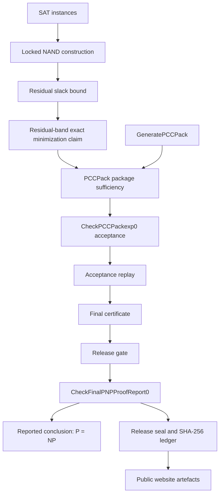

# Reviewer Guide

## Executive Summary

This repository is a public review and artefact-identity package for a claimed proof that `P = NP`.

The bundled report states a route from SAT to exact minimization of a specially constrained NAND construction, then to a finite proof-carrying package (`PCCPack`) accepted by an executable checker stack. The public website repository contains the report, release manifest, checksum ledger, browser verification flow, reviewer documentation, minimal reviewer fixtures, and smoke tests. It does not contain the full source/checker implementation referenced by the report.

The local executable checks in this repository establish only the following:

- bundled public files match `downloads/release-seal.json` and `downloads/SHA256SUMS`;
- minimal reviewer fixtures accept or reject for named reasons;
- local documentation links resolve.

These checks do not establish theorem correctness. A theorem audit requires the source/checker revision named in the report: `final-pnp-proof-report-hardened-7072f8d` at commit `7072f8d0bda6d44d240f9bb3fad624fd357e1278`.

## Mathematics, Software, And Assumptions

| Layer | What it says or does | Status in this checkout | Reviewer action |
| --- | --- | --- | --- |
| Mathematical route | SAT is reduced to exact residual-band minimization over a locked NAND construction; accepted package sufficiency implies `P = NP`. | Described in `downloads/canonical_proof_report.tex` and PDF. | Check definitions, reductions, bounds, and theorem dependencies directly. |
| Generated finite package | `GeneratePCCPack()` is claimed to emit the package whose acceptance discharges the antecedent. | Referenced by report and site; implementation not present here. | Obtain and inspect the source/checker revision. |
| Checker stack | `CheckPCCPackexp0`, acceptance replay, final certificate, release gate, and `CheckFinalPNPProofReport0` are claimed to accept. | Claimed in report; not re-executable from this public checkout. | Re-run from source/checker tag and audit checker soundness. |
| Public file seal | SHA-256 hashes bind listed public files to the manifest. | Executable here with `npm run verify:seal`. | Treat a match as file identity only. |
| Minimal examples | Tiny fixtures demonstrate terminology and named rejection modes. | Executable here with `npm run examples:minimal` and `npm run test:negative`. | Use for onboarding only; do not treat as proof evidence. |
| Assumptions | Correct mathematics, sound checker implementation, faithful generator, deterministic canonical encoding, and valid build environment. | Not discharged by hash checks. | Audit or replace each trusted component. |

## Dependency Graph

The edge from `SEAL` to `PUBLIC` is an identity check, not a soundness check. The soundness-critical edges run through the mathematics, package, and checker.

## Audit Path: Complexity Theorist

1. Start with `docs/proof_pipeline.md`.
2. Read `downloads/canonical_proof_report.tex` Sections 1, 18, 20, and Appendix B.
3. Verify that the SAT-to-locked-NAND construction is polynomial and semantics-preserving.
4. Verify the residual slack definition `Lambda(C) = |C| - mu(C)` and the claimed constant bound for the constructed instances.
5. Look for any use of exact minimization inside the asserted polynomial procedure.
6. Check whether the finite package sufficiency theorem proves an unconditional polynomial SAT algorithm once package acceptance is established.
7. Record any failed implication in `docs/audit_questions.md` terms.

## Audit Path: Proof Engineer

1. Start with `docs/trust_model.md` and `docs/terminology_crosswalk.md`.
2. Identify every checker named in the report: `CheckPCCPackexp0`, `CheckAcceptRun0`, replay, final certificate, release gate, and `CheckFinalPNPProofReport0`.
3. Obtain the source/checker revision named in the report.
4. Audit parser/canonical encoding before proof rules. Parser ambiguity can invalidate all later records.
5. Audit hash discipline: every digest lookup must be followed by full key or canonical-byte comparison.
6. Audit the no-hidden-minimization scan after macro, alias, template, and import expansion.
7. Audit mode-safety and obligation ledgers, especially quotient-to-full transfers.
8. Re-run the acceptance and replay stack in a clean environment and compare the accepted theorem fields.

## Audit Path: Security And Reproducibility Reviewer

1. Run `npm test` in this checkout.
2. Inspect `downloads/release-seal.json` and `downloads/SHA256SUMS`.
3. Confirm that `npm run verify:seal` recomputes file hashes locally.
4. Confirm that the browser verification in `verify.html` states file identity only.
5. Inspect `server.mjs` for its public allowlist and path normalization.
6. Request the source/checker tag, release-documentation tag, and sealed artefact tag named in [source_checker_map.md](source_checker_map.md).
7. Rebuild from a fresh clone of the source/checker repository, not from this website-only checkout.
8. Compare regenerated accepted records against the report's theorem fields and central digests.

## Audit Path: Skeptical General Technical Reader

1. Read the first screen of `README.md`.
2. Open `docs/proof_pipeline.md` for the conventional pipeline.
3. Use `docs/terminology_crosswalk.md` to translate internal terms.
4. Run `npm run verify:seal`; observe that it confirms file identity only.
5. Run `npm run examples:minimal`; observe named pass/fail examples.
6. Treat the public report as a claim requiring expert audit, not as external acceptance.

## Fast Falsification Checklist

A serious reviewer should first try to break the claim at these points:

- Find a SAT-to-locked-NAND instance where satisfiability is not preserved.
- Find a constructed instance whose residual slack is not bounded as claimed.
- Find a hidden exact-minimization call in the asserted polynomial path after macro and import expansion.
- Find a quotient equality used as a full-mode replacement without a checked full lift and discharged obligations.
- Find a package theorem whose reflected checker conclusion is stronger than the checker actually validates.
- Find a hash lookup used as object equality without canonical-byte or full-key comparison.
- Find parser ambiguity: two byte strings for one object, one byte string with two parses, or accepted trailing bytes.
- Find an import cycle or forbidden import that lets Package O and Package G assume each other.
- Find a mismatch between accepted report fields and the public theorem statement.
- Find a reproduction path that changes accepted theorem fields, not merely release-context metadata.

## Not Claimed

This repository, by itself, does not establish any of the following:

- external community acceptance of the proof;
- correctness of the mathematical argument;
- correctness or soundness of the source/checker implementation;
- availability of the full source/checker artefacts in this checkout;
- theorem validity from a SHA-256 match;
- theorem validity from the minimal reviewer fixtures;
- that the public PDF is easier to trust than the source/checker records;
- that the claim has been validated by a journal, conference, or independent formal-methods group.

The public hash check only answers: "Are these local bytes the same bytes named by the local manifest and checksum ledger?"
