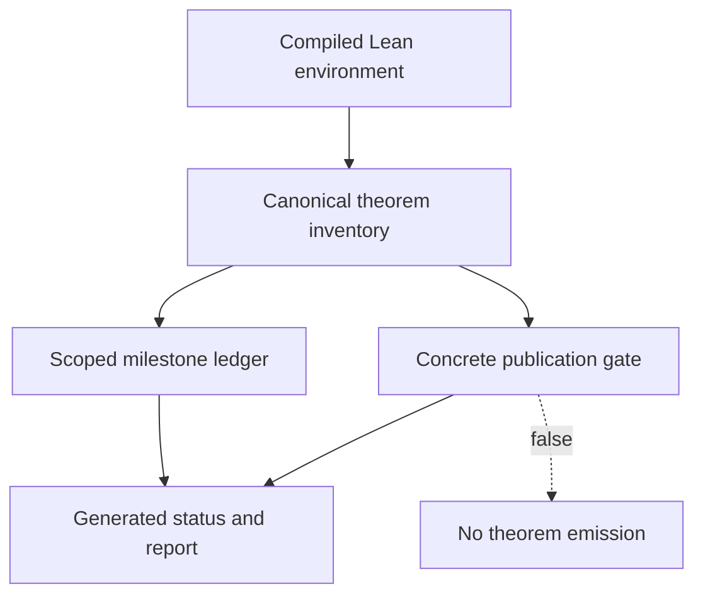

# Reviewer Guide

## Executive Summary

This checkout publishes the current formal-reconstruction status of the PNP project. It does not
establish `P = NP`.

The canonical report downloads are now a fifty-two-page, non-claiming report generated from a compiled
Lean theorem inventory. The inventory contains 10,775 public declarations across 95 modules,
including 6,078 theorem-kind declarations, 3,366 assumption-free theorem-kind declarations, and four
disclosed project axioms. Four thousand one hundred ninety-four private compiler auxiliaries are excluded explicitly.

The concrete publication gate is false. Its concrete target is present, its compatibility-root theorem is
absent, its reviewed activation fingerprints are intentionally unset, all six formal blockers
remain, and no JSON field, Boolean, string, hash, historical checker verdict, or website state can
substitute for the missing Lean evidence.

Start with these current-authority files:

- [`public/pnp-status.json`](../public/pnp-status.json): generated status, milestones, blockers, and gate;
- [`public/pnp-theorem-inventory.json`](../public/pnp-theorem-inventory.json): byte-mirrored compiled inventory;
- [`downloads/canonical_proof_report.pdf`](../downloads/canonical_proof_report.pdf): current fifty-two-page report;
- [`downloads/formal-publication-release.json`](../downloads/formal-publication-release.json): exact merged-core provenance and file identities.

The older 56-page direct-claim manuscript remains a historical audit target only. It is located at
source tag `final-pnp-proof-report-hardened-7072f8d`, commit
`7072f8d0bda6d44d240f9bb3fad624fd357e1278`, and is indexed by
`archive/legacy-v0/ARCHIVE.json` in the source repository. It is not served through the canonical
download aliases.

## Evidence Layers

| Layer | Current evidence | What it supports | What it cannot support |
| --- | --- | --- | --- |
| Compiled Lean inventory | Environment constants and `collectAxioms`, exported under the pinned Lean toolchain | Names, modules, kinds, and axiom dependencies for all public declarations; raw kernel types for the 1649 reviewed milestone candidates | A theorem broader than a reviewed candidate's exact type |
| Earned milestones | One thousand six hundred forty-nine reviewed theorem-type fingerprints, permitted axiom closures, and the complete Lean-source digest | Fifty-two narrowly scoped formal milestones, including `CNFSAT ∈ NP`, raw-machine compilation, exact Cook-Levin semantic equivalence, encoded-formula bounds and schedules, a direct coordinate cursor, four complete fixed clauses, traversal through the remaining first-constraint padding, the separator and sign beginning the second scheduled constraint, and the complete first literal of its second scheduled constraint under an external polynomial bound | The following width-dependent `Finish` or `T`, traversal of the second constraint, a general dynamic formula cursor, remaining formula body, complete raw builder, builder `FunctionProgram.RawRefinement`, packaged reduction, CNF-SAT in P, NP-completeness, global locked-NAND construction, complete residual search, or `P = NP` |
| Concrete publication gate | Exact target/root kinds and types, non-null reviewed fingerprints, fixed Lean-standard axiom allowlist, and source closure | A fail-closed activation boundary for a future concrete theorem | Activation while any subcheck is false or unconfigured |
| Status and report generation | Deterministic derivation from the canonical inventory and publication map | Current public wording and exact report bytes | Independent theorem evidence |
| Public seal | SHA-256, byte counts, exact ledger agreement, and alias equality | File identity | Theorem correctness, checker soundness, or semantic equality |
| Historical checker archive | Pinned 7072f8d tags, files, and replay route | Historical implementation and assertion-checker auditability | Current theorem authority or mathematical proof |
| Minimal examples | Small local educational fixtures | Named toy accept/reject behavior | Real package soundness or any theorem conclusion |

## Current Dependency Boundary

The status and report are consumers of formal evidence, not premises for it. Publication output is
allowed only when every concrete-gate subcheck passes. In this release every output field remains
non-claiming because the gate is false.

## Audit Path: Formal Methods

1. Reproduce the pinned Lean build in `aisknab/pnp` at merged commit
   `2869924b3f5b7f4cea1b27d40ccebb91ee36a5ec`.
2. Re-export the inventory and compare it byte-for-byte with
   `public/pnp-theorem-inventory.json`.
3. Inspect every one of the 1649 reviewed milestone declarations at its exact kernel type.
4. Confirm that each earned milestone uses only the permitted Lean-standard axiom allowlist, has no
   project axiom, and matches the pinned complete Lean-source digest.
5. Mutate a theorem type or source file and confirm that the corresponding milestone is revoked.
6. Inspect the gate's fixed standard-axiom allowlist and verify that unknown, project, and `sorryAx`
   dependencies reject.
7. Confirm that null expected fingerprints never compare equal to null actual fingerprints.

## Audit Path: Complexity Theory

The formal inventory earns fifty-two scoped milestones: the concrete bitstring/machine/cost kernel,
including collision-free state namespaces and one full four-stage raw compiler for every raw input to a proof-bearing
polynomial-time target; charged-pipeline P/NP/reduction definitions; universal concrete CNF-SAT verifier correctness,
no-timeout and NP membership; Cook-Levin layout, tableau, CNF compilation, finite semantics, the raw-tape bridge, encoded-size bound, exact rectangular formula schedule, direct coordinate cursor with exact fuelled traversal, all four complete fixed clauses, traversal through the remaining first-constraint padding, the second-constraint separator and sign, and the complete first literal of its second scheduled constraint under an external polynomial bound; typed direct-wire semantics; finite reference enumeration/minimum;
concrete framed replacement/slack; five local locked-NAND baselines; a six-premise conditional
threshold boundary; and explicit-list residual-route soundness.

Review the gaps between those scopes and the target theorem:

1. The charged-pipeline model and concrete CNF-SAT language are formalized. Every proof-bearing function or decision program tree recursively compiles into one literal finite machine. The Cook-Levin construction proves exact semantic equivalence between its generated formula and the verifier language, bounds the actual encoded formula by an external input-size polynomial, supplies an exact answer-independent rectangular schedule, and supplies direct coordinate decoders with exact fuelled traversal. Fixed finite machines reach `T^FormulaWidth F Sep T F T T F T T T F Finish`, the canonical prefix through the complete first clause, execute all remaining first-clause padding opportunities without emission, and emit `Sep F F F T F Finish`, completing the fixed second clause. The composed machines traverse all `FormulaTokensPerClause - 7` remaining clause-two padding coordinates, emit `Sep F F F T T F Finish`, complete the fixed third clause, traverse all `FormulaTokensPerClause - 8` remaining clause-three padding coordinates without emission, emit the fixed `Sep` beginning clause four, both negative literals `F T F` and `F T T F`, and the `Finish` that completes clause four. They then traverse all `FormulaTokensPerClause - 9` remaining clause-four padding opportunities without emission, cross the intentionally empty fifth clause rectangle, continue through every remaining padding opportunity in the first scheduled constraint, emit the `Sep` starting the second scheduled constraint, and emit the positive `T` sign, all three unary `T` tokens, and the terminating `F` completing its first literal. The latest machine retains `FormulaVariableSlotBound + 1 + FormulaClauseSlotsPerConstraint * FormulaTokensPerClause + 6`, whose direct next token is `Finish` at width one and the positive `T` at wider widths, under an external polynomial bound. It observes but does not emit that following width-dependent token or traverse the second constraint, implement a general dynamic formula cursor, emit the remaining body, or supply a complete raw builder, builder `FunctionProgram.RawRefinement`, or packaged polynomial reduction. CNF-SAT NP-completeness and a deterministic polynomial-time CNF-SAT decider are absent.
2. The six locked-NAND threshold premises are not instantiated by a uniform polynomial builder.
3. Local baseline minima do not establish global `BaselineDistinct`, carrier layout, trace
   equivalence, or the report threshold.
4. The residual scanner searches only a caller-supplied finite list. `unresolved` excludes no
   unlisted gain and cannot imply `ZeroSlack`.
5. PCCMin exactness, the residual-band minimizer, and polynomial runtime/certificate bounds remain
   unproved.
6. The concrete root theorem `PNP.Main.p_eq_np` is absent.

Any proof of the final claim must close those gaps with concrete definitions and checked Lean
theorems; historical package acceptance does not close them.

## Audit Path: Reproducibility And Security

1. Run `npm test` in this checkout.
2. Run `npm run verify:seal` and compare the four report aliases.
3. Verify the inventory SHA-256 against `public/pnp-status.json`.
4. Confirm that the local server exposes both `/public/pnp-status.json` and
   `/public/pnp-theorem-inventory.json` with no-cache headers.
5. Run the cross-repository check against the exact merged core commit.
6. Inspect the report-sync workflow and verify that it is read-only and cannot commit or restore
   historical report bytes.
7. Treat every digest match as byte-identity evidence only.

## Historical Audit Path

The source/checker, documentation, and generated-artifact refs for 7072f8d are preserved separately
in [source_checker_map.md](source_checker_map.md). Use them only to inspect or replay the historical
assertion-checker release. References to numbered report sections in historical worksheets refer to
the manuscript at the pinned 7072f8d source tag, never to the current fifty-two-page report.

A historical replay can show that a named implementation produced the recorded acceptance fields.
It cannot establish the mathematical implications encoded by those fields and cannot activate the
current publication gate.

## Fast Falsification Checklist

- Change one inventory byte without changing status and confirm rejection.
- Replace a milestone theorem with a same-name theorem of weaker type and confirm it is unearned.
- Add a project or unknown axiom to a milestone/root closure and confirm rejection.
- Set an expected gate fingerprint to null and confirm that it remains unconfigured and nonmatching.
- Insert the abstract string-handle `PNP.PEqualsNP` type and confirm that it is publication-ineligible.
- Forge a historical accepted flag or checker Boolean and confirm that theorem output remains false.
- Remove one blocker or project axiom from public status and confirm rejection.
- Serve a stale or missing inventory and confirm that the browser remains fail-closed.
- Replace the canonical PDF with the historical 56-page hash and confirm seal/sync rejection.

## Not Claimed

This checkout does not claim external acceptance, journal validation, checker soundness, a complete
candidate universe, polynomial exact minimization, SAT in P, or `P = NP`. The local checks establish
only their explicitly named file-identity, consistency, rendering, and toy-fixture properties.
