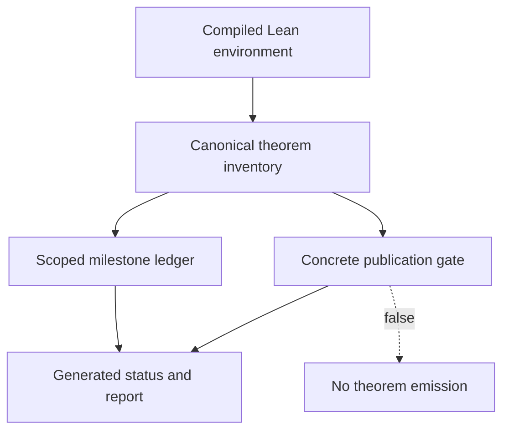

# Reviewer Guide

## Executive Summary

This checkout publishes the current formal-reconstruction status of the PNP project. It does not
establish `P = NP`.

The canonical report is a non-claiming presentation of the compiled Lean inventory.
The [inventory mirror](../public/pnp-theorem-inventory.json) records the actual declarations,
modules, theorem kinds and axiom closures, with private compiler auxiliaries excluded.
Inventory totals are metadata rather than proof completion; no project-specific axioms remain.

The concrete publication gate is false. Its concrete target is present, its compatibility-root theorem is
absent, its reviewed activation fingerprints are intentionally unset, all five formal blockers
remain, and no JSON field, Boolean, string, hash, historical checker verdict, or website state can
substitute for the missing Lean evidence.

Start with these current-authority files:

- [`public/pnp-status.json`](../public/pnp-status.json): generated status, milestones, blockers, and gate;
- [`public/pnp-theorem-inventory.json`](../public/pnp-theorem-inventory.json): byte-mirrored compiled inventory;
- [`downloads/canonical_proof_report.pdf`](../downloads/canonical_proof_report.pdf): current report;
- [`downloads/formal-publication-release.json`](../downloads/formal-publication-release.json): exact merged-core provenance and file identities.

The older 57-page direct-claim manuscript remains a historical audit target only. It is located at
source tag `final-pnp-proof-report-hardened-7072f8d`, commit
`7072f8d0bda6d44d240f9bb3fad624fd357e1278`, and is indexed by
`archive/legacy-v0/ARCHIVE.json` in the source repository. It is not served through the canonical
download aliases.

## Evidence Layers

| Layer | Current evidence | What it supports | What it cannot support |
| --- | --- | --- | --- |
| Compiled Lean inventory | Environment constants and `collectAxioms`, exported under the pinned Lean toolchain | Names, modules, kinds, and axiom dependencies for all public declarations; raw kernel types for reviewed milestone candidates | A theorem broader than a reviewed candidate's exact type |
| Earned milestones | Reviewed theorem-type fingerprints, permitted axiom closures and the complete Lean-source digest | 234 of 236 scoped rows; source-derived proper zero/unary support discovery and actual full-field-preserving replacement | Completeness covers proper physical supports with zero or one actual incoming wire. It does not cover all boundary widths, prove global minimality or unconditional ZeroSlack, or establish total polynomial encoded-input runtime, output size or certificate size. The full manuscript carrier, general obligation calculus and complete global routes remain open. Earlier supplied-data residual results remain conditional and do not construct every required terminal-derived object. |
| Progress tracker | `public/pnp-proof-progress.json`, checked against status and compiled inventory | Formal artefact coverage is reported separately from the risk-weighted proof-completion estimate, uncertainty range, five global gates, project axioms, root theorem, and publication gate. | Treating row coverage as proof completion; awarding fixed checkpoint credit for local, finite, conditional, or supplied-data results; treating the score as probability, confidence, or schedule |
| Concrete publication gate | Exact target/root kinds and types, non-null reviewed fingerprints, fixed Lean-standard axiom allowlist, and source closure | A fail-closed activation boundary for a future concrete theorem | Activation while any subcheck is false or unconfigured |
| Status and report generation | Deterministic derivation from the canonical inventory and publication map | Current public wording and exact report bytes | Independent theorem evidence |
| Public seal | SHA-256, byte counts, exact ledger agreement, and alias equality | File identity | Theorem correctness, checker soundness, or semantic equality |
| Historical checker archive | Pinned 7072f8d tags, files, and replay route | Historical implementation and assertion-checker auditability | Current theorem authority or mathematical proof |
| Minimal examples | Small local educational fixtures | Named toy accept/reject behavior | Real package soundness or any theorem conclusion |

## Current Dependency Boundary

```mermaid
flowchart TD
  LEAN[Compiled Lean environment] --> INV[Canonical theorem inventory]
  INV --> MILE[Scoped milestone ledger]
  INV --> GATE[Concrete publication gate]
  MILE --> STATUS[Generated status and report]
  GATE --> STATUS
  GATE -. false .-> BLOCK[No theorem emission]
```

The status and report are consumers of formal evidence, not premises for it. Publication output is
allowed only when every concrete-gate subcheck passes. In this release every output field remains
non-claiming because the gate is false. PNPLabs verifies the pinned artifacts and publication
contract without invoking Lean; compilation and axiom verification are reproduced at the exact core
commit in the formal-methods path below.

## Audit Path: Formal Methods

1. Reproduce the pinned Lean build in `aisknab/pnp` at merged commit
   `6296c6e1130fbae674548ccbf949f6e608b996c7`.
2. Re-export the inventory and compare it byte-for-byte with
   `public/pnp-theorem-inventory.json`.
3. Inspect every reviewed milestone declaration at its exact kernel type.
4. Confirm that each earned milestone uses only the permitted Lean-standard axiom allowlist, has no
   project axiom, and matches the pinned complete Lean-source digest.
5. Mutate a theorem type or source file and confirm that the corresponding milestone is revoked.
6. Inspect the gate's fixed standard-axiom allowlist and verify that unknown, project, and `sorryAx`
   dependencies reject.
7. Confirm that null expected fingerprints never compare equal to null actual fingerprints.

## Audit Path: Complexity Theory

Formal artefact coverage: 234 of 236 current scoped publication rows earned. Risk-weighted proof completion estimate: 40%. Uncertainty range: 20% to 40%. Global gates closed: 0 of 5. This batch changes no fixed weighted checkpoint. Added publication rows do not mechanically increase the proof-completion estimate, which is neither a probability of correctness nor a time estimate.

Review the latest result at its exact compiled type and keep these dependency boundaries separate:

1. M230 supplies the complete all-input Cook-Levin formula builder and its polynomial reduction to CNFSAT. The source-derived finite machine covers empty and odd-length inputs as well as every other bitstring, with total runtime and output-size bounds polynomial in the original input length. It does not decide satisfiability.
2. M231 combines the complete Cook-Levin reduction with the concrete verifier to prove CNF-SAT NP-hardness and NP-completeness in the selected finite-machine model. The CNFSAT-to-NAND-to-locked-NAND reductions are also checked. NP-completeness is not a deterministic polynomial-time SAT algorithm.
3. M232-M241 establish local observation, physical-accounting, ownership and replacement laws. Their supplied observation/request families and exhaustive reference constructions retain their exact limitations. They do not derive the full manuscript carrier or complete global route coverage.
4. M242-M248 construct physical sharing, output pruning, constant propagation and a loop reaching common quiescence of those passes. Quiescence is not semantic minimality or complete manuscript normalization. M243 also replaces the supplied SAT-hardness edge in the active report bridge with the checked theorem, but that bridge still requires the missing minimization-loop certificate and existence premise.
5. M249-M254 construct literal support splicing, exposed computational-field transport, paid restoration, quotient/frontier lifts and source-identity cancellation. Read each local-agreement premise and cost comparison exactly; quotient agreement is not full-frontier agreement, and a lifted-reference saving need not be an original-circuit gain.
6. M255-M258 derive minimum constant/unary local words, successful arbitrary-support compilation in that boundary class and a complete source-derived proper-gain search. No support family, replacement, rank, order or completeness certificate is supplied to the final search. A negative answer excludes only proper zero/unary support gains, not a smaller global circuit. Candidate-count bounds do not prove total encoded-input polynomial runtime.
7. The full manuscript carrier and obligation calculus, terminal-derived complete families, global rank-decreasing routes, unconditional SaturatePositive, BCELReady and ZeroSlack, exact general PCCMin and its complete polynomial bounds remain open. Earlier finite or supplied-data component results retain their original boundaries.
8. Deterministic CNFSAT in P and the eligible root `PNP.Main.p_eq_np` remain absent, and the publication gate is false. Eliminating project-specific axioms is not itself a proof of P = NP.

The full component scopes and historical limitations remain in the canonical milestone ledger at [formal status](../status.html) and in the [compiled status payload](../public/pnp-status.json). Historical package acceptance and matching artefact hashes cannot close these mathematical gaps.

## Audit Path: Reproducibility And Security

1. Run `npm test` in this checkout.
2. Inspect the seal and four-alias results already included in `npm test`; run `npm run verify:seal` separately only for focused diagnosis or a changed artifact boundary.
3. Verify the inventory SHA-256 against `public/pnp-status.json`.
4. Confirm that the local server exposes both `/public/pnp-status.json` and
   `/public/pnp-theorem-inventory.json` with no-cache headers.
5. Run the cross-repository check against the exact merged core commit.
6. Inspect the report-sync workflow and verify that it is read-only and cannot commit or restore
   historical report bytes.
7. Treat every digest match as byte-identity evidence only.

## Historical Audit Path

The source/checker, documentation, and generated-artifact refs for 7072f8d are preserved separately
in [source_checker_map.md](source_checker_map.md). Use them only to inspect or replay the historical
assertion-checker release. References to numbered report sections in historical worksheets refer to
the manuscript at the pinned 7072f8d source tag, never to the current report.

A historical replay can show that a named implementation produced the recorded acceptance fields.
It cannot establish the mathematical implications encoded by those fields and cannot activate the
current publication gate.

## Fast Falsification Checklist

- Change one inventory byte without changing status and confirm rejection.
- Replace a milestone theorem with a same-name theorem of weaker type and confirm it is unearned.
- Add a project or unknown axiom to a milestone/root closure and confirm rejection.
- Set an expected gate fingerprint to null and confirm that it remains unconfigured and nonmatching.
- Remove or forge the exact `PNP.Main.p_eq_np` root while leaving the `PNP.PEqualsNP` compatibility alias present, and confirm that publication remains closed.
- Forge a historical accepted flag or checker Boolean and confirm that theorem output remains false.
- Remove one blocker or project axiom from public status and confirm rejection.
- Serve a stale or missing inventory and confirm that the browser remains fail-closed.
- Replace the canonical PDF with the historical 57-page hash and confirm seal/sync rejection.

## Not Claimed

This checkout does not claim external acceptance, journal validation, checker soundness, a complete
candidate universe, polynomial exact minimization, SAT in P, or `P = NP`. The local checks establish
only their explicitly named file-identity, consistency, rendering, and toy-fixture properties.

<!-- CURRENT_PUBLICATION:START -->
## M280 current publication

**Proving cost comparisons for nested completed supports**

For nested supports that have already been completed by the existing construction, the project now builds the comparison circuits needed to prove cost and positive-saving bounds. The bounds follow from those physical constructions instead of being assumptions.

This establishes the enlargement step for already-completed supports. It does not show that every raw local witness can be completed without losing its saving, and the complete admissibility and global routing arguments remain open.

Formal artefact coverage: 256 of 258 current scoped publication rows earned. Risk-weighted proof completion estimate: 40%. Uncertainty range: 20% to 40%. Global gates closed: 0 of 5.

### A verified limit on replacing parts of a circuit

The project has verified a counterexample to an unrestricted reading of the original report's replacement claim. The checked example has a smaller replacement for one part, but inserting it would create a circular dependency; the whole circuit was already minimal.

This does not invalidate the checked replacement results that enforce the necessary restrictions, and it does not settle P versus NP. It identifies a central obligation for the next research: derive the admissible replacements and show that the general method can use them without losing the required saving.

This correction adds no earned positive publication row or fixed checkpoint credit.

This batch changes no fixed weighted checkpoint. Added publication rows do not mechanically increase the proof-completion estimate, which is neither a probability of correctness nor a time estimate. Project-specific axioms remaining: 0. The eligible root `PNP.Main.p_eq_np` is absent and the publication gate is false.

Current source: [`f14cb7a87004ebedfa55351f6ba20d68a333cc18`](https://github.com/aisknab/pnp/tree/f14cb7a87004ebedfa55351f6ba20d68a333cc18), tree `1cbaf64d8a7303b154848ec73f38e85e406defca`. Original current review coordinate: `PNP-FORMAL-RECONSTRUCTION-STATUS-2026-09-20-280`. Inspect the [source-bound update](../updates.html#2026-09-24-computed-closed-support-nested-positivity), the [verified correction](../updates.html#unrestricted-compatible-support-slack-correction) and the [complete current milestone ledger](../status.html).

M230 and M231 close complete Cook-Levin emission/refinement and concrete CNF-SAT NP-completeness. NP-completeness is not a deterministic polynomial-time SAT algorithm. M243 consumes that checked hardness in the still-conditional report bridge; the complete minimization-loop certificate and its existence premise remain unconstructed. Earlier named component limitations describe those standalone components and do not negate later earned results.
<!-- CURRENT_PUBLICATION:END -->
