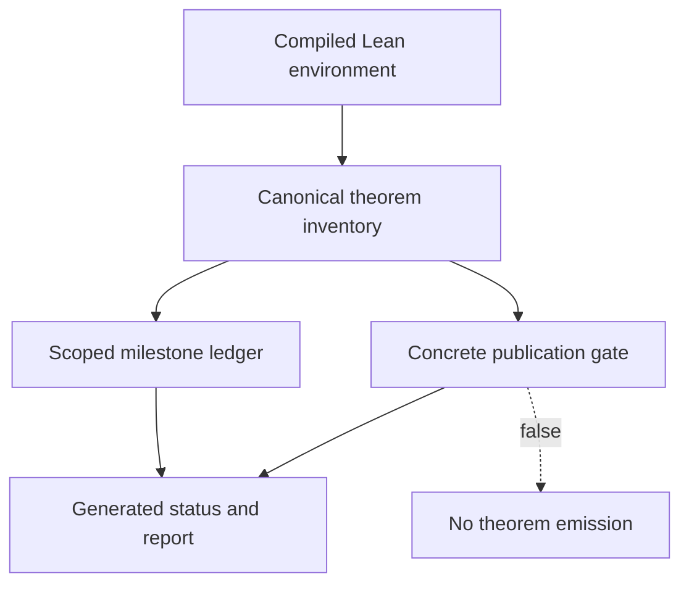

# Reviewer Guide

## Executive Summary

This checkout publishes the current formal-reconstruction status of the PNP project. It does not
establish `P = NP`.

The canonical report downloads are now a seventy-four-page, non-claiming report generated from a compiled
Lean theorem inventory. The inventory contains 24,211 public declarations across 219 modules,
including 13,049 theorem-kind declarations, 6,927 assumption-free theorem-kind declarations, and four
disclosed project axioms. Exactly 14,524 private compiler auxiliaries are excluded explicitly.

The concrete publication gate is false. Its concrete target is present, its compatibility-root theorem is
absent, its reviewed activation fingerprints are intentionally unset, all six formal blockers
remain, and no JSON field, Boolean, string, hash, historical checker verdict, or website state can
substitute for the missing Lean evidence.

Start with these current-authority files:

- [`public/pnp-status.json`](../public/pnp-status.json): generated status, milestones, blockers, and gate;
- [`public/pnp-theorem-inventory.json`](../public/pnp-theorem-inventory.json): byte-mirrored compiled inventory;
- [`downloads/canonical_proof_report.pdf`](../downloads/canonical_proof_report.pdf): current seventy-four-page report;
- [`downloads/formal-publication-release.json`](../downloads/formal-publication-release.json): exact merged-core provenance and file identities.

The older 57-page direct-claim manuscript remains a historical audit target only. It is located at
source tag `final-pnp-proof-report-hardened-7072f8d`, commit
`7072f8d0bda6d44d240f9bb3fad624fd357e1278`, and is indexed by
`archive/legacy-v0/ARCHIVE.json` in the source repository. It is not served through the canonical
download aliases.

## Evidence Layers

| Layer | Current evidence | What it supports | What it cannot support |
| --- | --- | --- | --- |
| Compiled Lean inventory | Environment constants and `collectAxioms`, exported under the pinned Lean toolchain | Names, modules, kinds, and axiom dependencies for all public declarations; raw kernel types for the 2,183 reviewed milestone candidates | A theorem broader than a reviewed candidate's exact type |
| Earned milestones | 2,183 reviewed theorem-type fingerprints, permitted axiom closures, and the complete Lean-source digest | Eighty narrowly scoped formal milestones, including `CNFSAT ∈ NP`, raw-machine compilation, exact Cook-Levin semantic equivalence and its bounded builder prefix, the locked-NAND typed threshold and strict-v0 semantic encoding, concrete polynomial reductions, the universal verified residual-gain-chain bound, the global semantic stopping criterion, the direct-wire terminal full-carrier bridge, the computed terminal quotient/full mode firewall, exhaustive attained full/quotient projection minima, the exact signed four-corner projection-transfer identity, finite saturation closure under explicit dependencies, executable exact boundary/interface wire completion, and arbitrary finite terminal-support extraction with exact open semantics and whole-circuit recovery | A complete Cook-Levin formula builder, derivation of the manuscript's proper governed support squares, support completion in the manuscript's full sense and square legitimacy, a gain generator or route-completeness proof, the manuscript's ZeroSlack/PCCMin construction and polynomial runtime, SAT NP-hardness or CNF-SAT NP-completeness, discharge of the abstract threshold axiom, CNF-SAT in P, or `P = NP` |
| Concrete publication gate | Exact target/root kinds and types, non-null reviewed fingerprints, fixed Lean-standard axiom allowlist, and source closure | A fail-closed activation boundary for a future concrete theorem | Activation while any subcheck is false or unconfigured |
| Status and report generation | Deterministic derivation from the canonical inventory and publication map | Current public wording and exact report bytes | Independent theorem evidence |
| Public seal | SHA-256, byte counts, exact ledger agreement, and alias equality | File identity | Theorem correctness, checker soundness, or semantic equality |
| Historical checker archive | Pinned 7072f8d tags, files, and replay route | Historical implementation and assertion-checker auditability | Current theorem authority or mathematical proof |
| Minimal examples | Small local educational fixtures | Named toy accept/reject behavior | Real package soundness or any theorem conclusion |

## Current Dependency Boundary

```mermaid
flowchart TD
  LEAN[Compiled Lean environment] --> INV[Canonical theorem inventory]
  INV --> MILE[Scoped milestone ledger]
  INV --> GATE[Concrete publication gate]
  MILE --> STATUS[Generated status and report]
  GATE --> STATUS
  GATE -. false .-> BLOCK[No theorem emission]
```

The status and report are consumers of formal evidence, not premises for it. Publication output is
allowed only when every concrete-gate subcheck passes. In this release every output field remains
non-claiming because the gate is false.

## Audit Path: Formal Methods

1. Reproduce the pinned Lean build in `aisknab/pnp` at merged commit
   `5bc35c370e0d8987c69bd51f7f31e29070f7c162`.
2. Re-export the inventory and compare it byte-for-byte with
   `public/pnp-theorem-inventory.json`.
3. Inspect every one of the 2,183 reviewed milestone declarations at its exact kernel type.
4. Confirm that each earned milestone uses only the permitted Lean-standard axiom allowlist, has no
   project axiom, and matches the pinned complete Lean-source digest.
5. Mutate a theorem type or source file and confirm that the corresponding milestone is revoked.
6. Inspect the gate's fixed standard-axiom allowlist and verify that unknown, project, and `sorryAx`
   dependencies reject.
7. Confirm that null expected fingerprints never compare equal to null actual fingerprints.

## Audit Path: Complexity Theory

The formal inventory earns eighty scoped milestones: the concrete bitstring/machine/cost kernel,
including collision-free state namespaces and one full four-stage raw compiler for every raw input to a proof-bearing
polynomial-time target; charged-pipeline P/NP/reduction definitions; universal concrete CNF-SAT verifier correctness,
no-timeout and NP membership; Cook-Levin layout, tableau, CNF compilation, finite semantics, the raw-tape bridge, encoded-size bound, exact rectangular formula schedule, direct coordinate cursor with exact fuelled traversal, all four complete fixed clauses, traversal through the remaining first-constraint padding, the complete first literal of its second scheduled constraint, its width-selected successor token, its first six width-selected opportunities, and the seventh padding-or-unary opportunity under an external polynomial bound; typed direct-wire semantics; finite reference enumeration/minimum;
concrete framed replacement/slack; five local locked-NAND baselines; a six-premise conditional
threshold boundary; exact carrier separation and trace equivalence; exact source-derived `B/B`
baseline and `B+4/B+1` extended candidate assembly for arbitrary finite topological NAND circuits;
global baseline-output distinctness, both whole-carrier final-output branches, all six typed
semantic premises, the exact satisfiable/reference-minimum threshold, residual slack at most four,
strict-v0 encoding round trips for normalized circuits and complete locked-NAND instances, a
pure fail-closed encoded transformation that preserves the semantic threshold on valid inputs, and
one literal 228-state, 2,052-rule source parser that validates every bitstring, preserves valid bytes,
clears invalid bytes, cannot time out within its compiled cubic bound, and has polynomial-time
machine/function witnesses plus validator-leaf `RawRefinement`; and one literal 1,387,921-rule
target emitter that emits the exact direct target for every grammar-decoded circuit, rejects
malformed grammar with empty output, has explicit polynomial runtime and quadratic output-size
bounds, supplies polynomial-time witnesses and exact leaf `RawRefinement`, and composes with the
strict parser to compute `buildLockedNANDInstance`; a concrete polynomial many-one reduction from
`EncodedNANDSAT` to `EncodedLockedNANDThreshold`, with exact function identity, exact output,
all-bitstring language equivalence, a `ReducesTo` witness, and recursive raw-machine refinement;
a general semantic CNF-to-NAND compiler with exact satisfiability preservation, gate count, quadratic
serialized-output bound, malformed-input failure, and locked-threshold composition; one fixed
135,070-rule three-node finite work graph with exact all-bitstring output, an external polynomial
runtime bound, `PolynomialTimeFunction`, literal `RawRefinement`, a direct `CNFSAT`-to-`EncodedNANDSAT`
`PolynomialReduction`, and composition to `EncodedLockedNANDThreshold`; explicit-list
residual-route soundness; and a universal theorem that every finite proof-bearing or executably verified
strict equivalent-gain chain preserves semantics and the exhaustive reference minimum and has length
at most its starting residual slack, hence at most four for the complete locked-NAND candidate; and
the direct-wire terminal full-carrier bridge, which preserves exact circuit, gate count, and complete
input/output semantics and equates whole-span cheaper realizations with positive residual slack; and
the computed ten-role terminal profile, explicit forgetful projection, and checked quotient-to-full lift;
exhaustive attained full/quotient profile minima and their exact nonnegative defect; the signed four-corner
projection-transfer identity; finite saturation closure under explicit dependencies; an executable finite
saturation work list plus exact canonical incoming-boundary and outgoing-interface wire completion; and
arbitrary finite, including noncontiguous, terminal-support extraction with exact open semantics for every
boundary valuation and whole-circuit recovery.

Review the gaps between those scopes and the target theorem:

1. The charged-pipeline model and concrete CNF-SAT language are formalized. Every proof-bearing function or decision program tree recursively compiles into one literal finite machine. The Cook-Levin construction proves exact semantic equivalence between its generated formula and the verifier language, bounds the actual encoded formula by an external input-size polynomial, supplies an exact answer-independent rectangular schedule, and supplies direct coordinate decoders with exact fuelled traversal. Fixed finite machines reach `T^FormulaWidth F Sep T F T T F T T T F Finish`, the canonical prefix through the complete first clause, execute all remaining first-clause padding opportunities without emission, and emit `Sep F F F T F Finish`, completing the fixed second clause. The composed machines traverse all `FormulaTokensPerClause - 7` remaining clause-two padding coordinates, emit `Sep F F F T T F Finish`, complete the fixed third clause, traverse all `FormulaTokensPerClause - 8` remaining clause-three padding coordinates without emission, emit the fixed `Sep` beginning clause four, both negative literals `F T F` and `F T T F`, and the `Finish` that completes clause four. They then traverse all `FormulaTokensPerClause - 9` remaining clause-four padding opportunities without emission, cross the intentionally empty fifth clause rectangle, continue through every remaining padding opportunity in the first scheduled constraint, emit the `Sep` starting the second scheduled constraint, and emit the positive `T` sign, all three unary `T` tokens, and the terminating `F` completing its first literal. A width-selected step then emits `Finish` at width one or positive `T` at wider widths. Four following machines consume the first four padding opportunities without emission at width one or emit the first four unary `T` tokens of the second literal at wider widths. The next machine consumes padding without emission at width one or emits the second literal's terminating `F` at wider widths. The latest machine then consumes another padding position without emission at width one or emits the first unary-index `T` of the following literal at wider widths, retains `FormulaVariableSlotBound + 1 + FormulaClauseSlotsPerConstraint * FormulaTokensPerClause + 14`, and stays within an external polynomial bound. It observes but does not consume the following padding opportunity at width one or second unary-index `T` at wider widths, complete the following literal or traverse the second constraint, implement a general dynamic formula cursor, emit the remaining body, or supply a complete raw builder, builder `FunctionProgram.RawRefinement`, or packaged polynomial reduction. CNF-SAT NP-completeness and a deterministic polynomial-time CNF-SAT decider are absent.
2. The exact `X/T/O/R/L/z` carrier, both trace-equivalence directions, complete baseline plus
   four-gate candidate assembly, global `BaselineDistinct`, both whole-carrier final-output
   branches, all six typed semantic premises, and the exhaustive reference-minimum equivalence are
   now formalized for arbitrary finite topological NAND circuits. The full candidate also has
   residual slack at most four. Every finite proof-bearing or executably verified adjacent strict-gain
   chain preserves semantics and the exhaustive reference minimum, while endpoint slack plus length
   is bounded by starting slack; the full candidate specialization therefore permits at most four
   verified steps. Zero slack and semantic minimality are now each equivalent to the global absence
   of a smaller equivalent implementation, so a verified endpoint packages an exact minimum when
   separate global no-gain evidence is supplied. Terminalization now preserves the whole direct-wire
   implementation, exact gate count, and every input/output result; an independently stated terminal
   minimum equals the exhaustive reference minimum, and whole-span full witnesses characterize positive
   slack and strict descent. A computed ten-role terminal profile now projects explicitly to selected
   quotient coordinates without changing the implementation, gate count, or complete semantics. A
   selected-coordinate comparison lifts to the full profile exactly when every omitted coordinate agrees;
   lossless projections lift directly, and obligation discharge transports through a checked lift. Exhaustive
   scans through the supplied implementation's gate count now attain full-profile and quotient-profile minima,
   prove that projection cannot increase the minimum, decompose the full minimum into the quotient minimum plus
   an exact nonnegative defect, and characterize zero defect by a checked full lift at an attained quotient
   minimum. Across four supplied corners sharing one observer and projection, signed full and quotient
   deltas now obey the exact Section 5.2 transfer identity; the constant-cut hypotheses make projection
   excess equal the join defect and positive when that defect is positive. For every finite terminal
   primitive-record universe and explicitly supplied rule-tagged dependency relation, generated saturation
   is extensive, closed, least, monotone and idempotent, with exactly the closed supports as fixed points.
   A deterministic finite work list now computes exactly that saturation, and the actual program computes
   every incoming boundary and outgoing interface wire for any selected node set in canonical order,
   without omissions or extras. For any supplied finite terminal record list, including noncontiguous
   selections, the extracted open candidate now has that exact boundary and interface, agrees with an
   independently defined open-support function for every boundary valuation, and recovers the original
   selected interface values from whole-circuit-induced boundaries. The record list and dependency system
   remain explicit data. Proper or governed support
   construction, support completion in the manuscript's full sense, square legitimacy,
   BCEL/BN2–BN6, packet/selector completeness, route generation, the manuscript's `ZeroSlack` certificate,
   and polynomial checker/PCCMin runtime remain unformalized. Strict-v0 codecs now prove normalized-circuit and complete-instance
   round trips, and a pure all-bitstring transformation rejects malformed source bytes while
   preserving the semantic threshold for valid encoded circuits.
3. The literal target emitter and strict parser/emitter composition are formalized. The standalone
   emitter deliberately accepts grammar-valid circuits with intrinsically invalid references; the
   parser supplies strict fail-closed semantics. Their exact all-bitstring language equivalence is
   now packaged as a concrete `PolynomialReduction` from `EncodedNANDSAT` to
   `EncodedLockedNANDThreshold`, with recursive raw-machine refinement. The fixed all-input CNF compiler
   now packages a direct `PolynomialReduction` from `CNFSAT` to `EncodedNANDSAT` and composes the two
   reductions. This does not decide CNF-SAT, prove SAT NP-hardness or CNF-SAT NP-completeness, discharge
   the separate abstract locked-NAND threshold axiom, put CNF-SAT in P, or prove `P = NP`.
4. The residual scanner searches only a caller-supplied finite list. `unresolved` excludes no
   unlisted gain and cannot imply `ZeroSlack`.
5. PCCMin exactness, the residual-band minimizer, and polynomial runtime/certificate bounds remain
   unproved.
6. The concrete root theorem `PNP.Main.p_eq_np` is absent.

Any proof of the final claim must close those gaps with concrete definitions and checked Lean
theorems; historical package acceptance does not close them.

## Audit Path: Reproducibility And Security

1. Run `npm test` in this checkout.
2. Run `npm run verify:seal` and compare the four report aliases.
3. Verify the inventory SHA-256 against `public/pnp-status.json`.
4. Confirm that the local server exposes both `/public/pnp-status.json` and
   `/public/pnp-theorem-inventory.json` with no-cache headers.
5. Run the cross-repository check against the exact merged core commit.
6. Inspect the report-sync workflow and verify that it is read-only and cannot commit or restore
   historical report bytes.
7. Treat every digest match as byte-identity evidence only.

## Historical Audit Path

The source/checker, documentation, and generated-artifact refs for 7072f8d are preserved separately
in [source_checker_map.md](source_checker_map.md). Use them only to inspect or replay the historical
assertion-checker release. References to numbered report sections in historical worksheets refer to
the manuscript at the pinned 7072f8d source tag, never to the current seventy-four-page report.

A historical replay can show that a named implementation produced the recorded acceptance fields.
It cannot establish the mathematical implications encoded by those fields and cannot activate the
current publication gate.

## Fast Falsification Checklist

- Change one inventory byte without changing status and confirm rejection.
- Replace a milestone theorem with a same-name theorem of weaker type and confirm it is unearned.
- Add a project or unknown axiom to a milestone/root closure and confirm rejection.
- Set an expected gate fingerprint to null and confirm that it remains unconfigured and nonmatching.
- Insert the abstract string-handle `PNP.PEqualsNP` type and confirm that it is publication-ineligible.
- Forge a historical accepted flag or checker Boolean and confirm that theorem output remains false.
- Remove one blocker or project axiom from public status and confirm rejection.
- Serve a stale or missing inventory and confirm that the browser remains fail-closed.
- Replace the canonical PDF with the historical 57-page hash and confirm seal/sync rejection.

## Not Claimed

This checkout does not claim external acceptance, journal validation, checker soundness, a complete
candidate universe, polynomial exact minimization, SAT in P, or `P = NP`. The local checks establish
only their explicitly named file-identity, consistency, rendering, and toy-fixture properties.
