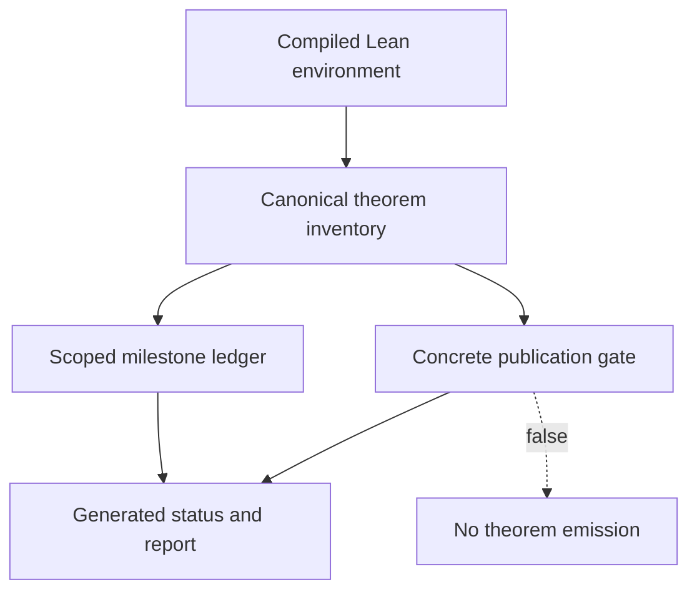

# Reviewer Guide

## Executive Summary

This checkout publishes the current formal-reconstruction status of the PNP project. It does not
establish `P = NP`.

The canonical report downloads are now a 142-page, non-claiming report generated from a compiled
Lean theorem inventory. The inventory contains 31,198 public declarations across 320 modules,
including 15,936 theorem-kind declarations, 7,703 assumption-free theorem-kind declarations, and no
project-specific axioms. Exactly 15,181 private compiler auxiliaries are excluded explicitly.

The concrete publication gate is false. Its concrete target is present, its compatibility-root theorem is
absent, its reviewed activation fingerprints are intentionally unset, all five formal blockers
remain, and no JSON field, Boolean, string, hash, historical checker verdict, or website state can
substitute for the missing Lean evidence.

Start with these current-authority files:

- [`public/pnp-status.json`](../public/pnp-status.json): generated status, milestones, blockers, and gate;
- [`public/pnp-theorem-inventory.json`](../public/pnp-theorem-inventory.json): byte-mirrored compiled inventory;
- [`downloads/canonical_proof_report.pdf`](../downloads/canonical_proof_report.pdf): current 142-page report;
- [`downloads/formal-publication-release.json`](../downloads/formal-publication-release.json): exact merged-core provenance and file identities.

The older 57-page direct-claim manuscript remains a historical audit target only. It is located at
source tag `final-pnp-proof-report-hardened-7072f8d`, commit
`7072f8d0bda6d44d240f9bb3fad624fd357e1278`, and is indexed by
`archive/legacy-v0/ARCHIVE.json` in the source repository. It is not served through the canonical
download aliases.

## Evidence Layers

| Layer | Current evidence | What it supports | What it cannot support |
| --- | --- | --- | --- |
| Compiled Lean inventory | Environment constants and `collectAxioms`, exported under the pinned Lean toolchain | Names, modules, kinds, and axiom dependencies for all public declarations; raw kernel types for the 3,140 reviewed milestone candidates | A theorem broader than a reviewed candidate's exact type |
| Earned milestones | 3,140 reviewed theorem-type fingerprints, permitted axiom closures, and the complete Lean-source digest | 176 of 178 scoped formal milestone rows. The newest row proves that singleton and order-preserving pair proper cuts form a duplicate-free quadratic-size family equivalent to every sparse V53 proper-cut equation. A total classifier returns the first exact small-cut mismatch or derives the equation, and the checked adapter reflects a mismatch through the direct raw ledger or reaches conditional ZeroSlack. | Treating the local list bound as a complete runtime theorem; treating a returned mismatch as a constructed gain or global rank decrease; or treating supplied raw cells, certificates, tables, ranks, route data, terminal data, upstream construction, or other supplied stages as complete PkgC/BN3 through BN6 integration, manuscript-wide SaturatePositive, BCELReady, executable PCCMin, unconditional ZeroSlack, polynomial runtime, a target decider, SAT hardness transport, a root theorem, or P = NP |
| Progress tracker | `public/pnp-proof-progress.json`, checked against status and compiled inventory | Formal artefact coverage is reported separately from the risk-weighted proof-completion estimate, uncertainty range, five global gates, project axioms, root theorem, and publication gate. | Treating row coverage as proof completion; awarding fixed checkpoint credit for local, finite, conditional, or supplied-data results; treating the score as probability, confidence, or schedule |
| Concrete publication gate | Exact target/root kinds and types, non-null reviewed fingerprints, fixed Lean-standard axiom allowlist, and source closure | A fail-closed activation boundary for a future concrete theorem | Activation while any subcheck is false or unconfigured |
| Status and report generation | Deterministic derivation from the canonical inventory and publication map | Current public wording and exact report bytes | Independent theorem evidence |
| Public seal | SHA-256, byte counts, exact ledger agreement, and alias equality | File identity | Theorem correctness, checker soundness, or semantic equality |
| Historical checker archive | Pinned 7072f8d tags, files, and replay route | Historical implementation and assertion-checker auditability | Current theorem authority or mathematical proof |
| Minimal examples | Small local educational fixtures | Named toy accept/reject behavior | Real package soundness or any theorem conclusion |

## Current Dependency Boundary

```mermaid
flowchart TD
  LEAN[Compiled Lean environment] --> INV[Canonical theorem inventory]
  INV --> MILE[Scoped milestone ledger]
  INV --> GATE[Concrete publication gate]
  MILE --> STATUS[Generated status and report]
  GATE --> STATUS
  GATE -. false .-> BLOCK[No theorem emission]
```

The status and report are consumers of formal evidence, not premises for it. Publication output is
allowed only when every concrete-gate subcheck passes. In this release every output field remains
non-claiming because the gate is false. PNPLabs verifies the pinned artifacts and publication
contract without invoking Lean; compilation and axiom verification are reproduced at the exact core
commit in the formal-methods path below.

## Audit Path: Formal Methods

1. Reproduce the pinned Lean build in `aisknab/pnp` at merged commit
   `e355f1c93ef17f7d8069cc128b204a351b4792b7`.
2. Re-export the inventory and compare it byte-for-byte with
   `public/pnp-theorem-inventory.json`.
3. Inspect every one of the 3,140 reviewed milestone declarations at its exact kernel type.
4. Confirm that each earned milestone uses only the permitted Lean-standard axiom allowlist, has no
   project axiom, and matches the pinned complete Lean-source digest.
5. Mutate a theorem type or source file and confirm that the corresponding milestone is revoked.
6. Inspect the gate's fixed standard-axiom allowlist and verify that unknown, project, and `sorryAx`
   dependencies reject.
7. Confirm that null expected fingerprints never compare equal to null actual fingerprints.

## Audit Path: Complexity Theory

The formal inventory earns one hundred and sixty-nine scoped milestones: the concrete bitstring/machine/cost kernel,
including collision-free state namespaces and one full four-stage raw compiler for every raw input to a proof-bearing
polynomial-time target; charged-pipeline P/NP/reduction definitions; universal concrete CNF-SAT verifier correctness,
no-timeout and NP membership; Cook-Levin layout, tableau, CNF compilation, finite semantics, the raw-tape bridge, encoded-size bound, exact rectangular formula schedule, direct coordinate cursor with exact fuelled traversal, all four complete fixed clauses, traversal through the remaining first-constraint padding, the complete first literal of its second scheduled constraint, its width-selected successor token, its first six width-selected opportunities, and the seventh padding-or-unary opportunity under an external polynomial bound; typed direct-wire semantics; finite reference enumeration/minimum;
concrete framed replacement/slack; five local locked-NAND baselines; a six-premise conditional
threshold boundary; exact carrier separation and trace equivalence; exact source-derived `B/B`
baseline and `B+4/B+1` extended candidate assembly for arbitrary finite topological NAND circuits;
global baseline-output distinctness, both whole-carrier final-output branches, all six typed
semantic premises, the exact satisfiable/reference-minimum threshold, residual slack at most four,
strict-v0 encoding round trips for normalized circuits and complete locked-NAND instances, a
pure fail-closed encoded transformation that preserves the semantic threshold on valid inputs, and
one literal 228-state, 2,052-rule source parser that validates every bitstring, preserves valid bytes,
clears invalid bytes, cannot time out within its compiled cubic bound, and has polynomial-time
machine/function witnesses plus validator-leaf `RawRefinement`; and one literal 1,387,921-rule
target emitter that emits the exact direct target for every grammar-decoded circuit, rejects
malformed grammar with empty output, has explicit polynomial runtime and quadratic output-size
bounds, supplies polynomial-time witnesses and exact leaf `RawRefinement`, and composes with the
strict parser to compute `buildLockedNANDInstance`; a concrete polynomial many-one reduction from
`EncodedNANDSAT` to `EncodedLockedNANDThreshold`, with exact function identity, exact output,
all-bitstring language equivalence, a `ReducesTo` witness, and recursive raw-machine refinement;
a general semantic CNF-to-NAND compiler with exact satisfiability preservation, gate count, quadratic
serialized-output bound, malformed-input failure, and locked-threshold composition; one fixed
135,070-rule three-node finite work graph with exact all-bitstring output, an external polynomial
runtime bound, `PolynomialTimeFunction`, literal `RawRefinement`, a direct `CNFSAT`-to-`EncodedNANDSAT`
`PolynomialReduction`, and composition to `EncodedLockedNANDThreshold`; explicit-list
residual-route soundness; and a universal theorem that every finite proof-bearing or executably verified
strict equivalent-gain chain preserves semantics and the exhaustive reference minimum and has length
at most its starting residual slack, hence at most four for the complete locked-NAND candidate; and
the direct-wire terminal full-carrier bridge, which preserves exact circuit, gate count, and complete
input/output semantics and equates whole-span cheaper realizations with positive residual slack; and
the computed ten-role terminal profile, explicit forgetful projection, and checked quotient-to-full lift;
exhaustive attained full/quotient profile minima and their exact nonnegative defect; the signed four-corner
projection-transfer identity; finite saturation closure under explicit dependencies; an executable finite
saturation work list plus exact canonical incoming-boundary and outgoing-interface wire completion; and
arbitrary finite, including noncontiguous, terminal-support extraction with exact open semantics for every
boundary valuation and whole-circuit recovery; and exhaustive governed search for a nonempty proper
support with exact positive local gain inside the canonical seed universe of an explicitly supplied
terminal dependency system; and exact closed meet and saturated-union join laws, physical compatibility,
open-support semantics, and whole-circuit recovery for every pair of seeds under such a dependency system;
exact governed frontier gluing; exact commutation of that governed structure with every forgetful
terminal projection; side-tight minimum arithmetic; one duplicate-free common carrier with exact
endpoint, profile, and fail-closed side-coordinate transport for every computed support square; reversible
placement and deterministic coherence classification of the four corner optima; conditional side-tight
completion; complete tight-basis enumeration with its exact signed maximum under local route silence;
computed BN2 square legitimacy; the canonical positive terminal BCEL anchor nucleus; candidate-derived
saturation and finite routing; the finite positive-saturation composition and fixed ten-coordinate RankWF;
finite BN3, BN4, BN5, PkgC, V54, V53, and grouped BN6 packet kernels; payload-backed Packet selector
seeds; exact grouped-footprint payload-selector membership; unique canonical input-relative handles; their
fail-closed unary codec; total fail-closed recovery of the exact original source cell, footprint, and
canonical positive payload atom behind every accepted code; a checked gain scan over every supplied candidate in
one selected source cell; an exhaustive gain scan across every canonical selector in the supplied family; conditional
gain-or-ZeroSlack under an explicit global gain-coverage certificate; the finite charge-surplus kernel; a checked
unit-charge blueprint realizer; a finite typed-realizer validator that accepts each faithful supplied row only as
a genuine gain, active same-or-lower-rank hereditary or budget blocker, or faithful strictly lower-rank seed; and
exact-rank well-foundedness with no directed cycle for a supplied finite HN and budget dependency graph; and
a total HN/BUD dependency table that materializes every listed dependency from one row per finite node and
derives exact row-to-edge coverage, well-founded induction with an explicit local premise, and cycle exclusion; and
a checked active-dependency closure that combines that local premise with strict rank descent, proves every supplied
HN and budget activity bit false, and removes those typed-bot branches while retaining gain or lower-seed outcomes;
and a conditional selector-silence closure that combines that inactivity with explicit global semantic gain exclusion
and strong induction on supplied finite selector ranks; and an executable selector-silence induction that exhaustively
checks every canonical realizer claim as a typed bottom, then combines HN/BUD inactivity with strong induction to prove
every canonical selector nonfaithful without global semantic no-gain as a theorem premise; and selector-faithfulness
routing that checks ten source-payload routes and turns every positive Packet into a faithful handle that contradicts
accepted executable silence; and a canonical table constructor that computes faithfulness from those payloads while
preserving the supplied rank map, realizer claims, and HN/BUD activity exactly; a total payload classifier that
returns no route exactly on acceptance and an earliest typed route exactly on rejection; and exact first-route semantics
that identify every returned route with its unique earliest failed supplied field, carry the failure proof through the
positive Packet/HB endpoint, and require no route-clear or binding premise; and rank reflection that computes the
final descent field from the exact ten-coordinate RankWF comparison, proves acceptance carries actual descent and a
forced final route carries actual nondecrease, and requires no route-clear or descent-binding premise; and canonical
source-route reflection that follows each handle to its exact grouped cell and original positive payload atom, marks
that internal route clear by construction, and copies the authoritative rank; charge reflection that uses the
selected atom's strictly positive mass to clear the charge field; and colour reflection that computes internal
grouped-footprint eligibility from selector-relevant size while proving carrier membership separately. These make
colour, charge, exactRoute, and rank impossible without presenting the internal eligibility result as full external
manuscript colour equivalence.

The later HResolve layers first classify an arbitrary supplied finite candidate family and audit a checked
`NoHereditary` sidecar, then derive the complete duplicate-free canonical support-seed family from each finite
direct-wire candidate and compute exact semantic-minimum or strict-equivalent-gain evidence. The budget-envelope
and budget no-lower layers add supplied natural resource caps, recompute feasibility across that complete
canonical universe, and prove accepted exhaustive coverage excludes every feasible strict-equivalent gain. A
same-candidate composition with the checked five-row Packet no-lower ledger also excludes a positive Packet
conclusion. The next layer constructs a governed maximal H-disjoint subfamily over an arbitrary finite
duplicate-free family of supplied hereditary footprints. A later layer computes the exact lexicographic
minimum by realized cost, residual rank, frontier deviation, and direct-wire code over every nonempty finite
supplied family of certified hereditary paths. A later layer combines supplied proof-bearing candidates,
those exact minima, supplied footprints, and supplied path-to-footprint coherence into a maximal pairwise
H-disjoint selected family, with a selected first interference route for every rejection. The following layer
makes the report-facing HResolve ZeroSlack sidecar proof-bearing through checked blocked coverage and exact/gain
route bindings. A following layer makes the Budget ZeroSlack sidecar proof-bearing through the exact failed
terminal-envelope search and semantic route bindings. The following layer composes the same-candidate Packet and
terminal-budget equations in one checked proof-bearing no-lower sidecar. Its exact equation proves every governed
budget-feasible support semantically minimum, excludes every such strict equivalent gain, and excludes a positive
Packet conclusion for the supplied family. A dependent BCEL sidecar then proves that constant activation would
construct the excluded positive Packet when the grouped carrier has at least two anchors. The next coherence layer
derives Selector/HB evidence from that same accepted certificate and carries it through the dependent BCEL boundary.
The terminal-side composition takes an explicit finite direct-wire candidate, executable saturation model,
candidate-derived anchor problem, and positive full-slack premise, reruns the finite SaturatePositive classifier,
and retains only its positive-projection branch with a computed BCEL-ready anchor nucleus and checked proper-cut
conclusions. The next layer identifies that nucleus with the supplied grouped Packet carrier through a checked
bijection, then tests the required total-defect and proper-cut activation equations on that same family. Full
numerical coherence would contradict the existing Packet exclusion, so its deterministic classifier returns a
proof-bearing mismatch. M196 derives the family carrier, duplicate-freedom, cut value, and positivity from the
checked nucleus and a supplied grouped-cell ledger. M197 normalizes supplied raw positive supports inside that
carrier, constructs singleton consumer systems, coalesces duplicate footprints, and preserves every positive
payload atom. M198 proves that this coalescing preserves the exact direct raw crossing-mass sum on every cut.
M199 replaces the endpoint's exhaustive proper-cut check with a sparse V53 basis equivalent to all proper-cut
equations; basis acceptance derives constant activation and conditional ZeroSlack. M200 proves that the
singleton and order-preserving pair cuts form a duplicate-free quadratic-size family equivalent to the full
equation and makes rejection retain the first exact small-cut raw activation mismatch. That mismatch still
diagnoses rather than repairs the missing numerical bridge. The local list bound is not a complete runtime
theorem. The route does not derive the raw cells or payloads from terminal input, map the mismatch into a
constructed decreasing gain, establish manuscript-wide
SaturatePositive or BCELReady, complete the global route system, prove unconditional ZeroSlack, or prove
polynomial PCCMin.

Review the gaps between those scopes and the target theorem:

1. The charged-pipeline model and concrete CNF-SAT language are formalized. Every proof-bearing function or decision program tree recursively compiles into one literal finite machine. The Cook-Levin construction proves exact semantic equivalence between its generated formula and the verifier language, bounds the actual encoded formula by an external input-size polynomial, supplies an exact answer-independent rectangular schedule, and supplies direct coordinate decoders with exact fuelled traversal. Fixed finite machines reach `T^FormulaWidth F Sep T F T T F T T T F Finish`, the canonical prefix through the complete first clause, execute all remaining first-clause padding opportunities without emission, and emit `Sep F F F T F Finish`, completing the fixed second clause. The composed machines traverse all `FormulaTokensPerClause - 7` remaining clause-two padding coordinates, emit `Sep F F F T T F Finish`, complete the fixed third clause, traverse all `FormulaTokensPerClause - 8` remaining clause-three padding coordinates without emission, emit the fixed `Sep` beginning clause four, both negative literals `F T F` and `F T T F`, and the `Finish` that completes clause four. They then traverse all `FormulaTokensPerClause - 9` remaining clause-four padding opportunities without emission, cross the intentionally empty fifth clause rectangle, continue through every remaining padding opportunity in the first scheduled constraint, emit the `Sep` starting the second scheduled constraint, and emit the positive `T` sign, all three unary `T` tokens, and the terminating `F` completing its first literal. A width-selected step then emits `Finish` at width one or positive `T` at wider widths. Four following machines consume the first four padding opportunities without emission at width one or emit the first four unary `T` tokens of the second literal at wider widths. The next machine consumes padding without emission at width one or emits the second literal's terminating `F` at wider widths. The latest machine then consumes another padding position without emission at width one or emits the first unary-index `T` of the following literal at wider widths, retains `FormulaVariableSlotBound + 1 + FormulaClauseSlotsPerConstraint * FormulaTokensPerClause + 14`, and stays within an external polynomial bound. It observes but does not consume the following padding opportunity at width one or second unary-index `T` at wider widths, complete the following literal or traverse the second constraint, implement a general dynamic formula cursor, emit the remaining body, or supply a complete raw builder, builder `FunctionProgram.RawRefinement`, or packaged polynomial reduction. CNF-SAT NP-completeness and a deterministic polynomial-time CNF-SAT decider are absent.
2. The exact `X/T/O/R/L/z` carrier, both trace-equivalence directions, complete baseline plus
   four-gate candidate assembly, global `BaselineDistinct`, both whole-carrier final-output
   branches, all six typed semantic premises, and the exhaustive reference-minimum equivalence are
   now formalized for arbitrary finite topological NAND circuits. The full candidate also has
   residual slack at most four. Every finite proof-bearing or executably verified adjacent strict-gain
   chain preserves semantics and the exhaustive reference minimum, while endpoint slack plus length
   is bounded by starting slack; the full candidate specialization therefore permits at most four
   verified steps. Zero slack and semantic minimality are now each equivalent to the global absence
   of a smaller equivalent implementation, so a verified endpoint packages an exact minimum when
   separate global no-gain evidence is supplied. Terminalization now preserves the whole direct-wire
   implementation, exact gate count, and every input/output result; an independently stated terminal
   minimum equals the exhaustive reference minimum, and whole-span full witnesses characterize positive
   slack and strict descent. A computed ten-role terminal profile now projects explicitly to selected
   quotient coordinates without changing the implementation, gate count, or complete semantics. A
   selected-coordinate comparison lifts to the full profile exactly when every omitted coordinate agrees;
   lossless projections lift directly, and obligation discharge transports through a checked lift. Exhaustive
   scans through the supplied implementation's gate count now attain full-profile and quotient-profile minima,
   prove that projection cannot increase the minimum, decompose the full minimum into the quotient minimum plus
   an exact nonnegative defect, and characterize zero defect by a checked full lift at an attained quotient
   minimum. Across four supplied corners sharing one observer and projection, signed full and quotient
   deltas now obey the exact Section 5.2 transfer identity; the constant-cut hypotheses make projection
   excess equal the join defect and positive when that defect is positive. For every finite terminal
   primitive-record universe and explicitly supplied rule-tagged dependency relation, generated saturation
   is extensive, closed, least, monotone and idempotent, with exactly the closed supports as fixed points.
   A deterministic finite work list now computes exactly that saturation, and the actual program computes
   every incoming boundary and outgoing interface wire for any selected node set in canonical order,
   without omissions or extras. For any supplied finite terminal record list, including noncontiguous
   selections, the extracted open candidate now has that exact boundary and interface, agrees with an
   independently defined open-support function for every boundary valuation, and recovers the original
   selected interface values from whole-circuit-induced boundaries. For every explicit terminal dependency
   system, an exhaustive search now enumerates every canonical primitive-record seed, saturates and physically
   completes it, extracts its exact open support, and returns a proof-bearing nonempty proper support exactly
   when one with positive local gain exists in that seed universe. The dependency system remains explicit
   rather than circuit-derived, and the search is exhaustive rather than polynomial. Global gain completeness,
   support completion in the manuscript's full sense, square legitimacy,
   the full manuscript BCEL/BN2–BN6 chain, packet/selector completeness beyond the earned finite kernels,
   global route generation, the manuscript's `ZeroSlack` certificate,
   and polynomial checker/PCCMin runtime remain unformalized. Strict-v0 codecs now prove normalized-circuit and complete-instance
   round trips, and a pure all-bitstring transformation rejects malformed source bytes while
   preserving the semantic threshold for valid encoded circuits.
3. The literal target emitter and strict parser/emitter composition are formalized. The standalone
   emitter deliberately accepts grammar-valid circuits with intrinsically invalid references; the
   parser supplies strict fail-closed semantics. Their exact all-bitstring language equivalence is
   now packaged as a concrete `PolynomialReduction` from `EncodedNANDSAT` to
   `EncodedLockedNANDThreshold`, with recursive raw-machine refinement. The fixed all-input CNF compiler
   now packages a direct `PolynomialReduction` from `CNFSAT` to `EncodedNANDSAT` and composes the two
   reductions. M186 subsequently removes the duplicate report-facing locked-NAND axiom and reuses
   that concrete reduction directly. M187 removes the report-facing residual-band language axiom,
   proves exact fail-closed reference-minimum semantics, and replaces its caller-supplied edge with
   an identity reduction. M188 removes the final two opaque PCCPack declarations and caller-supplied
   reflection field through transparent typed generation and structural checking of an explicitly
   supplied loop certificate. M189 then proves a total semantics-preserving strict-gain loop under an
   explicit proof-bearing total oracle, with exact-minimum output, zero residual slack, and an iteration
   bound. M190 composes a supplied proof-bearing normalizer with that oracle, and M191 enforces the
   manuscript's HResolve, BudgetResolve, then canonical all-ranks selector order. M192 replaces arbitrary
   proof-bearing selector rows with a supplied checked data-only Packet table, validates every canonical
   handle claim, and derives exact-rank rows from the supplied table-owned rank map. M193 replaces the
   opaque complete-silence callback with executable selector-silence induction and checked HB no-outcome
   closure, leaving one explicit positive-residual-slack-to-faithful-selector premise before conditional
   ZeroSlack. M194 removes that arbitrary selector callback: under an explicit constant-activation premise,
   positive slack reaches the general BN6 Packet theorem, and checked route-clear payload data computes the
   faithful selector consumed by the M193 contradiction. M195 removes that explicit constant-activation
   premise inside one supplied same-candidate checked BCEL and Packet boundary: it exhaustively compares
   the carrier, cut value, and every proper-cut activation weight, returning a proof-bearing mismatch or
   deriving coherent constant activation before reusing M194. M196 removes the independently supplied
   family carrier and cut value: it constructs both from the checked BCEL nucleus, proves duplicate-freedom
   and positivity, and makes those two M195 mismatch routes impossible. M197 then normalizes supplied raw
   supports into that carrier, constructs singleton consumer systems, coalesces duplicate footprints, and
   preserves every positive payload atom, producing M196's grouped-family input canonically. M198 preserves
   the exact raw cut ledger, and M199 replaces the endpoint's powerset classifier with an equivalent sparse
   constant-cut basis. M200 proves that singleton and order-preserving pair proper cuts form a duplicate-free
   quadratic-size family equivalent to all proper-cut equations, then returns the first exact small-cut raw
   activation mismatch or reaches the existing conditional ZeroSlack branch. The terminal problem, positive
   premise, checked finite BCEL-ready certificate, raw
   positive supports and payloads, tables, ranks, route-clear proof, normalizer, resolvers, blocker semantics,
   upstream construction, and complete encoded-size bounds remain supplied. The local quadratic list bound
   is not a complete polynomial runtime theorem, and the returned mismatch is not a constructed gain or
   globally decreasing transition, so the route still does not complete PkgC/BN3 through BN6 integration,
   prove manuscript-wide SaturatePositive or BCELReady, construct executable PCCMin, prove unconditional ZeroSlack, decide
   CNF-SAT, prove SAT NP-hardness or CNF-SAT NP-completeness, put CNF-SAT in P, or prove `P = NP`.
4. The residual scanner searches only a caller-supplied finite list. `unresolved` excludes no
   unlisted gain and cannot imply `ZeroSlack`.
5. PCCMin exactness, a polynomial residual-band minimizer with promise bounds, and polynomial
   runtime/certificate bounds remain unproved. Exhaustive finite reference minimisation is not enough.
6. The concrete root theorem `PNP.Main.p_eq_np` is absent.

Any proof of the final claim must close those gaps with concrete definitions and checked Lean
theorems; historical package acceptance does not close them.

## Audit Path: Reproducibility And Security

1. Run `npm test` in this checkout.
2. Run `npm run verify:seal` and compare the four report aliases.
3. Verify the inventory SHA-256 against `public/pnp-status.json`.
4. Confirm that the local server exposes both `/public/pnp-status.json` and
   `/public/pnp-theorem-inventory.json` with no-cache headers.
5. Run the cross-repository check against the exact merged core commit.
6. Inspect the report-sync workflow and verify that it is read-only and cannot commit or restore
   historical report bytes.
7. Treat every digest match as byte-identity evidence only.

## Historical Audit Path

The source/checker, documentation, and generated-artifact refs for 7072f8d are preserved separately
in [source_checker_map.md](source_checker_map.md). Use them only to inspect or replay the historical
assertion-checker release. References to numbered report sections in historical worksheets refer to
the manuscript at the pinned 7072f8d source tag, never to the current 142-page report.

A historical replay can show that a named implementation produced the recorded acceptance fields.
It cannot establish the mathematical implications encoded by those fields and cannot activate the
current publication gate.

## Fast Falsification Checklist

- Change one inventory byte without changing status and confirm rejection.
- Replace a milestone theorem with a same-name theorem of weaker type and confirm it is unearned.
- Add a project or unknown axiom to a milestone/root closure and confirm rejection.
- Set an expected gate fingerprint to null and confirm that it remains unconfigured and nonmatching.
- Remove or forge the exact `PNP.Main.p_eq_np` root while leaving the `PNP.PEqualsNP` compatibility alias present, and confirm that publication remains closed.
- Forge a historical accepted flag or checker Boolean and confirm that theorem output remains false.
- Remove one blocker or project axiom from public status and confirm rejection.
- Serve a stale or missing inventory and confirm that the browser remains fail-closed.
- Replace the canonical PDF with the historical 57-page hash and confirm seal/sync rejection.

## Not Claimed

This checkout does not claim external acceptance, journal validation, checker soundness, a complete
candidate universe, polynomial exact minimization, SAT in P, or `P = NP`. The local checks establish
only their explicitly named file-identity, consistency, rendering, and toy-fixture properties.
