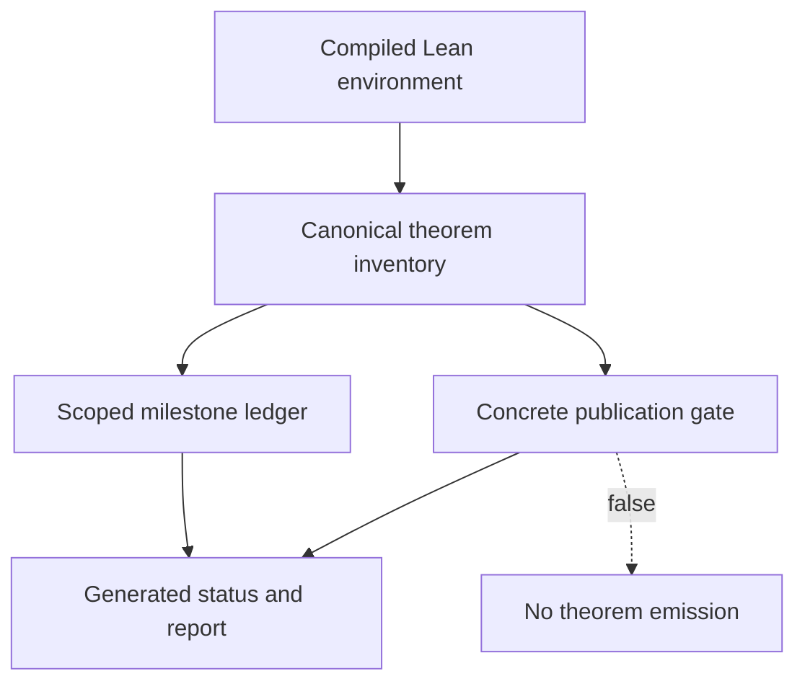

# Reviewer Guide

## Executive Summary

This checkout publishes the current formal-reconstruction status of the PNP project. It does not
establish `P = NP`.

The canonical report downloads are now a non-claiming report generated from a compiled
Lean theorem inventory. The inventory contains 46,094 public declarations across 497 modules,
including 25,322 theorem-kind declarations, 11,029 assumption-free theorem-kind declarations, and no
project-specific axioms. Exactly 19,720 private compiler auxiliaries are excluded explicitly.

The concrete publication gate is false. Its concrete target is present, its compatibility-root theorem is
absent, its reviewed activation fingerprints are intentionally unset, all five formal blockers
remain, and no JSON field, Boolean, string, hash, historical checker verdict, or website state can
substitute for the missing Lean evidence.

Start with these current-authority files:

- [`public/pnp-status.json`](../public/pnp-status.json): generated status, milestones, blockers, and gate;
- [`public/pnp-theorem-inventory.json`](../public/pnp-theorem-inventory.json): byte-mirrored compiled inventory;
- [`downloads/canonical_proof_report.pdf`](../downloads/canonical_proof_report.pdf): current report;
- [`downloads/formal-publication-release.json`](../downloads/formal-publication-release.json): exact merged-core provenance and file identities.

The older 57-page direct-claim manuscript remains a historical audit target only. It is located at
source tag `final-pnp-proof-report-hardened-7072f8d`, commit
`7072f8d0bda6d44d240f9bb3fad624fd357e1278`, and is indexed by
`archive/legacy-v0/ARCHIVE.json` in the source repository. It is not served through the canonical
download aliases.

## Evidence Layers

| Layer | Current evidence | What it supports | What it cannot support |
| --- | --- | --- | --- |
| Compiled Lean inventory | Environment constants and `collectAxioms`, exported under the pinned Lean toolchain | Names, modules, kinds, and axiom dependencies for all public declarations; raw kernel types for reviewed milestone candidates | A theorem broader than a reviewed candidate's exact type |
| Earned milestones | Reviewed theorem-type fingerprints, permitted axiom closures, and the complete Lean-source digest | 207 of 209 scoped formal milestone rows. For every language in the concrete bounded-certificate NP class, M231 extracts its polynomial-time verifier from NP membership and applies the complete source-derived all-input Cook-Levin PolynomialReduction to CNFSAT. Together with the existing concrete CNFSAT verifier, the closed theorem proves NPComplete CNFSAT in the selected finite-machine model. No reduction, execution trace, finite-instance restriction or correctness certificate is supplied. Both complete theorem interfaces are root-built and axiom-audited; their closures contain only the Lean standard axioms Classical.choice, Quot.sound and propext. | NP-completeness is hardness plus NP membership, not a deterministic polynomial-time SAT algorithm. This closes only the fixed concrete NP-hardness checkpoint. It does not close the separate final complexity transport to P = NP, unconditional residual minimization or ZeroSlack, complete polynomial PCCMin construction and certificate bounds, deterministic CNFSAT in P, or the eligible root theorem. All five global proof gates and the publication gate remain open; P = NP is not proved. Supplied-data residual results remain conditional and do not construct every required terminal-derived object. |
| Progress tracker | `public/pnp-proof-progress.json`, checked against status and compiled inventory | Formal artefact coverage is reported separately from the risk-weighted proof-completion estimate, uncertainty range, five global gates, project axioms, root theorem, and publication gate. | Treating row coverage as proof completion; awarding fixed checkpoint credit for local, finite, conditional, or supplied-data results; treating the score as probability, confidence, or schedule |
| Concrete publication gate | Exact target/root kinds and types, non-null reviewed fingerprints, fixed Lean-standard axiom allowlist, and source closure | A fail-closed activation boundary for a future concrete theorem | Activation while any subcheck is false or unconfigured |
| Status and report generation | Deterministic derivation from the canonical inventory and publication map | Current public wording and exact report bytes | Independent theorem evidence |
| Public seal | SHA-256, byte counts, exact ledger agreement, and alias equality | File identity | Theorem correctness, checker soundness, or semantic equality |
| Historical checker archive | Pinned 7072f8d tags, files, and replay route | Historical implementation and assertion-checker auditability | Current theorem authority or mathematical proof |
| Minimal examples | Small local educational fixtures | Named toy accept/reject behavior | Real package soundness or any theorem conclusion |

## Current Dependency Boundary

```mermaid
flowchart TD
  LEAN[Compiled Lean environment] --> INV[Canonical theorem inventory]
  INV --> MILE[Scoped milestone ledger]
  INV --> GATE[Concrete publication gate]
  MILE --> STATUS[Generated status and report]
  GATE --> STATUS
  GATE -. false .-> BLOCK[No theorem emission]
```

The status and report are consumers of formal evidence, not premises for it. Publication output is
allowed only when every concrete-gate subcheck passes. In this release every output field remains
non-claiming because the gate is false. PNPLabs verifies the pinned artifacts and publication
contract without invoking Lean; compilation and axiom verification are reproduced at the exact core
commit in the formal-methods path below.

## Audit Path: Formal Methods

1. Reproduce the pinned Lean build in `aisknab/pnp` at merged commit
   `e4af115a66cd5a6715a9363abea7a2008238d401`.
2. Re-export the inventory and compare it byte-for-byte with
   `public/pnp-theorem-inventory.json`.
3. Inspect every reviewed milestone declaration at its exact kernel type.
4. Confirm that each earned milestone uses only the permitted Lean-standard axiom allowlist, has no
   project axiom, and matches the pinned complete Lean-source digest.
5. Mutate a theorem type or source file and confirm that the corresponding milestone is revoked.
6. Inspect the gate's fixed standard-axiom allowlist and verify that unknown, project, and `sorryAx`
   dependencies reject.
7. Confirm that null expected fingerprints never compare equal to null actual fingerprints.

## Audit Path: Complexity Theory

Formal artefact coverage is 207 of 209 scoped publication rows, not proof completion. The fixed reductions-concrete-np-hardness checkpoint earns 2 points, raising the risk-weighted estimate from 38% to 40%. Formal artefact coverage is 207 of 209 current scoped publication rows earned. All five global gates remain open.

Review the latest result at its exact compiled type and keep these dependency boundaries separate:

1. M230 supplies the complete all-input Cook-Levin formula builder and its polynomial reduction to CNFSAT. The source-derived finite machine covers empty and odd-length inputs as well as every other bitstring, with total runtime and output-size bounds polynomial in the original input length. It does not decide satisfiability.
2. M231 combines the complete Cook-Levin reduction with the concrete verifier to prove CNF-SAT NP-hardness and NP-completeness in the selected finite-machine model. The CNFSAT-to-NAND-to-locked-NAND reductions are also checked. NP-completeness is not a deterministic polynomial-time SAT algorithm.
3. The residual and Packet/HB layers retain their exact finite, local, conditional or supplied-data scopes. They do not derive every terminal family, support, payload, rank or blocker table from valid input, or supply complete globally decreasing route coverage. A local mismatch or exhaustive reference minimum is not that missing construction.
4. Unconditional manuscript-level SaturatePositive, BCELReady and global ZeroSlack remain open. A checked positive-premise branch or supplied completeness certificate is not an unconditional theorem.
5. Executable exact PCCMin, its complete polynomial runtime, output-size and certificate-size bounds, and deterministic CNFSAT in P remain open. Local iteration or finite-size bounds do not close those obligations.
6. The eligible root `PNP.Main.p_eq_np` remains absent and the publication gate is false. There are no project-specific axioms, but eliminating those axioms is not itself a proof of P = NP.

The full component scopes and historical limitations remain in the canonical milestone ledger at [formal status](../status.html) and in the [compiled status payload](../public/pnp-status.json). Historical package acceptance and matching artefact hashes cannot close these mathematical gaps.

## Audit Path: Reproducibility And Security

1. Run `npm test` in this checkout.
2. Run `npm run verify:seal` and compare the four report aliases.
3. Verify the inventory SHA-256 against `public/pnp-status.json`.
4. Confirm that the local server exposes both `/public/pnp-status.json` and
   `/public/pnp-theorem-inventory.json` with no-cache headers.
5. Run the cross-repository check against the exact merged core commit.
6. Inspect the report-sync workflow and verify that it is read-only and cannot commit or restore
   historical report bytes.
7. Treat every digest match as byte-identity evidence only.

## Historical Audit Path

The source/checker, documentation, and generated-artifact refs for 7072f8d are preserved separately
in [source_checker_map.md](source_checker_map.md). Use them only to inspect or replay the historical
assertion-checker release. References to numbered report sections in historical worksheets refer to
the manuscript at the pinned 7072f8d source tag, never to the current report.

A historical replay can show that a named implementation produced the recorded acceptance fields.
It cannot establish the mathematical implications encoded by those fields and cannot activate the
current publication gate.

## Fast Falsification Checklist

- Change one inventory byte without changing status and confirm rejection.
- Replace a milestone theorem with a same-name theorem of weaker type and confirm it is unearned.
- Add a project or unknown axiom to a milestone/root closure and confirm rejection.
- Set an expected gate fingerprint to null and confirm that it remains unconfigured and nonmatching.
- Remove or forge the exact `PNP.Main.p_eq_np` root while leaving the `PNP.PEqualsNP` compatibility alias present, and confirm that publication remains closed.
- Forge a historical accepted flag or checker Boolean and confirm that theorem output remains false.
- Remove one blocker or project axiom from public status and confirm rejection.
- Serve a stale or missing inventory and confirm that the browser remains fail-closed.
- Replace the canonical PDF with the historical 57-page hash and confirm seal/sync rejection.

## Not Claimed

This checkout does not claim external acceptance, journal validation, checker soundness, a complete
candidate universe, polynomial exact minimization, SAT in P, or `P = NP`. The local checks establish
only their explicitly named file-identity, consistency, rendering, and toy-fixture properties.

## M231 current publication boundary

M230 completes the all-input Cook-Levin formula builder. M231 combines its polynomial reduction with the concrete verifier to prove CNF-SAT NP-completeness in the finite-machine model. This is not a polynomial-time SAT algorithm. Risk-weighted proof completion estimate: 40%, with uncertainty 20% to 40%. Formal artefact coverage: 207 of 209 current scoped publication rows earned. Global gates closed: 0 of 5. Project-specific axioms remaining: 0. The eligible root theorem PNP.Main.p_eq_np remains absent and the publication gate is false.

Current source: [`e4af115a66cd5a6715a9363abea7a2008238d401`](https://github.com/aisknab/pnp/tree/e4af115a66cd5a6715a9363abea7a2008238d401). The exact compiled evidence and limitation are recorded in the [NP-completeness result note](https://github.com/aisknab/pnp/blob/e4af115a66cd5a6715a9363abea7a2008238d401/docs/lean_cook_levin_np_completeness.md). Earlier named component limitations describe those components, not the now-complete M230 builder.
